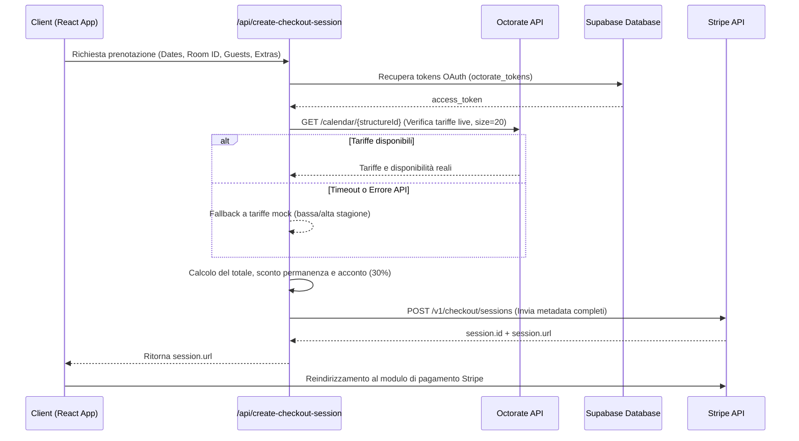
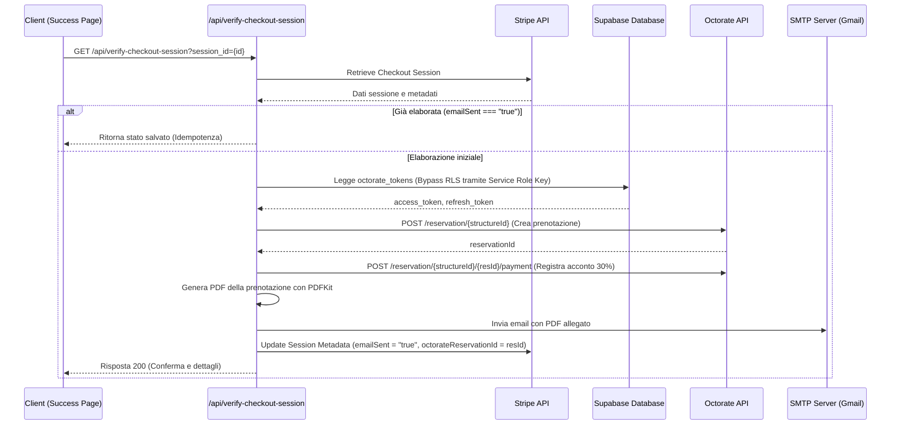

# Architettura Core — Flower Power Village & Spa

Documentazione tecnica dell'architettura e delle integrazioni del sistema di prenotazione e pagamento per il resort Flower Power Village (Koh Phayam, Thailandia). Questo documento è progettato per fungere da archivio di conoscenza per Gemini Notebook.

---

## 1. Stack Tecnologico

Il sistema è strutturato come un'applicazione a pagina singola (SPA) con backend serverless leggero, integrando servizi esterni per la persistenza dei dati, la gestione dei pagamenti e la sincronizzazione con il Channel Manager alberghiero.

*   **Frontend Framework:** React 18.3 + TypeScript 5.5, compilato tramite Vite 8.x.
*   **State Management:** Zustand 5.x per la gestione reattiva del carrello e dello stato locale.
*   **Database & Storage:** Supabase (PostgreSQL) per la memorizzazione dei dati degli alloggi, degli ordini e dei token di autenticazione. I bucket di Supabase Storage gestiscono le foto degli alloggi e le ricevute di pagamento.
*   **Payment Gateway:** Stripe API (Stripe Checkout) per l'elaborazione sicura dei pagamenti con carta di credito (acconto del 30%).
*   **Channel Manager & PMS:** API Octorate (REST v1) per il controllo in tempo reale della disponibilità delle camere, delle tariffe dinamiche e per la registrazione automatica delle prenotazioni.
*   **Image Proxy (Ottimizzazione CDN):** Proxy `wsrv.nl` per il ridimensionamento dinamico e la conversione in formato WebP ad alta efficienza delle immagini caricate sui bucket Supabase Storage.
*   **Generazione PDF:** `PDFKit` (libreria server-side in Node.js) per la creazione on-the-fly della ricevuta di prenotazione in formato PDF.
*   **Mailing Service:** Servizio SMTP di Gmail integrato tramite `Nodemailer` per l'invio automatizzato delle email di conferma della prenotazione con il PDF in allegato.
*   **Serverless Environment:** Vercel Serverless Functions (Node.js) ospitate sotto la cartella `/api`.

---

## 2. Flussi Logici

Il flusso di lavoro si articola principalmente attorno alla creazione e alla verifica delle sessioni di prenotazione.

### A. Flusso di Creazione Prenotazione e Avvio Pagamento

### B. Flusso di Conferma, Sincronizzazione PMS ed Emailing

---

## 3. Configurazioni Chiave

### Variabili d'Ambiente Critiche

| Variabile | Scopo | Ambito |
|---|---|---|
| `SUPABASE_URL` / `VITE_SUPABASE_URL` | Endpoint dell'istanza del database PostgreSQL e Storage. | Client & Server |
| `VITE_SUPABASE_ANON_KEY` | Chiave anonima pubblica per interrogazioni standard da frontend. | Client |
| `SUPABASE_SERVICE_ROLE_KEY` | Chiave privata ad alto privilegio per bypassare le policy RLS sulle tabelle riservate. | Server (Segreta) |
| `STRIPE_TARGET` | Identifica l'ambiente Stripe attivo (`TEST` o `LIVE`). | Server |
| `STRIPE_SECRET_KEY_TEST` | Chiave segreta di Stripe per transazioni in modalità di test. | Server (Segreta) |
| `OCTORATE_SECRET_KEY` / `VITE_OCTORATE_SECRET_KEY` | Chiave segreta privata dell'applicazione client registrata su Octorate. | Server (Segreta) |
| `VITE_OCTORATE_CLIENT_ID` | Client ID pubblico associato all'applicazione Octorate. | Client & Server |
| `VITE_OCTORATE_STRUCTURE_ID` | Identificativo univoco della struttura ricettiva su Octorate (`366879`). | Client & Server |
| `SMTP_HOST` / `SMTP_PORT` / `SMTP_USER` / `SMTP_PASS` | Credenziali del server mail per l'invio delle notifiche. | Server (Segreta) |

### Caching e Ottimizzazioni di Stato
1.  **Filtro Idempotenza Client-Side:** All'interno di [booking-engine.tsx](file:///d:/WEB%20SITE%20Antigravity/flowerpowervillage/src/booking/components/booking-engine.tsx), non appena viene intercettato il parametro `session_id`, la chiave viene registrata in `sessionStorage` impostando temporaneamente lo stato su `PENDING_{sessionId}`. Questo impedisce al client di inviare richieste di verifica duplicate in caso di refresh della pagina o click multipli.
2.  **Bypass RLS per Token OAuth:** Poiché le credenziali OAuth di Octorate (access e refresh token) risiedono nella tabella protetta `octorate_tokens`, le chiamate API serverless utilizzano la `SUPABASE_SERVICE_ROLE_KEY`. Questo consente l'accesso in lettura/scrittura anche in assenza di una sessione utente autenticata (l'utente finale è un ospite anonimo).
3.  **Ottimizzazione delle Immagini:** Il caricamento delle immagini in griglia evita di scaricare file pesanti direttamente dal cloud. L'URL di Supabase viene passato al volo al server di ottimizzazione `wsrv.nl` che restituisce un WebP compresso e ridimensionato a `800px` di larghezza.

---

## 4. Problem Solving & Patch Storiche

Di seguito sono documentate le principali criticità architetturali emerse durante lo sviluppo e le relative soluzioni tecniche adottate.

### A. Timeout del modulo Fetch globale su Windows (Vercel Dev)
*   **Problema:** Durante lo sviluppo in ambiente locale su Windows utilizzando `vercel dev`, le chiamate HTTP esterne effettuate tramite il `fetch` globale di Node.js verso le API di Stripe o Octorate subivano sporadici blocchi di rete con conseguente `ConnectTimeout` dopo 20 secondi.
*   **Soluzione:** Nelle rotte serverless critiche (ad esempio in [verify-checkout-session.ts](file:///d:/WEB%20SITE%20Antigravity/flowerpowervillage/api/verify-checkout-session.ts)) il `fetch` globale è stato sostituito da una funzione helper personalizzata (`httpsPost`) basata sul modulo nativo `https` di Node.js. Questo ha azzerato i problemi di timeout legati all'implementazione dei socket nel fetch nativo su Windows.

### B. Errore 400 Bad Request (`errPageSize`) dall'API Calendario di Octorate
*   **Problema:** La rotta `/api/create-checkout-session` falliva il recupero dei prezzi reali restituendo un errore 400 da parte di Octorate. L'endpoint del calendario veniva interrogato con il parametro `size=100`, un valore non supportato dal PMS che generava l'eccezione `ApiParamsExemption` (errPageSize).
*   **Soluzione:** La query di richiesta del calendario in [create-checkout-session.ts](file:///d:/WEB%20SITE%20Antigravity/flowerpowervillage/api/create-checkout-session.ts) è stata modificata impostando `size=20` (in linea con la paginazione supportata dal PMS), ripristinando la corretta sincronizzazione delle tariffe in tempo reale.

### C. ReferenceError su `balanceDue` nelle Note Private di Octorate
*   **Problema:** A seguito di una modifica per arricchire il campo `privateNotes` inviato ad Octorate con i dettagli finanziari dell'acconto e del saldo, la sincronizzazione falliva silenziosamente. Il server sollevava un `ReferenceError: balanceDue is not defined` poiché la variabile veniva letta ma non era stata estratta tramite destrutturazione dall'oggetto `session.metadata`.
*   **Soluzione:** La variabile `balanceDue` è stata inserita correttamente nell'assegnazione destrutturata di `session.metadata` all'inizio del modulo di verifica.

### D. Autenticazione OAuth Octorate e Gestione Scadenza Token
*   **Problema:** I token di Octorate hanno una durata limitata. Se l'access token scadeva durante una prenotazione, la chiamata falliva con errore 401.
*   **Soluzione:** È stato implementato un meccanismo di auto-refresh. Se l'API di prenotazione risponde con un codice `401 Unauthorized`, il server invia immediatamente una richiesta `refresh_token` all'endpoint `/identity/refresh` di Octorate utilizzando le credenziali segrete, aggiorna il database Supabase (`octorate_tokens`) in modo transazionale e ripete la chiamata originale con il nuovo token.
