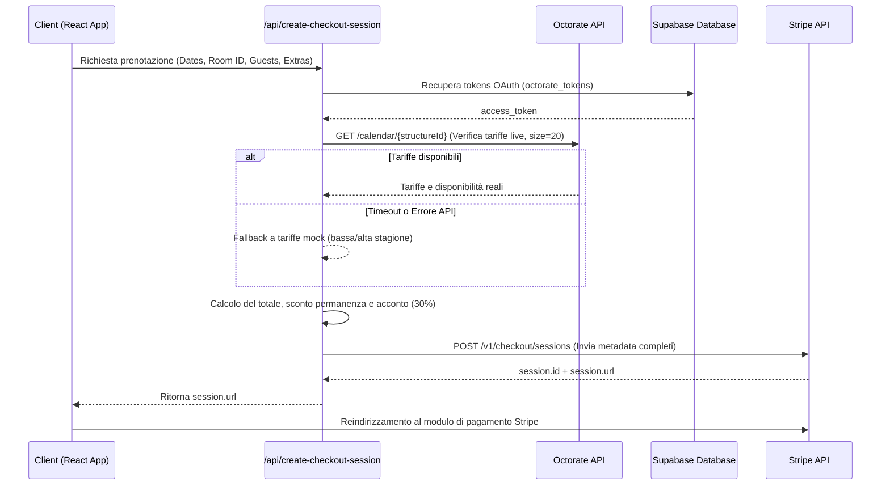
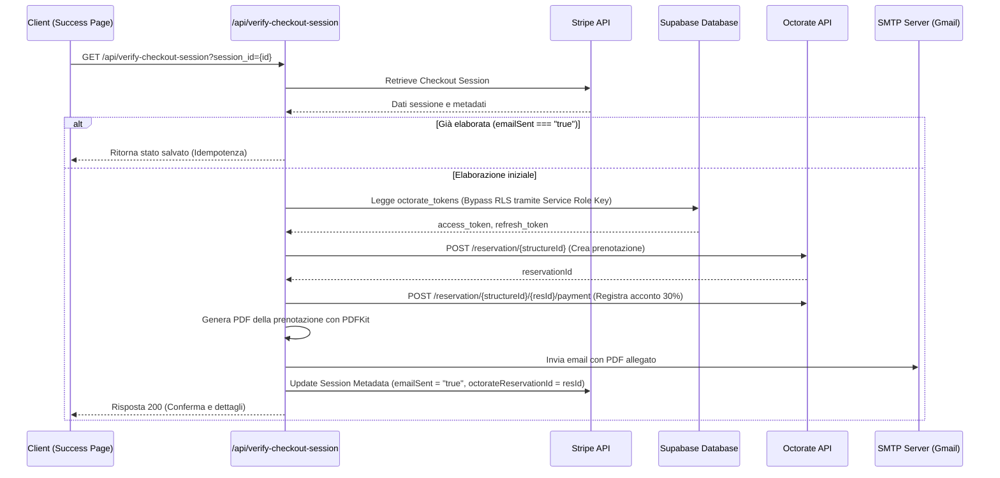

# Architettura Core — Flower Power Village & Spa

Documentazione tecnica dell'architettura e delle integrazioni del sistema di prenotazione e pagamento per il resort Flower Power Village (Koh Phayam, Thailandia). Questo documento è progettato per fungere da archivio di conoscenza per Gemini Notebook.

---

## 1. Stack Tecnologico

Il sistema è strutturato come un'applicazione a pagina singola (SPA) con backend serverless leggero, integrando servizi esterni per la persistenza dei dati, la gestione dei pagamenti e la sincronizzazione con il Channel Manager alberghiero.

*   **Frontend Framework:** React 18.3 + TypeScript 5.5, compilato tramite Vite 8.x.
*   **State Management:** Zustand 5.x per la gestione reattiva del carrello e dello stato locale.
*   **Database & Storage:** Supabase (PostgreSQL) per la memorizzazione dei dati degli alloggi, degli ordini e dei token di autenticazione. I bucket di Supabase Storage gestiscono le foto degli alloggi e le ricevute di pagamento.
*   **Payment Gateways (Multi-Gateway Switcher):**
    *   **Omise / Opn Payments (Pizza Delivery):** Gateway attivo in produzione LIVE (`pkey_68v...` e `skey_696...`) per pagamenti con carta 3D Secure e PromptPay in Baht thailandesi.
    *   **Cash (Ksher API):** Gateway primario per pagamenti in Thai Baht (THB) con PromptPay QR Code dinamico e carte di credito/debito internazionali con firma crittografica RSA-MD5.
    *   **PayPal API (Orders v2):** Metodo parallelo con calcolo trasparente e gestione commissioni (+10%).
    *   **Stripe API (Stripe Checkout):** Fallback per prenotazioni resort con carta di credito.
*   **Motore Fiscale & Contabilità Commercialista (`paymentCalculations.ts`):** Calcolo centralizzato di VAT 7% e costi incorporati (+4% Ksher, +10% PayPal, 0% Bonifico) con esportazione CSV e diciture fiscali 100% saldato senza voci di deposito.
*   **Channel Manager & PMS:** API Octorate (REST v1) per il controllo in tempo reale della disponibilità delle camere, delle tariffe dinamiche e per la registrazione automatica delle prenotazioni.
*   **Image Proxy (Ottimizzazione CDN):** Proxy `wsrv.nl` per il ridimensionamento dinamico e la conversione in formato WebP ad alta efficienza delle immagini caricate sui bucket Supabase Storage.
*   **Generazione PDF:** `PDFKit` (libreria server-side in Node.js) per la creazione on-the-fly della ricevuta di prenotazione in formato PDF.
*   **Modulo Web Reader & Documenti (3° Reparto Stagno):** Motore autonomo con parsing PDF (`pdfjs-dist`), Excel (`xlsx`), Word (`mammoth`) e OCR multilingua (`tesseract.js`) per generare mini-siti web a 256-bit agent-ready (`/read/[token]`).
*   **Mailing Service:** Servizio SMTP di Gmail integrato tramite `Nodemailer` per l'invio automatizzato delle email di conferma della prenotazione con il PDF in allegato.
*   **Serverless Environment:** Vercel Serverless Functions (Node.js) ospitate sotto la cartella `/api`.
*   **Routing Multi-Dominio & Edge Redirects (`vercel.json`):**
    *   `flowerpowervillage.com` / `www.flowerpowervillage.com`: Booking engine resort, bungalows & spa a Koh Phayam.
    *   `flowerpowerpizza.com` / `www.flowerpowerpizza.com`: Ristorante & delivery food a Ranong.
    *   **Ponte & Redirect 301 Edge:** Regole di reindirizzamento permanente per i vecchi percorsi Flazio (es. `/flowerpowerpizzaranong` e relative sottopagine) indirizzate direttamente a `https://www.flowerpowerpizza.com`.

---

## 1.1 Gestione Domini & Migrazione da Flazio a Spaceship

Il dominio `flowerpowervillage.com` è in fase di migrazione (Auth-Code/EPP transfer) verso **Spaceship** con puntamento DNS a **Vercel**:
*   **Record A (`@`)**: `76.76.21.21` (Vercel Edge Global Anycast).
*   **Record CNAME (`www`)**: `cname.vercel-dns.com`.
*   **Ponte Transitorio Flazio**: Script di reindirizzamento JavaScript inserito nell'`<head>` di Flazio per dirottare in tempo reale i visitatori della vecchia pagina `/flowerpowerpizzaranong` su `https://www.flowerpowerpizza.com`.

## 1.2 Architettura a 3 Stadi e Prontuario Comandi Operativi

Il sistema adotta un'architettura di sviluppo a 3 stadi per garantire zero impatto sui clienti di produzione durante lo sviluppo:
1. **Stadio 1: Locale (`http://localhost:3000`)**: Sviluppo a caldo su Vite/Vercel dev.
2. **Stadio 2: Staging Privato (`https://staging.flowerpowerpizza.com`)**: Branch `staging` isolato per collaudi mobile/desktop.
3. **Stadio 3: Produzione Ufficiale (`https://www.flowerpowerpizza.com` e `https://www.flowerpowervillage.com`)**: Branch `main` per i clienti pubblici.

### Prontuario Comandi Ufficiali:
* `MARKDOWN-STAGING-PIZZA` / `MARKDOWN-STAGING-VILLAGE` / `MARKDOWN-STAGING`: Deploy su Staging privato.
* `MARKDOWN-WEBSITE-PIZZA` / `MARKDOWN-WEBSITE-VILLAGE` / `MARKDOWN-WEBSITE`: Deploy su Produzione ufficiale.
* `MARKDOWN-PROJECT`: **Master Workflow** che aggiorna la documentazione `.md`, cifra il Vault, genera il report per Gemini Notebook e rilascia contemporaneamente su Staging e Produzione.

## 2. Flussi Logici

Il flusso di lavoro si articola principalmente attorno alla creazione e alla verifica delle sessioni di prenotazione.

### A. Flusso di Creazione Prenotazione e Avvio Pagamento

```mermaid
sequenceDiagram
    participant Client as Client (React App)
    participant API_Create as /api/create-checkout-session
    participant Octorate as Octorate API
    participant Supabase as Supabase Database
    participant Stripe as Stripe API

    Client->>API_Create: Richiesta prenotazione (Dates, Room ID, Guests, Extras)
    API_Create->>Supabase: Recupera tokens OAuth (octorate_tokens)
    Supabase-->>API_Create: access_token
    API_Create->>Octorate: GET /calendar/{structureId} (Verifica tariffe live, size=20)
    alt Tariffe disponibili
        Octorate-->>API_Create: Tariffe e disponibilità reali
    else Timeout o Errore API
        API_Create-->>API_Create: Fallback a tariffe mock (bassa/alta stagione)
    end
    API_Create->>API_Create: Calcolo del totale, sconto permanenza e acconto (30%)
    API_Create->>Stripe: POST /v1/checkout/sessions (Invia metadata completi)
    Stripe-->>API_Create: session.id + session.url
    API_Create-->>Client: Ritorna session.url
    Client->>Stripe: Reindirizzamento al modulo di pagamento Stripe
```

### B. Flusso di Conferma, Sincronizzazione PMS ed Emailing

```mermaid
sequenceDiagram
    participant Client as Client (Success Page)
    participant API_Verify as /api/verify-checkout-session
    participant Stripe as Stripe API
    participant Supabase as Supabase Database
    participant Octorate as Octorate API
    participant Email as SMTP Server (Gmail)

    Client->>API_Verify: GET /api/verify-checkout-session?session_id={id}
    API_Verify->>Stripe: Retrieve Checkout Session
    Stripe-->>API_Verify: Dati sessione e metadati
    alt Già elaborata (emailSent === "true")
        API_Verify-->>Client: Ritorna stato salvato (Idempotenza)
    else Elaborazione iniziale
        API_Verify->>Supabase: Legge octorate_tokens (Bypass RLS tramite Service Role Key)
        Supabase-->>API_Verify: access_token, refresh_token
        API_Verify->>Octorate: POST /reservation/{structureId} (Crea prenotazione)
        Octorate-->>API_Verify: reservationId
        API_Verify->>Octorate: POST /reservation/{structureId}/{resId}/payment (Registra acconto 30%)
        API_Verify->>API_Verify: Genera PDF della prenotazione con PDFKit
        API_Verify->>Email: Invia email con PDF allegato
        API_Verify->>Stripe: Update Session Metadata (emailSent = "true", octorateReservationId = resId)
        API_Verify-->>Client: Risposta 200 (Conferma e dettagli)
    end
```

---

## 3. Configurazioni Chiave

### Variabili d'Ambiente Critiche

| Variabile | Scopo | Ambito |
|---|---|---|
| `SUPABASE_URL` / `VITE_SUPABASE_URL` | Endpoint dell'istanza del database PostgreSQL e Storage. | Client & Server |
| `VITE_SUPABASE_ANON_KEY` | Chiave anonima pubblica per interrogazioni standard da frontend. | Client |
| `SUPABASE_SERVICE_ROLE_KEY` | Chiave privata ad alto privilegio per bypassare le policy RLS sulle tabelle riservate. | Server (Segreta) |
| `STRIPE_TARGET` | Identifica l'ambiente Stripe attivo (`TEST` o `LIVE`). | Server |
| `STRIPE_SECRET_KEY_TEST` | Chiave segreta di Stripe per transazioni in modalità di test. | Server (Segreta) |
| `OCTORATE_SECRET_KEY` / `VITE_OCTORATE_SECRET_KEY` | Chiave segreta privata dell'applicazione client registrata su Octorate. | Server (Segreta) |
| `VITE_OCTORATE_CLIENT_ID` | Client ID pubblico associato all'applicazione Octorate. | Client & Server |
| `VITE_OCTORATE_STRUCTURE_ID` | Identificativo univoco della struttura ricettiva su Octorate (`366879`). | Client & Server |
| `SMTP_HOST` / `SMTP_PORT` / `SMTP_USER` / `SMTP_PASS` | Credenziali del server mail per l'invio delle notifiche. | Server (Segreta) |

### Caching e Ottimizzazioni di Stato
1.  **Filtro Idempotenza Client-Side:** All'interno di [booking-engine.tsx](file:///d:/WEB%20SITE%20Antigravity/flowerpowervillage/src/booking/components/booking-engine.tsx), non appena viene intercettato il parametro `session_id`, la chiave viene registrata in `sessionStorage` impostando temporaneamente lo stato su `PENDING_{sessionId}`. Questo impedisce al client di inviare richieste di verifica duplicate in caso di refresh della pagina o click multipli.
2.  **Bypass RLS per Token OAuth:** Poiché le credenziali OAuth di Octorate (access e refresh token) risiedono nella tabella protetta `octorate_tokens`, le chiamate API serverless utilizzano la `SUPABASE_SERVICE_ROLE_KEY`. Questo consente l'accesso in lettura/scrittura anche in assenza di una sessione utente autenticata (l'utente finale è un ospite anonimo).
3.  **Ottimizzazione delle Immagini:** Il caricamento delle immagini in griglia evita di scaricare file pesanti direttamente dal cloud. L'URL di Supabase viene passato al volo al server di ottimizzazione `wsrv.nl` che restituisce un WebP compresso e ridimensionato a `800px` di larghezza.

---

## 4. Problem Solving & Patch Storiche

Di seguito sono documentate le principali criticità architetturali emerse durante lo sviluppo e le relative soluzioni tecniche adottate.

### A. Timeout del modulo Fetch globale su Windows (Vercel Dev)
*   **Problema:** Durante lo sviluppo in ambiente locale su Windows utilizzando `vercel dev`, le chiamate HTTP esterne effettuate tramite il `fetch` globale di Node.js verso le API di Stripe o Octorate subivano sporadici blocchi di rete con conseguente `ConnectTimeout` dopo 20 secondi.
*   **Soluzione:** Nelle rotte serverless critiche (ad esempio in [verify-checkout-session.ts](file:///d:/WEB%20SITE%20Antigravity/flowerpowervillage/api/verify-checkout-session.ts)) il `fetch` globale è stato sostituito da una funzione helper personalizzata (`httpsPost`) basata sul modulo nativo `https` di Node.js. Questo ha azzerato i problemi di timeout legati all'implementazione dei socket nel fetch nativo su Windows.

### B. Errore 400 Bad Request (`errPageSize`) dall'API Calendario di Octorate
*   **Problema:** La rotta `/api/create-checkout-session` falliva il recupero dei prezzi reali restituendo un errore 400 da parte di Octorate. L'endpoint del calendario veniva interrogato con il parametro `size=100`, un valore non supportato dal PMS che generava l'eccezione `ApiParamsExemption` (errPageSize).
*   **Soluzione:** La query di richiesta del calendario in [create-checkout-session.ts](file:///d:/WEB%20SITE%20Antigravity/flowerpowervillage/api/create-checkout-session.ts) è stata modificata impostando `size=20` (in linea con la paginazione supportata dal PMS), ripristinando la corretta sincronizzazione delle tariffe in tempo reale.

### C. ReferenceError su `balanceDue` nelle Note Private di Octorate
*   **Problema:** A seguito di una modifica per arricchire il campo `privateNotes` inviato ad Octorate con i dettagli finanziari dell'acconto e del saldo, la sincronizzazione falliva silenziosamente. Il server sollevava un `ReferenceError: balanceDue is not defined` poiché la variabile veniva letta ma non era stata estratta tramite destrutturazione dall'oggetto `session.metadata`.
*   **Soluzione:** La variabile `balanceDue` è stata inserita correttamente nell'assegnazione destrutturata di `session.metadata` all'inizio del modulo di verifica.

### E. Protocollo di Sincronizzazione Cassaforte & Allineamento Notebook (Vault-Sync & MARKDOWN-PROJECT)
*   **Problema:** Necessità di sincronizzare credenziali e chiavi segrete API (.env, Stripe, Supabase, Telegram, Octorate) in modo sicuro tra postazioni di lavoro multiple senza mai esporre chiavi in chiaro su repository Git pubblici, e garantire che le istruzioni dell'agente assistente siano sempre perfettamente allineate nel Gemini Notebook del taccuino browser.
*   **Soluzione:**
    *   Implementato lo script di cifratura/decifratura AES-256-GCM ([scratch/vault-sync.mjs](file:///d:/01%20ANTIGRAVITY/flower-power-village-com/flowerpowervillage/scratch/vault-sync.mjs)). Il report delle credenziali viene cifrato in `.secret_docs/api_credentials_report.md.enc` ed è l'unico file di credenziali tracciato da Git.
    *   Integrazione nel protocollo **`MARKDOWN-PROJECT`** della copia speculare automatica dei file di istruzioni dell'agente: `.agents/AGENTS.md` in `documentation_reports/AGENTS.md` e `.agentinstructions` in `documentation_reports/agentinstructions.txt` (estensione `.txt` per permettere un caricamento fluido nel taccuino browser).
    *   Se l'utente nota questi file evidenziati in **GIALLO** (Stato: Modificato) nell'IDE a seguito di una sessione, deve trascinarli nel Gemini Notebook per mantenere l'assistente web perfettamente aggiornato.

### F. Architettura Dashboard Unificata con Bivio (Entry Point)
*   **Problema:** Necessità di un unico portale amministrativo (`/admin`) che permetta allo staff autenticato di accedere alla gestione sia del reparto Pizzeria (Ranong) che del reparto Resort (Koh Phayam), mantenendo tuttavia una compartimentazione logica, visiva e di stato (Zustand) totale tra i due domini.
*   **Soluzione:** Implementata la nuova struttura modulare in `src/admin/`:
    *   **Common (`src/admin/common/`)**: Shell di autenticazione Supabase unificata (`AdminAuth`), header con selettore reparto (`AdminHeader`) e gestione errori isolata (`ErrorBoundary`).
    *   **Gateway (`src/admin/gateway/`)**: Schermata di ingresso a Bivio (`AdminGateway`) con card interattive per la scelta immediata tra Ranong e Koh Phayam.
    *   **Pizzeria (`src/admin/pizza/`)**: Modulo Pizzeria isolato con proprio Zustand store (`usePizzaAdminStore`) e componente `PizzaDashboard`.
    *   **Resort (`src/admin/resort/`)**: Modulo Resort isolato con proprio Zustand store (`useResortAdminStore`) e componente `ResortDashboard`.

### H. Refactoring API Gateway Catch-All per Limite Vercel Hobby (Max 12 Functions)
*   **Problema:** Il deployment su Vercel (piano Hobby) falliva con l'errore `"No more than 12 Serverless Functions can be added to a Deployment on the Hobby plan"`. L'applicazione tentava di compilare **14 funzioni serverless distinte** distribuite tra `/api/`, `/api/admin/` e `/api/resort/`.
*   **Soluzione:** Implementata l'architettura **API Gateway Catch-All**:
    *   Spostati tutti gli handler delle API nella cartella protetta `api/_handlers/` (`checkout.ts`, `verify.ts`, `download.ts`, `telegram.ts`, `octorate.ts`, `octorate-webhook.ts`). I file/cartelle che iniziano con `_` vengono ignorati dal compilatore Vercel e **non conteggiati come serverless functions**.
    *   Creato un punto di ingresso unico `api/[...route].ts` ed il file dedicato `api/webhooks/octorate.ts` (con Ping Catcher per Octorate e Vercel) che gestiscono il routing di tutte le chiamate `/api/*` senza modificare alcun URL lato frontend o webhook.
    *   Il conteggio delle Serverless Functions è sceso **da 14 a 2 singole funzioni**, rispettando ampiamente il limite di 12 del piano Vercel Hobby.

#### 5. Checklist di Go-Live (Migrazione Dominio Definitivo)
- **Aggiornamento Webhook Octorate**: Rieseguire lo script `node scratch/register-octorate-webhooks.mjs` inserendo il nuovo URL `https://www.flowerpowervillage.com/api/webhooks/octorate` per istruire Octorate sulla nuova destinazione delle notifiche in background.
- **Aggiornamento Stripe**: Modificare nella dashboard di Stripe gli URL di reindirizzamento post-pagamento e l'eventuale Webhook di Stripe, facendoli puntare al nuovo dominio definitivo.

### L. Favicon Dinamica Differenziata per Ambiente (Locale / Virtuale / Produzione)
*   **Modulo (`src/utils/environmentFavicon.ts`) & Init (`src/main.tsx`):**
    *   **🔴 Ambiente Locale (`localhost` / `127.0.0.1`):** Canvas genera dinamicamente un anello circolare rosso vivo (`#EF4444`) ad alto contrasto intorno al logo.
    *   **🟢 Ambiente Virtuale / Staging (`*.vercel.app`):** Canvas genera un anello circolare verde smeraldo (`#10B981`) per distinguere a colpo d'occhio i test remoti.
    *   **🌐 Dominio Ufficiale Produzione (`flowerpowerpizza.com` / `flowerpowervillage.com`):** Nessun anello, favicon ufficiale standard per la clientela finale.

### M. Gestione API Prenotazione Tavoli e Codici Promo nel Gateway Catch-All
*   **Routing Serverless Unificato (`api/[...route].ts` & `api/_handlers/table-reservation.ts`):** Instrada in modo trasparente `/api/pizza/table-reservations` e `/api/pizza/promo-codes` mantenendo il conteggio funzioni serverless Vercel a sole 2 unità.
*   **Integrazione Webhook Telegram Multi-Azione:** I bot callback e le approvazioni/rifiuti avvengono via `/api/telegram-webhook` collegandosi reattivamente a Supabase.

### N. Ottimizzazione SEO & AI Search (`llms.txt`, `sitemap.xml`, `Structured Data`)
*   **Standardizzazione Schema.org JSON-LD (`PizzaStructuredData.tsx`):** Dati strutturati `Restaurant`, `Menu` e `GeoCoordinates` per motori di ricerca e assistenti vocali.
*   **AI Crawler Discovery Files (`public/llms.txt`, `public/llms-full.txt`):** Documentazione sintetica ed esaustiva per agenti LLM (Perplexity, ChatGPT Search, Claude, Gemini) con catalogo menu e contatti ufficiali.

### O. Regola Radicale Tariffe OFF = Stop Sell Istantaneo su tutte le OTA (Octorate Engine)
*   **Problema Overbooking su Tariffe Derivate AC:** Le tariffe derivate AC di Booking.com e OTA presentavano periodi aperti a monte pur risultando disattivate a livello visuale in dashboard.
*   **Soluzione:** Implementata la regola ferrea e intrinseca nell'infrastruttura:
    1. Ogni volta che un piano tariffario (es. `AC7d`, `AC14d`, `AC bnb-7d`, `AC bnb-14d`, `AirBnB AC`) risulta impostato su `OFF` nella dashboard, il sistema invia istantaneamente un push API a Octorate per applicare `stopSells: true, closed: true` su tutti i prodotti associati per l'intera stagione (`2026-10-06` -> `2027-10-31`).
    2. Modificato `useRestrictionsStore.ts` per inizializzare di default `stopSell: true` sui periodi standard di tutte le tariffe AC disattivate e attivare il push automatico in background all'azione di toggle.

### P. DeepSeek AI Translation Engine & Automazione Email Marketing (`api/_handlers/campaign-translate.ts`, `api/_helpers/dining-voucher-email.ts`)
*   **DeepSeek AI Batch 9-in-1 Engine:** L'endpoint `/api/campaign-translate` instrada verso le API Chat di DeepSeek (`deepseek-chat`) con prompt per la generazione simultanea e sicura dei contenuti tradotti in 9 lingue certificate.
*   **Automazione Voucher Dining Tablet:** Al checkout del tavolo, se fornita l'email, viene generato il voucher `DINE10-XXXXX` (10 giorni di validità) e inviata in background l'email con link 1-click via Nodemailer / Gmail SMTP.

