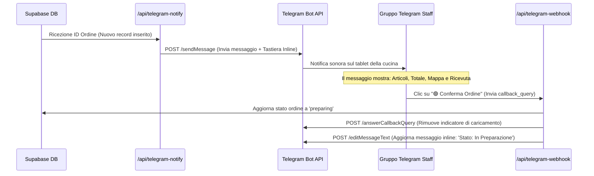

# Integrazione Telegram Bot — Notifiche & Tracking

Documentazione tecnica del sistema di notifica automatica degli ordini pizza, della gestione dello stato tramite bot interattivo e del tracciamento GPS live dei fattorini per "Flower Power Pizza" (Ranong, Thailandia). Questo documento è progettato per fungere da archivio di conoscenza per Gemini Notebook.

---

## 1. Stack Tecnologico

L'integrazione con Telegram funge da pannello di controllo operativo per la cucina e i fattorini, eliminando la necessità di una complessa dashboard web in locale.

*   **API di Integrazione:** Telegram Bot API (chiamate HTTP native). Per mantenere minime le dimensioni delle Serverless Functions ed evitare ritardi di cold start, non sono stati utilizzati framework esterni (es. Telegraf.js o node-telegram-bot-api), bensì invocazioni REST dirette tramite `fetch`.
*   **Hosting Backend:** Vercel Serverless Functions. Le rotte `/api/telegram-notify` (invio notifica iniziale) e `/api/telegram-webhook` (ricezione callback pulsanti e tracciamento GPS) elaborano le richieste in modo asincrono.
*   **Database & Configurazione Dinamica:** Supabase.
    *   Tabella `telegram_config`: memorizza in modo persistente e aggiornabile il token del bot (`bot_token`) e l'ID del gruppo (`chat_id`), evitandone l'hardcoding.
    *   Tabella `pizza_orders`: mantiene lo stato dell'ordine (`status`), abilitata con Supabase Realtime per inviare aggiornamenti istantanei al client dell'utente.

---

## 2. Flussi Logici

Il flusso si estende dall'inoltro dell'ordine fino alla consegna finale a casa del cliente.

### A. Ciclo di Notifica e Conferma dell'Ordine

### B. Flusso di Consegna e Tracciamento GPS Live
1.  **Avvio Spedizione:** Quando la pizza è pronta, lo staff preme il pulsante inline **"🛵 Fai Partire la Delivery"** e poi **"🛫 PARTENZA"**:
    *   L'ordine viene impostato su `tracking_active = true` in Supabase.
    *   Il bot invia un messaggio di promemoria in chat chiedendo al fattorino di attivare la **Condivisione della Posizione in Tempo Reale** ("Live Location" nativa di Telegram).
2.  **Streaming delle Coordinate:**
    *   Finché il fattorino ha la Live Location attiva, Telegram invia continuamente pacchetti di coordinate GPS al webhook `/api/telegram-webhook` (intercettando gli eventi `update.message.location` o `update.edited_message.location`).
    *   Il webhook riceve `latitude` e `longitude` e aggiorna i campi `driver_latitude` e `driver_longitude` dell'ordine corrispondente in Supabase.
    *   Il client dell'utente (che ascolta in tempo reale tramite Supabase Realtime) aggiorna istantaneamente l'icona del motorino sulla Google Map in base alle nuove coordinate.
3.  **Consegna Completata:** All'arrivo, lo staff o il fattorino preme **"🛬 ARRIVO"** (imposta `tracking_active = false` e coordinate sentinella a `-99`) e infine **"🏁 Conferma Consegnato"** (imposta `status = 'completed'`).

---

## 3. Configurazioni Chiave e Sicurezza

### Parametri di Configurazione
Le credenziali del bot vengono lette in modo dinamico all'avvio di ogni rotta tramite la funzione helper `getTelegramCredentials` in [telegram.ts](file:///d:/WEB%20SITE%20Antigravity/flowerpowervillage/api/_helpers/telegram.ts):
1.  **Lettura da DB:** Cerca un record nella tabella `telegram_config` con ID `default`.
2.  **Fallback Ambientale:** Se il database non risponde o la tabella è vuota, ripiega sulle variabili d'ambiente `TELEGRAM_BOT_TOKEN` e `TELEGRAM_CHAT_ID`.

### Sicurezza del Webhook
Per impedirere a malintenzionati di inviare falsi webhook o modificare gli stati di cassa premendo i pulsanti inline:
*   Il webhook `/api/telegram-webhook` confronta l'ID della chat che ha originato la callback (`update.callback_query.message.chat.id`) con il `chatId` autorizzato salvato in `telegram_config`.
*   Se l'ID non corrisponde, la richiesta viene immediatamente rifiutata con stato `unauthorized` senza effettuare modifiche su Supabase.

### Normalizzazione dei Contatti
La funzione helper `normalizeThaiPhone` converte i numeri di telefono inseriti dai clienti (es. `0949800200`) nel formato internazionale tailandese (`66949800200`). Questo permette di generare nel messaggio Telegram dei link ipertestuali rapidi per contattare direttamente il cliente in caso di problemi:
*   **WhatsApp:** `https://wa.me/66949800200`
*   **LINE:** `https://line.me/ti/p/~66949800200`

---

## 4. Problem Solving & Patch Storiche

### A. Ottimizzazione delle Prestazioni Serverless (Cold Start)
*   **Problema:** L'utilizzo del framework Telegraf.js causava tempi di caricamento del modulo lenti ed elevata latenza su Vercel in modalità serverless, portando a ritardi di notifica fino a 5-10 secondi alla creazione di ogni ordine.
*   **Soluzione:** L'intera logica di bot è stata riscritta utilizzando chiamate HTTP native via `fetch` verso gli endpoint API di Telegram. Questo ha ridotto il tempo di avvio della rotta a pochi millisecondi, garantendo notifiche istantanee.

### B. Prevenzione della Duplicazione dei Messaggi (Idempotenza)
*   **Problema:** In presenza di ritardi o di instabilità della connessione di rete, il client poteva riprovare l'invio dell'ordine, causando l'invio di messaggi duplicati sul gruppo della cucina e generando confusione.
*   **Soluzione:** Prima di inviare una notifica, l'endpoint controlla la colonna `telegram_notified` nella tabella `pizza_orders`. Se impostata su `true`, la rotta restituisce immediatamente successo senza effettuare alcuna chiamata a Telegram. Il flag viene impostato atomicamente subito dopo l'avvenuto invio del messaggio.

### C. Aggiornamento Inline dei Messaggi per evitare lo Spam in Chat
*   **Problema:** All'inizio del progetto, ogni cambio di stato (es. da preparato a spedito) inviava un nuovo messaggio nella chat di Telegram dello staff, intasando la cronologia e rendendo difficile tenere traccia degli ordini attivi.
*   **Soluzione:** Implementato l'aggiornamento dinamico del messaggio originale tramite l'endpoint `/editMessageText` di Telegram. Ogni cambio di stato aggiorna lo stesso identico messaggio inserendo la firma dell'operatore che ha effettuato l'azione (es. `Consegna avviata da @fattorino`) e aggiorna inline i pulsanti della tastiera, lasciando la chat pulita ed ordinata.
