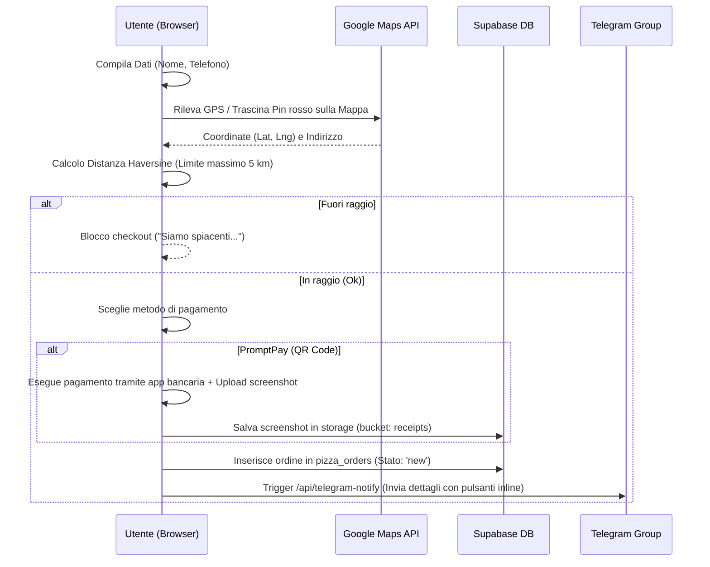

# Modulo Pizza & Online Delivery — Flower Power Pizza

Documentazione tecnica del sistema di ordinazione online, del catalogo dei prodotti e del flusso di gestione degli ordini per il reparto pizzeria "Flower Power Pizza" (Ranong, Thailandia). Questo documento è progettato per fungere da archivio di conoscenza per Gemini Notebook.

---

## 1. Stack Tecnologico

Il sistema gestisce l'intero catalogo dei prodotti e l'inoltro degli ordini via web, appoggiandosi a un'architettura in tempo reale basata su notifiche push e mappe interattive.

*   **Frontend UI & Interazioni:** React 18.3 + TypeScript 5.5 (Vite).
*   **Gestione dello Stato Carrello e Geolocalizzazione:** Zustand 5.x. Lo store `cartStore.ts` calcola i subtotali e valida i vincoli sul carrello, mentre `locationStore.ts` gestisce il posizionamento dell'utente.
*   **Database Relazionale & Realtime:** Supabase. La tabella `pizza_orders` memorizza gli ordini in tempo reale, sfruttando le funzionalità di ascolto dei cambiamenti di stato (Supabase Realtime) per aggiornare il tracciamento sul client dell'utente.
*   **Cloud Storage:** Supabase Storage (bucket `receipts`) per l'archiviazione e la verifica pubblica degli screenshot delle ricevute di pagamento PromptPay.
*   **Geolocalizzazione & Maps:** Google Maps JavaScript API (integrata tramite `@vis.gl/react-google-maps`). Permette la visualizzazione interattiva della zona di consegna e il trascinamento del pin per precisare le coordinate.
*   **Instant Notification & Kitchen Dashboard:** Telegram Bot API. Invece di richiedere una dashboard costantemente attiva sul browser della cucina, il sistema invia le notifiche d'ordine direttamente a un gruppo Telegram dello staff tramite un bot dedicato.
*   **Serverless Webhooks:** Vercel Serverless Functions (`/api/telegram-notify` e `/api/telegram-webhook`) per gestire l'invio del messaggio e le risposte interattive tramite pulsanti di callback di Telegram.

---

## 2. Flussi Logici

Il ciclo di vita di un ordine si sviluppa in quattro fasi: composizione, geolocalizzazione e pagamento, notifica istantanea, e tracciamento in tempo reale.

### A. Composizione dell'Ordine nel Carrello
1.  L'utente naviga nel catalogo strutturato in categorie (pizze classiche, pasta, insalate, bevande, ecc.).
2.  All'apertura della scheda prodotto (`ProductModal`), l'utente definisce la taglia/variante del piatto (es. pizza Normale o Gigante) ed eventuali ingredienti extra.
3.  Zustand (`cartStore.ts`) calcola il prezzo totale del singolo articolo applicando i modificatori di prezzo della variante selezionata e sommando gli extra.

### B. Geolocalizzazione e Checkout


### C. Gestione dell'Ordine Lato Staff (Telegram Flow)
1.  Il serverless handler `/api/telegram-notify` riceve l'ID ordine, estrae i dati da Supabase e invia al gruppo Telegram dello staff un messaggio HTML completo:
    *   Dettaglio degli articoli e opzioni selezionate.
    *   Mappa stradale (link rapido a Google Maps con le coordinate GPS esatte).
    *   Link alla ricevuta PromptPay per il controllo contabile.
    *   **Pulsanti Inline:** `Conferma Ordine`, `Rifiuta Ordine`, `PARTENZA` (Delivery), `ARRIVO`.
2.  Lo staff preme **Conferma Ordine**:
    *   Telegram invia un callback webhook a `/api/telegram-webhook`.
    *   Il server aggiorna lo stato dell'ordine in Supabase su `preparing`.
    *   Il client dell'utente (che ascolta in tempo reale su Supabase) si aggiorna mostrando un countdown di preparazione di 25 minuti.
3.  Lo staff preme **PARTENZA**:
    *   L'ordine viene aggiornato a `delivering`.
    *   Il client dell'utente mostra lo stato di consegna e avvia il tracking live.

---

## 3. Configurazioni Chiave e Schemi Dati

### Schema della Tabella `pizza_orders` (Supabase)

```sql
CREATE TABLE pizza_orders (
  id UUID PRIMARY KEY DEFAULT gen_random_uuid(),
  created_at TIMESTAMP WITH TIME ZONE DEFAULT timezone('utc'::text, now()) NOT NULL,
  customer_name TEXT NOT NULL,
  phone TEXT NOT NULL,
  address TEXT NOT NULL,          -- Indirizzo testuale + [COORD: lat,lng] in append
  items JSONB NOT NULL,           -- Array di CartItemSaved (Varianti ed Extra inclusi)
  total NUMERIC NOT NULL,
  status TEXT DEFAULT 'new'::text NOT NULL, -- 'new', 'preparing', 'delivering', 'completed', 'rejected'
  payment_method TEXT NOT NULL,   -- 'promptpay', 'cash'
  receipt_url TEXT,               -- Link pubblico lo screenshot nel bucket storage
  latitude DOUBLE PRECISION,
  longitude DOUBLE PRECISION,
  has_whatsapp BOOLEAN DEFAULT false,
  has_line BOOLEAN DEFAULT false,
  telegram_notified BOOLEAN DEFAULT false,
  telegram_message_id BIGINT
);
```

### Regole Tariffarie di Spedizione
*   **Raggio massimo di consegna:** 5 km calcolati con la formula di Haversine a partire dalle coordinate del ristorante (`10.0125` N, `98.6345` E circa, definite in `locationStore.ts`).
*   **Costo di spedizione:**
    *   `0 THB` (gratis) per ordini superiori o uguali a **200 THB**.
    *   `30 THB` per ordini inferiori a **200 THB**.

---

## 4. Problem Solving & Patch Storiche

### A. Prevenzione dell'Autofill Invasivo del Browser
*   **Problema:** Gli utenti riscontravano problemi durante l'inserimento dell'indirizzo perché le funzionalità di autocompilazione (autofill) dei browser (specialmente Chrome su mobile) sovrascrivevano arbitrariamente i campi del modulo di geolocalizzazione, inserendo indirizzi vecchi o non allineati con il pin della mappa.
*   **Soluzione:** In [CheckoutFlow.tsx](file:///d:/WEB%20SITE%20Antigravity/flowerpowervillage/src/pizza/components/CheckoutFlow.tsx), l'attributo `id` del campo indirizzo viene generato in modo casuale a ogni montaggio del componente (es. `addr-[random]`). Inoltre, il campo viene inizializzato come `readOnly` e diventa editabile solo a seguito del focus dell'utente, disattivando efficacemente i meccanismi automatici di autofill dei browser.

### B. Gestione dei Tablet Staff Offline (Failsafe Timeout)
*   **Problema:** Se il tablet della cucina era offline o lo staff non notava la notifica Telegram in tempo, il cliente rimaneva bloccato indefinitamente in attesa della conferma.
*   **Soluzione:** Il client avvia un countdown visivo di 5 minuti (300 secondi). Se entro questo lasso di tempo lo stato dell'ordine nel database non passa a `preparing` (segno che la cucina non ha premuto il pulsante di conferma su Telegram), l'interfaccia utente mostra automaticamente una schermata di avviso d'emergenza, invitando il cliente a chiamare direttamente il numero telefonico della pizzeria o ad avviare una chat WhatsApp/Line pre-compilata.

### C. Simulazione in Dev Mode
*   **Problema:** In modalità di sviluppo locale, l'assenza di un database Supabase o di un bot Telegram configurato impediva il test del flusso di cassa e di preparazione degli ordini.
*   **Soluzione:** È stata implementata una logica condizionale per la quale, in ambiente locale (`DEV`), se l'inserimento nel database fallisce, il sistema crea un ordine simulato in memoria locale, lo notifica alla dashboard di amministrazione aperta localmente tramite un `BroadcastChannel` del browser (`flower_power_orders_channel`) e consente il test completo del flusso dell'interfaccia grafica.
