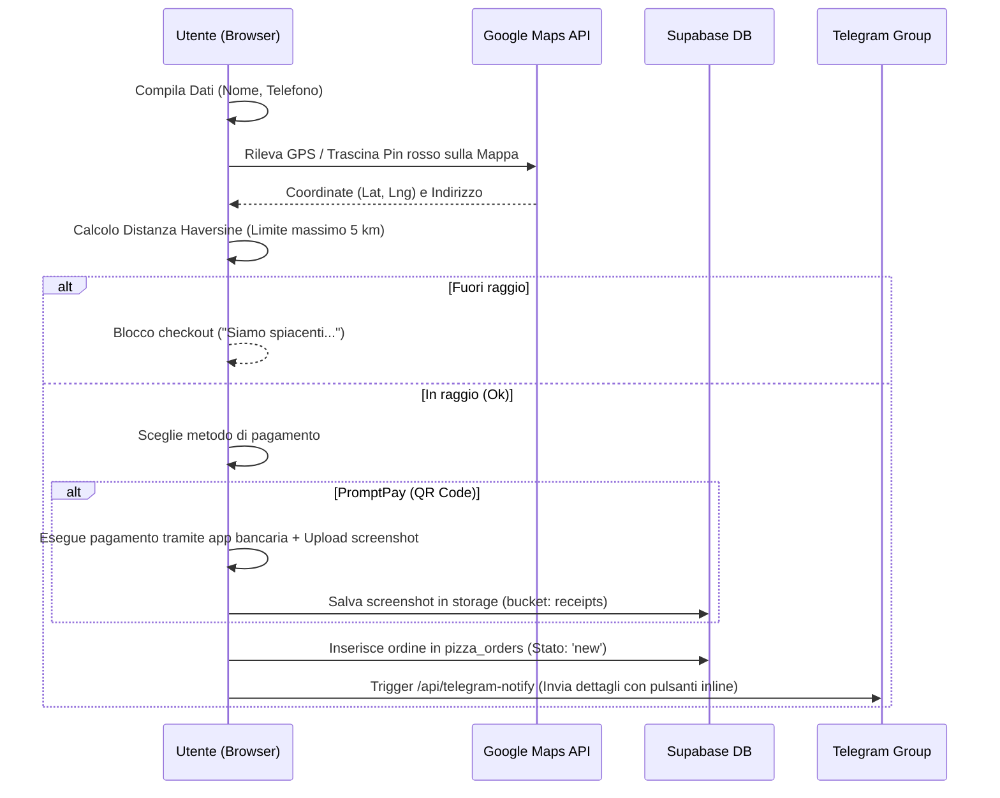

# Modulo Pizza & Online Delivery — Flower Power Pizza

Documentazione tecnica del sistema di ordinazione online, del catalogo dei prodotti e del flusso di gestione degli ordini per il reparto pizzeria "Flower Power Pizza" (Ranong, Thailandia). Questo documento è progettato per fungere da archivio di conoscenza per Gemini Notebook.

---

## 1. Stack Tecnologico

Il sistema gestisce l'intero catalogo dei prodotti e l'inoltro degli ordini via web, appoggiandosi a un'architettura in tempo reale basata su notifiche push e mappe interattive.

*   **Frontend UI & Interazioni:** React 18.3 + TypeScript 5.5 (Vite).
*   **Gestione dello Stato Carrello e Geolocalizzazione:** Zustand 5.x. Lo store `cartStore.ts` calcola i subtotali e valida i vincoli sul carrello, mentre `locationStore.ts` gestisce il posizionamento dell'utente.
*   **Database Relazionale & Realtime:** Supabase. La tabella `pizza_orders` memorizza gli ordini in tempo reale, sfruttando le funzionalità di ascolto dei cambiamenti di stato (Supabase Realtime) per aggiornare il tracciamento sul client dell'utente.
*   **Cloud Storage:** Supabase Storage (bucket `receipts`) per l'archiviazione e la verifica pubblica degli screenshot delle ricevute di pagamento PromptPay.
*   **Geolocalizzazione & Maps:** Google Maps JavaScript API (integrata tramite `@vis.gl/react-google-maps`). Permette la visualizzazione interattiva della zona di consegna e il trascinamento del pin per precisare le coordinate.
*   **Instant Notification & Kitchen Dashboard:** Telegram Bot API. Invece di richiedere una dashboard costantemente attiva sul browser della cucina, il sistema invia le notifiche d'ordine direttamente a un gruppo Telegram dello staff tramite un bot dedicato.
*   **Serverless Webhooks:** Vercel Serverless Functions (`/api/telegram-notify` e `/api/telegram-webhook`) per gestire l'invio del messaggio e le risposte interattive tramite pulsanti di callback di Telegram.

---

## 2. Architettura UI & Componenti Recenti

### A. Sistema di Filtri a Tendina Personalizzati (`CustomFilterDropdown`)
*   **Design Satinato & Z-Index Elevato (`z-[99999]`):** Tutti i sottomenu a pulsante sono stati convertiti in eleganti menu a tendina custom con chiusura al click esterno (`useRef` + window listener), badge con conteggio piatti, checkmark animato sulla selezione attiva e reset rapido.
*   **Menu Pasta (`CONDIMENTO / TIPO DI PASTA`):** Elenca i condimenti scritti esattamente come nel menu in **UPPERCASE** (`AGLIO, OLIO E PEPERONCINO`, `SALSA DI POMODORO`, `PESTO GENOVESE`, `SALSA AMATRICIANA`, `SALSA RAGÙ BOLOGNESE`, `CARBONARA`, `QUATTRO FORMAGGI`, `FLOWER POWER`, `LASAGNE`).
*   **Menu Bibite & Birre (`TIPOLOGIA BEVANDA`):** Sostituito il layout a pillole con tendina satinata (`TUTTE LE BEVANDE`, `BIBITE & ACQUA`, `BIRRE`).
*   **Menu Vini (`TIPOLOGIA VINO` & `ORIGINE / NAZIONE`):** Doppia tendina con bandiere nazionali e ordine rigoroso: **Italia, Francia, Australia, Cile**.

### B. Standardizzazione Tipografica del Simbolo Valuta Baht (`฿`)
*   **Colore Coerente e Nero:** Il simbolo `฿` è stato uniformato al colore nero del prezzo (`text-stone-900` o `text-[#8B1E1E]` se in evidenza), eliminando il vecchio grigio spento.
*   **Font Stack Dedicato:** Utilizzo dello stack tipografico ad alta resa `fontFamily: 'Prompt, Kanit, IBM Plex Sans Thai, system-ui, sans-serif'` su tutte le componenti: schede menu (`MenuGrid.tsx`), schede vini (`wineData.tsx`), carrello laterale (`CartDrawer.tsx`), modal di personalizzazione (`ProductModal.tsx`), cassa e checkout (`CheckoutFlow.tsx`) e Wine Studio.

### C. Allineamento Geometrico Schede Menu Food
*   **Ancoraggio Badge Extra a Fondo Scheda (`mt-auto`):** L'indicatore `• N INGREDIENTI EXTRA` e le opzioni di taglia sono posizionati stabilmente a contatto con la riga sottile divisoria (`border-t border-stone-200`) in tutte le schede della griglia, garantendo perfetto allineamento visivo a prescindere dalla lunghezza del testo descrittivo.

### D. Dominio Ufficiale, Routing Dedicato & Conformità Payment Gateway (`www.flowerpowerpizza.com`)
*   **Routing Automatico per Dominio (`RootRouter` in `App.tsx`):** I visitatori che accedono a `www.flowerpowerpizza.com` (o `flowerpowerpizza.com`) vengono indirizzati direttamente al menu delivery della Pizzeria (`PizzaSite`), mentre chi visita il dominio del villaggio o lo staging virtuale visualizza la consueta home multi-reparto (`SplitScreen`).
*   **Modalità di Conformità Normativa Gateway (Zero Alcolici):** In conformità con i requisiti dei Payment Gateway internazionali e thailandesi (Opn / Omise, Ksher, Stripe), sul dominio ufficiale `www.flowerpowerpizza.com` vengono **automaticamente escluse** le categorie alcoliche (`Vini` e `Bibite & Birre`), lasciando attive esattamente le **10 categorie pure alimentari, caffetteria e bevande alla frutta fresca**.
*   **Footer di Conformità & Informative Legali (`PizzaPoliciesModal.tsx`):** Accessibile direttamente dal footer del menu delivery con modale in 4 lingue contenente:
    1. *Termini di Consegna e Spedizione (raggio 5,0 km da Bang Rin Ranong, soglia consegna gratuita 300฿).*
    2. *Politica di Cancellazione e Rimborso Integrale al 100%.*
    3. *Informativa sulla Privacy (PDPA / GDPR) e Sicurezza dei Pagamenti Elettronici (PCI-DSS Level 1, crittografia 256-bit, 3D Secure, zero salvataggio carte).*
*   **Notifiche Email Ordini & Newsletter Studio (`flowerpowerpizzaranong.th@gmail.com`):** Configurato sender SMTP dedicato con template HTML brandizzati per conferme d'ordine e ricevute clienti, oltre al modulo Admin Marketing & Newsletter per campagne promozionali multilingua (`src/admin/pizza/components/PizzaNewsletterSection.tsx`).

### E. Dynamic Branding & Favicon (`flowerpowerpizza.com`)
*   **Favicon & Tab Title Intelligente (`DynamicHeadManager` in `App.tsx`):** Riconosce automaticamente il dominio o percorso: per `flowerpowerpizza.com` e `/pizza` imposta l'icona ufficiale rotonda della Pizzeria (`/flower-power-pizza-logo-256.png`) e il titolo *Flower Power Pizza Ranong*, mentre per il Villaggio imposta l'icona del logo storico (`/FP_04_-_LOGO_OFFICIAL_HD.png`).
*   **Logo Emblema in Navbar (`PizzaNav` in `PizzaSite.tsx`):** Inserito il logo rotondo ufficiale accanto alla scritta *FLOWER POWER Pizza*.

### F. Switcher "Sito Nuovo / Sito Vecchio" (Gestione Domini Ufficiali)
*   **Nascosto al Pubblico su Produzione:** Sui domini ufficiali (`flowerpowerpizza.com` e `flowerpowervillage.com`), il pulsante switcher è **automaticamente nascosto**, visualizzando direttamente e in modo pulito l'ultima versione scelta.
*   **Disponibile in Staging / Sviluppo:** Sull'ambiente virtuale Vercel (`flowerpowervillage.vercel.app`) e in locale (`localhost:3000`), il pulsante rimane accessibile per test e confronti.

### G. Banner Istituzionale "Anteprima & Collaudo Gateway" e Sandbox Mode
*   **Banner Istituzionale Multilingua (`DeliveryMenu.tsx`):** Espone in cima alla pagina un banner informativo satinato in 4 lingue (`IT`, `EN`, `TH`, `DE`) che dichiara l'imminente apertura del servizio e l'apertura della piattaforma per le verifiche di conformità e underwriting del Payment Gateway.
*   **Ispezione Checkout Completa in Sicurezza (`CheckoutFlow.tsx`):** Il flusso di cassa è navigabile al 100% per i revisori (carrello, calcolo consegna, indirizzo, mappa GPS, informativa legale e form di pagamento carta / PromptPay), operando in ambiente Sandbox protetto per impedire addebiti a clienti reali durante l'onboarding.

---

## 3. Flussi Logici dell'Ordine

Il ciclo di vita di un ordine si sviluppa in quattro fasi: composizione, geolocalizzazione e pagamento, notifica istantanea, e tracciamento in tempo reale.

### A. Composizione dell'Ordine nel Carrello
1.  L'utente naviga nel catalogo strutturato in categorie (pizze classiche, pasta, insalate, bevande, vini, ecc.).
2.  All'apertura della scheda prodotto (`ProductModal`), l'utente definisce la taglia/variante del piatto (es. pizza Normale o Gigante) ed eventuali ingredienti extra.
3.  Zustand (`cartStore.ts`) calcola il prezzo totale del singolo articolo applicando i modificatori di prezzo della variante selezionata e sommando gli extra.

### B. Geolocalizzazione e Checkout

```mermaid
sequenceDiagram
    participant Utente as Utente (Browser)
    participant Maps as Google Maps API
    participant DB as Supabase DB
    participant Tele as Telegram Group

    Utente->>Utente: Compila Dati (Nome, Telefono)
    Utente->>Maps: Rileva GPS / Trascina Pin rosso sulla Mappa
    Maps-->>Utente: Coordinate (Lat, Lng) e Indirizzo
    Utente->>Utente: Calcolo Distanza Haversine (Limite massimo 5 km)
    alt Fuori raggio
        Utente-->>Utente: Blocco checkout ("Siamo spiacenti...")
    else In raggio (Ok)
        Utente->>Utente: Sceglie metodo di pagamento
        alt PromptPay (QR Code)
            Utente->>Utente: Esegue pagamento tramite app bancaria + Upload screenshot
            Utente->>DB: Salva screenshot in storage (bucket: receipts)
        end
        Utente->>DB: Inserisce ordine in pizza_orders (Stato: 'new')
        Utente->>Tele: Trigger /api/telegram-notify (Invia dettagli con pulsanti inline)
    end
```

### C. Gestione dell'Ordine Lato Staff (Telegram Flow)
1.  Il serverless handler `/api/telegram-notify` riceve l'ID ordine, estrae i dati da Supabase e invia al gruppo Telegram dello staff un messaggio HTML completo:
    *   Dettaglio degli articoli e opzioni selezionate.
    *   Mappa stradale (link rapido a Google Maps con le coordinate GPS esatte).
    *   Link alla ricevuta PromptPay per il controllo contabile.
    *   **Pulsanti Inline:** `Conferma Ordine`, `Rifiuta Ordine`, `PARTENZA` (Delivery), `ARRIVO`.
2.  Lo staff preme **Conferma Ordine**:
    *   Telegram invia un callback webhook a `/api/telegram-webhook`.
    *   Il server aggiorna lo stato dell'ordine in Supabase su `preparing`.
    *   Il client dell'utente (che ascolta in tempo reale su Supabase) si aggiorna mostrando un countdown di preparazione di 25 minuti.
3.  Lo staff preme **PARTENZA**:
    *   L'ordine viene aggiornato a `delivering`.
    *   Il client dell'utente mostra lo stato di consegna e avvia il tracking live.

---

## 4. Configurazioni Chiave e Schemi Dati

### Schema della Tabella `pizza_orders` (Supabase)

```sql
CREATE TABLE pizza_orders (
  id UUID PRIMARY KEY DEFAULT gen_random_uuid(),
  created_at TIMESTAMP WITH TIME ZONE DEFAULT timezone('utc'::text, now()) NOT NULL,
  customer_name TEXT NOT NULL,
  phone TEXT NOT NULL,
  address TEXT NOT NULL,          -- Indirizzo testuale + [COORD: lat,lng] in append
  items JSONB NOT NULL,           -- Array di CartItemSaved (Varianti ed Extra inclusi)
  total NUMERIC NOT NULL,
  status TEXT DEFAULT 'new'::text NOT NULL, -- 'new', 'preparing', 'delivering', 'completed', 'rejected'
  payment_method TEXT NOT NULL,   -- 'promptpay', 'cash'
  receipt_url TEXT,               -- Link pubblico lo screenshot nel bucket storage
  latitude DOUBLE PRECISION,
  longitude DOUBLE PRECISION,
  has_whatsapp BOOLEAN DEFAULT false,
  has_line BOOLEAN DEFAULT false,
  telegram_notified BOOLEAN DEFAULT false,
  telegram_message_id BIGINT
);
```

### Regole Tariffarie di Spedizione
*   **Raggio massimo di consegna:** 5 km calcolati con la formula di Haversine a partire dalle coordinate del ristorante (`10.0125` N, `98.6345` E circa, definite in `locationStore.ts`).
*   **Costo di spedizione:**
    *   `0 THB` (gratis) per ordini superiori o uguali a **200 THB**.
    *   `30 THB` per ordini inferiori a **200 THB**.

---

## 5. Problem Solving & Patch Storiche

### A. Prevenzione dell'Autofill Invasivo del Browser
*   **Problema:** Gli utenti riscontravano problemi durante l'inserimento dell'indirizzo perché le funzionalità di autofill dei browser sovrascrivevano arbitrariamente i campi del modulo.
*   **Soluzione:** ID casuale univoco a ogni montaggio (`addr-[random]`) e gestione `readOnly` dinamica fino al focus.

### B. Gestione dei Tablet Staff Offline (Failsafe Timeout)
*   **Problema:** Se il tablet della cucina era offline, il cliente rimaneva bloccato in attesa della conferma.
*   **Soluzione:** Countdown visivo di 5 minuti (300s). Se lo stato non passa a `preparing`, scatta la schermata di emergenza con chiamata telefonica diretta o chat WhatsApp/Line.

### C. Simulazione in Dev Mode
*   **Problema:** In locale senza DB/Telegram il checkout era bloccato.
*   **Soluzione:** Simulazione d'ordine in memoria locale e notifica broadcast su `flower_power_orders_channel`.

### D. Master Catalogo Vini Resiliente & Sincronizzazione Cross-Workstation
*   **Problema:** La collezione vini completata nel WineCardStudio risiedeva inizialmente solo nel `localStorage` del browser, con conseguente perdita visiva o caricamento del segnaposto generico su postazioni differenti (Koh Phayam <-> Ranong) o su smartphone.
*   **Soluzione:** Scrittura definitiva e permanente dell'intera collezione di 20 vini (con URL WebP delle bottiglie su Supabase Storage `14-Wines`, prezzi, gradi e traduzioni complete nelle 4 lingue IT, EN, TH, DE) all'interno del codice sorgente master (`INITIAL_WINE_COLLECTION` in `wineData.tsx`).
*   **Auto-Healing Dinamico:** In `DeliveryMenu.tsx` è stata inserita una routine che analizza il `localStorage` e aggiorna automaticamente qualsiasi vecchia scheda che conteneva l'immagine generica di fallback con la foto reale master da Supabase, garantendo uniformità al 100% su qualsiasi dispositivo e browser.

### E. Architettura Cloud Indistruttibile per Nuovi Vini Futuri
*   **Pipeline Automatica Backend:** Implementato l'endpoint `/api/wine-collection` (`api/_handlers/wine-collection.ts`) che gestisce l'upload autenticato delle immagini con `service_role` (bypassando le RLS di Supabase Storage) e il salvataggio automatico dell'intero catalogo sul Cloud Supabase (`site-images/wine_collection.json`).
*   **Client Cloud Service:** Il modulo `src/pizza/data/wineCloudService.ts` sincronizza bidirezionalmente `WineCardStudio` e `DeliveryMenu` con il Cloud di Supabase: qualsiasi modifica, cancellazione o aggiunta di un nuovo vino futuro viene immediatamente salvata nel Cloud e distribuita in tempo reale a tutti i clienti e workstation.

### F. Kitchen Display System (KDS) & PWA per Tablet Cucina (Samsung Tab A 8.0 & Smartphone Landscape)
*   **Architettura PWA Standalone:** Configurato `public/manifest.json` e tag dedicati in `index.html` per l'installazione nativa come Web App su Android (`display: standalone`, tema scuro `#111620`, icone native).
*   **Rotte Dedicate:** Montate le rotte `/kitchen` e l'alias `/kds` all'interno di `App.tsx`, con pulsanti di accesso rapido da `PizzaDashboard` e dalla barra di navigazione Admin.
*   **Zero-Lag su Hardware Datato (Layout a 2 FASI - 50% / 50% dello Schermo):** Interfaccia KDS costruita specificamente per il Samsung Galaxy Tab A 8.0 (2-3 GB RAM). Niente blur pesanti, schermo diviso in 2 sole colonne giganti ("FASE 1: IN CUCINA - DA PREPARARE & CUOCERE" e "FASE 2: PRONTO - PARTENZA RIDER"), garantendo il doppio dello spazio per le comande, font giganti leggibili a distanza e flusso di lavoro snello e privo di intoppi.
*   **Kiosk Mode Blindato (Nessuna freccia indietro & Logo Ufficiale):** Rimossa qualsiasi freccia o link di ritorno per evitare uscite accidentali dal monitor cucina durante il servizio. In alto a sinistra campeggia il logo ufficiale di Flower Power Pizza (`Flower_Power_Pizza_-_HotSpring.png`).
*   **Switch Lingua Istantaneo a Bandierine (🇬🇧 EN / 🇹🇭 TH):** In alto a destra del KDS è presente un toggle a due bandiere (Inglese / Thai). Un tocco commuta l'intera interfaccia, colonne, bottoni, pizze ed ingredienti extra nella lingua scelta, persistita stabilmente in `localStorage`.
*   **Gestione Sonora Intelligente a Due Livelli & Suoneria Promemoria Rider 15 Minuti:**
    *   **Livello 1 (Nuove Comande - Emergenza Rossa):** Allarme a martello ad alta penetrazione via Web Audio API, squilla ininterrottamente ogni 1.25 secondi per le nuove comande finché non vengono accettate o silenziate.
    *   **Livello 2 (Promemoria Partenza Rider dopo 15 Minuti):** Quando una comanda viene accettata e passa nella colonna di destra in FASE 2 (`preparing`), il sistema tiene traccia dei minuti trascorsi (persistiti in `localStorage`). Trascorsi 15 minuti, scatta una suoneria dedicata: un **doppio bip elettronico acuto e brillante (2700 Hz ➔ 3400 Hz)** emesso ogni 4.5 secondi. È studiato specificamente per tagliare il rumore sordo della cucina (cappe di aspirazione, forni e conversazioni) costringendo l'operatore a guardare lo schermo, ma con 4.2 secondi di pausa tra un ciclo e l'altro per non generare ansia o panico.
    *   **UI Scheda 15+ Minuti:** Sulla comanda compare un banner pulsante bilingue `⏰ 15+ MIN: DISPATCH RIDER! / ⏰ เกิน 15 นาที: ไรเดอร์ออกส่งหรือยัง?` con il conteggio dei minuti e il tasto per silenziare/snoozare il singolo promemoria. Il pulsante principale si illumina in gradiente animato `🛵 DISPATCH RIDER (OUT) (15+ min)`.
    *   **Tasto di Prova Rapido (`TEST 🔔`):** Presente nella barra superiore del tablet per verificare la resa audio in qualsiasi momento.
*   **Sblocco Rapido & Azioni Dirette sulle Schede:** Ogni comanda in cucina include pulsanti rapidi per inviare il rider (`🛵 DISPATCH RIDER`), archiviare direttamente (`✓ ARCHIVE DIRECTLY`) o annullare (`✕ CANCEL`), evitando blocchi o comande orfane.
*   **Sistema Orari di Esercizio & Pause Emergenza Cucina (`PizzaServiceScheduleModal` & Website a 4 Lingue: IT, EN, TH, DE):**
    *   **Controllo dal Tablet KDS:** Tasto dedicato nell'header del KDS che apre un modal touch con pause rapide (+20m, +30m, +45m, +60m, o chiusura per stasera), riapertura anticipata e configurazione orari settimanali basati sul fuso orario di Ranong (Asia/Bangkok, UTC+7).
    *   **Backend Serverless & Cloud Storage:** Stato sincronizzato tramite endpoint `/api/pizza-service-status` su file Cloud `site-images/pizzeria_service_status.json`.
    *   **Banner Dinamico con Countdown sul Website:** Calcolo in tempo reale basato sul fuso orario di Ranong (Asia/Bangkok, UTC+7). Se il locale è chiuso fuori orario o in pausa, in cima al menu compare un banner con conto alla rovescia in tempo reale nella lingua dell'utente (IT, EN, TH, DE).
    *   **Protezione Carrello:** Se le ordinazioni sono sospese o fuori orario, il pulsante di checkout nel carrello laterale viene disabilitato e sostituito dal pulsante rapido per chiamare la pizzeria al telefono.
*   **Backend Status API (`/api/pizza-order-status`):** L'aggiornamento dello stato da parte del tablet viene instradato tramite endpoint serverless con privilegi `SUPABASE_SERVICE_ROLE_KEY` e aggiorna contestualmente il messaggio Telegram del gruppo staff.
*   **Screen Wake Lock API:** Mantiene costantemente acceso lo schermo del tablet evitando lo spegnimento durante il servizio.

### G. Produzione Domini Ufficiali & Conformità Ispezione Payment Gateway (`MARKDOWN-WEBSITE`)
*   **Routing Multi-Dominio:** Configurazione del dominio ufficiale `www.flowerpowerpizza.com` con routing diretto su `PizzaSite` e rimozione automatica dello switcher "Sito Nuovo / Sito Vecchio" al pubblico.
*   **Conformità Payment Gateway (Zero Alcolici):** Esclusione totale delle schede Vini e Birre/Alcolici su `flowerpowerpizza.com`, lasciando attive 10 categorie alimentari pure, bibite analcoliche, caffè e frullati di frutta.
*   **Policy & Informative Legali (`PizzaPoliciesModal`):**
    *   Consegna e Spedizioni: consegna limitata alla città di Ranong (raggio 5km), gratuita sopra i 300฿ (30฿ sotto soglia).
    *   Cancellazioni e Rimborsi: rimborso 100% prima della preparazione, assistenza via telefono/WhatsApp.
    *   Privacy & Trattamento Dati: conformità Thai PDPA e certificazione PCI-DSS tramite crittografia Omise Vault.
*   **Banner di Anteprima & Collaudo Gateway (4 Lingue: IT, EN, TH, DE):** Banner globale posizionato nella navbar superiore e all'interno del menu, oltre all'avviso dedicato nel modale di Checkout (Step 1 e 2) indicante che la piattaforma è in fase di allestimento e verifica tecnica del gateway con sandbox di test attiva.

