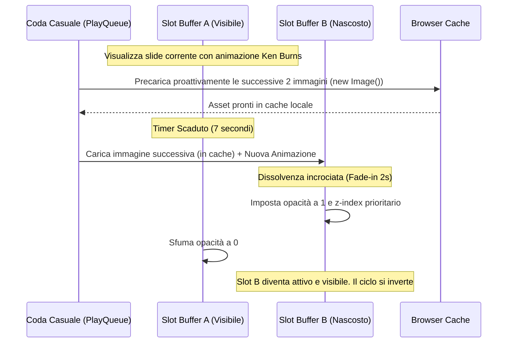

# Modulo Village — Sfondo Immersivo & Ottimizzazione Media

Documentazione tecnica del frontend, del sistema di slideshow con effetti cinematografici e delle tecniche di ottimizzazione delle immagini per il sito principale "Flower Power Village" (Koh Phayam, Thailandia). Questo documento è progettato per fungere da archivio di conoscenza per Gemini Notebook.

---

## 1. Stack Tecnologico

L'esperienza visiva del sito si basa su un'interfaccia fortemente immersiva con transizioni fluide di immagini ad alta definizione, ottimizzate per ridurre i tempi di caricamento e migliorare la fluidità delle animazioni.

*   **Frontend UI & Framework:** React 18.3 + TypeScript 5.5, integrato con Vite 8.x.
*   **Styling & Layout:** Tailwind CSS 3.4 per la reattività del posizionamento e delle query di container.
*   **Ottimizzazione Immagini (Image CDN Proxy):** Proxy open-source `wsrv.nl` per comprimere, convertire in WebP e ridimensionare dinamicamente le immagini ospitate su Supabase Storage.
*   **Media Helper Centralizzato:** [mediaConfig.ts](file:///d:/WEB%20SITE%20Antigravity/flowerpowervillage/src/lib/mediaConfig.ts) per la gestione centralizzata dei preset di risoluzione e qualità delle immagini del sito.
*   **Cinematic Slideshow:** Componente personalizzato [VillageSlideshow.tsx](file:///d:/WEB%20SITE%20Antigravity/flowerpowervillage/src/components/VillageSlideshow.tsx) per la gestione a doppio buffer del carosello di sfondo con effetti di pan e zoom in stile "Ken Burns".
*   **GPU Acceleration:** Proprietà CSS native (`will-change`, `backface-visibility`, `perspective`) per forzare il rendering via hardware e prevenire cali di framerate (FPS drop) durante le animazioni.

---

## 2. Flussi Logici

Il modulo gestisce la visualizzazione delle immagini di sfondo a schermo intero sia per la landing page split-screen, sia per le sezioni principali del villaggio.

### A. Algoritmo di Ripartizione Casuale (Fisher-Yates Queue)
Per evitare la visualizzazione ripetuta della stessa immagine e garantire un'alternanza dinamica costante:
1.  All'avvio, il componente inizializza una coda casuale di indici degli alloggi usando un algoritmo di rimescolamento di Fisher-Yates (`refillQueue`).
2.  Per prevenire lo sfarfallio o la visualizzazione dello stesso alloggio all'intersezione tra due cicli consecutivi, il primo elemento della nuova coda viene confrontato con l'ultimo visualizzato e scambiato se identico.

### B. Gestione del Doppio Buffer (Buffer Swapping & Preloading)


---

## 3. Configurazioni Chiave

### Preset delle Immagini (`mediaConfig.ts`)
Il file definisce cinque profili di ottimizzazione per bilanciare qualità visiva e consumo di banda:

```typescript
export const IMAGE_PRESETS = {
  mobile: { width: 800, quality: 80 },       // Griglie/caroselli per smartphone
  desktop: { width: 1400, quality: 80 },     // Slideshow e sfondi standard su desktop
  detail: { width: 1200, quality: 85 },      // Immagini di dettaglio degli alloggi
  thumbnail: { width: 400, quality: 75 },    // Anteprime ed elementi piccoli
  'ken-burns': { width: 2000, quality: 90 }, // Risoluzione 2K per zoom continui fluidi
};
```

### Parametri di Timing e Slide
*   `SLIDE_DURATION`: 7000ms (tempo totale di visualizzazione di ciascuna camera).
*   `FADE_DURATION`: 2000ms (tempo di transizione/dissolvenza incrociata tra i due buffer).
*   `SLIDES`: Array statico contenente il percorso della cartella e dell'immagine originale su Supabase Storage, associando un `origin` specifico (es. `20% 80%` per Jungle Villa Left) per guidare il fuoco visivo durante lo zoom Ken Burns.

---

## 4. Problem Solving & Ottimizzazioni UX

### A. Risoluzione della Sgranatura in Fase di Zoom (Effetto Ken Burns)
*   **Problema:** Gli slideshow animati con trasformazioni `scale` (zoom in/out) tendevano a sgranarsi o a mostrare pixel sfocati sui monitor ad alta risoluzione (Retina o 4K) in quanto l'immagine di partenza veniva caricata a risoluzioni desktop standard.
*   **Soluzione:** Introdotto il preset dedicato `'ken-burns'` in `mediaConfig.ts`. Questo preset richiede al proxy `wsrv.nl` un'immagine con larghezza **2K (2000px)** e qualità al **90%**. In questo modo, l'ingrandimento progressivo fino al 128% mantiene una nitidezza ottimale senza dover caricare il file raw originale (che peserebbe oltre 5MB).

### B. Reset delle Animazioni CSS in React
*   **Problema:** Quando il carosello alternava lo slot attivo ma assegnava lo stesso effetto di movimento keyframe, il browser ottimizzava il rendering evitando di riavviare l'animazione da zero. La slide successiva appariva ferma o scattava a metà corsa.
*   **Soluzione:** È stata introdotta una chiave di stato `animVer` (versione animazione) alternata ciclicamente tra `1` e `2` per ogni buffer. Nel foglio di stile CSS del componente sono state configurate classi duplicate per ogni effetto (es. `.kb-diagonal-up-left-v1` e `.kb-diagonal-up-left-v2`). Questo cambio di classe forza il browser a dereferenziare lo stile precedente e a resettare/far ripartire istantaneamente l'animazione keyframe.

### C. Ottimizzazione delle Prestazioni su Dispositivi Mobili (FPS Drop)
*   **Problema:** Le animazioni di trasformazione continua del layout su grandi sfondi causavano vistosi cali di framerate su smartphone e tablet a causa del continuo ricalcolo della rasterizzazione delle immagini.
*   **Soluzione:** La classe globale `.cinematic-img` è stata ottimizzata forzando la gestione via hardware da parte della GPU. Questo si ottiene applicando le seguenti proprietà CSS:
    *   `will-change: transform` (informa preventivamente la GPU che l'elemento subirà spostamenti).
    *   `backface-visibility: hidden` e `perspective: 1000px` (creano un contesto di rendering 3D, spostando l'elaborazione dal thread principale del browser al processore grafico).

### D. Auto-Scroll Checkout e Allineamento Ambienti Multi-Postazione
* **Problema:** Nel passaggio tra postazioni (Laptop -> Desktop), la mancanza delle variabili `STRIPE_TARGET` nel file `.env.local` provocava il fallimento 500 dell'API `/api/create-checkout-session` con l'errore frontend `Unexpected token 'A', "A server e"... is not valid JSON`. Inoltre, selezionando una camera il form di prenotazione non si posizionava in automatico nella viewport.
* **Soluzione:**
  1. Allineate le credenziali ambiente locali tramite `VAULT-SYNC` (`node scratch/vault-sync.mjs decrypt`), configurando `STRIPE_TARGET=TEST` ed eseguendo il test di verifica [test-credentials-verification.mjs](file:///d:/Antigravity%20-%20Sviluppo%20Website/flower-power-village-bolt/flowerpowervillage/scratch/test-credentials-verification.mjs).
  2. Introdotto in [booking-engine.tsx](file:///d:/Antigravity%20-%20Sviluppo%20Website/flower-power-village-bolt/flowerpowervillage/src/booking/components/booking-engine.tsx) un riferimento `checkoutSectionRef` con `scrollIntoView({ behavior: "smooth", block: "start" })` e classe Tailwind `scroll-mt-6` per posizionare l'utente all'inizio della sezione di completamento dati immediatamente dopo la scelta della camera.

---

## 5. Mappatura Database Octorate (Fonte di Verità Assoluta)

Tutti gli alloggi del resort e i relativi piani tariffari (Booking Engine `BE`, Standard `7d/14d`, `AC`, `bnb`, `Agoda`, `AirBnB`) sono catalogati e mappati nel file di riferimento [.agents/docs_octorate.md](file:///d:/Antigravity%20-%20Sviluppo%20Website/flower-power-village-bolt/flowerpowervillage/.agents/docs_octorate.md).
