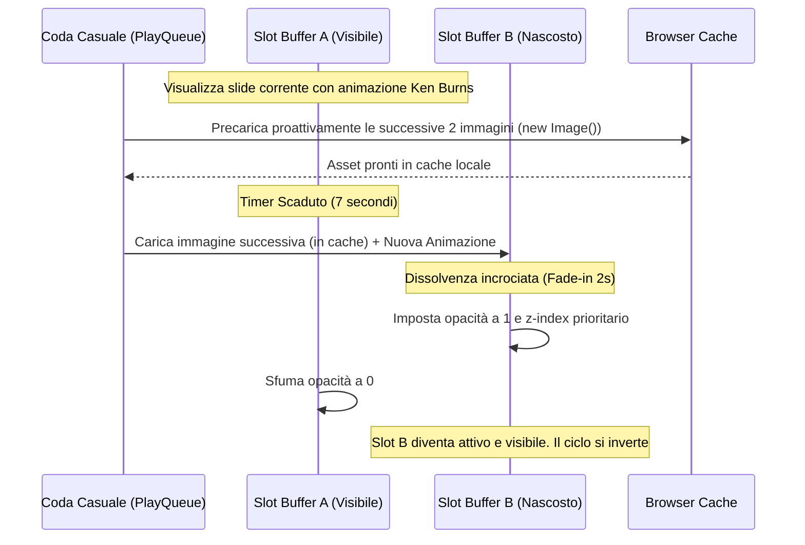

# Modulo Village — Sfondo Immersivo & Ottimizzazione Media

Documentazione tecnica del frontend, del sistema di slideshow con effetti cinematografici e delle tecniche di ottimizzazione delle immagini per il sito principale "Flower Power Village" (Koh Phayam, Thailandia). Questo documento è progettato per fungere da archivio di conoscenza per Gemini Notebook.

---

## 1. Stack Tecnologico

L'esperienza visiva del sito si basa su un'interfaccia fortemente immersiva con transizioni fluide di immagini ad alta definizione, ottimizzate per ridurre i tempi di caricamento e migliorare la fluidità delle animazioni.

*   **Frontend UI & Framework:** React 18.3 + TypeScript 5.5, integrato con Vite 8.x.
*   **Styling & Layout:** Tailwind CSS 3.4 per la reattività del posizionamento e delle query di container.
*   **Ottimizzazione Immagini (Image CDN Proxy):** Proxy open-source `wsrv.nl` per comprimere, convertire in WebP e ridimensionare dinamicamente le immagini ospitate su Supabase Storage.
*   **Media Helper Centralizzato:** [mediaConfig.ts](file:///d:/WEB%20SITE%20Antigravity/flowerpowervillage/src/lib/mediaConfig.ts) per la gestione centralizzata dei preset di risoluzione e qualità delle immagini del sito.
*   **Cinematic Slideshow:** Componente personalizzato [VillageSlideshow.tsx](file:///d:/WEB%20SITE%20Antigravity/flowerpowervillage/src/components/VillageSlideshow.tsx) per la gestione a doppio buffer del carosello di sfondo con effetti di pan e zoom in stile "Ken Burns".
*   **GPU Acceleration:** Proprietà CSS native (`will-change`, `backface-visibility`, `perspective`) per forzare il rendering via hardware e prevenire cali di framerate (FPS drop) durante le animazioni.

---

## 8. Modulo Soggiorno Minimo Dinamico (Gap-Fill) & Calendario Visivo Alloggi

### Architecture & Rules (Puro Gap-Fill Tabula Rasa)
- **Baseline Stagionale Pura (Tabula Rasa su Octorate)**:
  - **1 Nov - 20 Dec**: 2 notti.
  - **21 Dec - 15 Jan (Peak Season)**: 5 notti.
  - **16 Jan - 31 Mar**: 3 notti standard, **2 notti** se `arrivalDate - today <= 30` giorni.
  - **1 Apr - 31 Oct (Low Season)**: 2 notti.
- **Puro Gap-Filling (Ignora Density Pricing)**:
  - Se il buco tra due prenotazioni $G = \text{checkIn}_{\text{next}} - \text{checkOut}_{\text{prev}} < \text{baseline}$: applica `minStay = G` (**🔴 Cerchio Rosso Animato** in Simulazione Dry-Run, **🟢 Cerchio Verde Scuro** in Produzione).
  - Se $G \ge \text{baseline}$: **Non fa nulla** (Mantiene Cerchio Giallo Standard).
- **Controllo Check-out vs Stop Sell**:
  - Nel giorno di checkout (`isCheckoutDay`), se `stopSell === true` (o camera chiusa), la cella DEVE RIMANERE **ROSSA (Stop Sell / Chiuso)**. Se `stopSell === false`, torna **VERDE (Libera)**.
- **Formattazione Nomi Cliente**:
  - Mostra sempre prima il Cognome e poi il Nome (es. `"Sheppard Peter"`).

---

## 2. Flussi Logici

Il modulo gestisce la visualizzazione delle immagini di sfondo a schermo intero sia per la landing page split-screen, sia per le sezioni principali del villaggio.

### A. Algoritmo di Ripartizione Casuale (Fisher-Yates Queue)
Per evitare la visualizzazione ripetuta della stessa immagine e garantire un'alternanza dinamica costante:
1.  All'avvio, il componente inizializza una coda casuale di indici degli alloggi usando un algoritmo di rimescolamento di Fisher-Yates (`refillQueue`).
2.  Per prevenire lo sfarfallio o la visualizzazione dello stesso alloggio all'intersezione tra due cicli consecutivi, il primo elemento della nuova coda viene confrontato con l'ultimo visualizzato e scambiato se identico.

### B. Gestione del Doppio Buffer (Buffer Swapping & Preloading)

```mermaid
sequenceDiagram
    participant Coda as Coda Casuale (PlayQueue)
    participant SlotA as Slot Buffer A (Visibile)
    participant SlotB as Slot Buffer B (Nascosto)
    participant Browser as Browser Cache

    Note over SlotA: Visualizza slide corrente con animazione Ken Burns
    Coda->>Browser: Precarica proattivamente le successive 2 immagini (new Image())
    Browser-->>Coda: Asset pronti in cache locale
    Note over SlotA: Timer Scaduto (7 secondi)
    Coda->>SlotB: Carica immagine successiva (in cache) + Nuova Animazione
    Note over SlotB: Dissolvenza incrociata (Fade-in 2s)
    SlotB->>SlotB: Imposta opacità a 1 e z-index prioritario
    SlotA->>SlotA: Sfuma opacità a 0
    Note over SlotB: Slot B diventa attivo e visibile. Il ciclo si inverte
```

---

## 3. Configurazioni Chiave

### Preset delle Immagini (`mediaConfig.ts`)
Il file definisce cinque profili di ottimizzazione per bilanciare qualità visiva e consumo di banda:

```typescript
export const IMAGE_PRESETS = {
  mobile: { width: 800, quality: 80 },       // Griglie/caroselli per smartphone
  desktop: { width: 1400, quality: 80 },     // Slideshow e sfondi standard su desktop
  detail: { width: 1200, quality: 85 },      // Immagini di dettaglio degli alloggi
  thumbnail: { width: 400, quality: 75 },    // Anteprime ed elementi piccoli
  'ken-burns': { width: 2000, quality: 90 }, // Risoluzione 2K per zoom continui fluidi
};
```

### Parametri di Timing e Slide
*   `SLIDE_DURATION`: 7000ms (tempo totale di visualizzazione di ciascuna camera).
*   `FADE_DURATION`: 2000ms (tempo di transizione/dissolvenza incrociata tra i due buffer).
*   `SLIDES`: Array statico contenente il percorso della cartella e dell'immagine originale su Supabase Storage, associando un `origin` specifico (es. `20% 80%` per Jungle Villa Left) per guidare il fuoco visivo durante lo zoom Ken Burns.

---

## 4. Problem Solving & Ottimizzazioni UX

### A. Risoluzione della Sgranatura in Fase di Zoom (Effetto Ken Burns)
*   **Problema:** Gli slideshow animati con trasformazioni `scale` (zoom in/out) tendevano a sgranarsi o a mostrare pixel sfocati sui monitor ad alta risoluzione (Retina o 4K) in quanto l'immagine di partenza veniva caricata a risoluzioni desktop standard.
*   **Soluzione:** Introdotto il preset dedicato `'ken-burns'` in `mediaConfig.ts`. Questo preset richiede al proxy `wsrv.nl` un'immagine con larghezza **2K (2000px)** e qualità al **90%**. In questo modo, l'ingrandimento progressivo fino al 128% mantiene una nitidezza ottimale senza dover caricare il file raw originale (che peserebbe oltre 5MB).

### B. Reset delle Animazioni CSS in React
*   **Problema:** Quando il carosello alternava lo slot attivo ma assegnava lo stesso effetto di movimento keyframe, il browser ottimizzava il rendering evitando di riavviare l'animazione da zero. La slide successiva appariva ferma o scattava a metà corsa.
*   **Soluzione:** È stata introdotta una chiave di stato `animVer` (versione animazione) alternata ciclicamente tra `1` e `2` per ogni buffer. Nel foglio di stile CSS del componente sono state configurate classi duplicate per ogni effetto (es. `.kb-diagonal-up-left-v1` e `.kb-diagonal-up-left-v2`). Questo cambio di classe forza il browser a dereferenziare lo stile precedente e a resettare/far ripartire istantaneamente l'animazione keyframe.

### C. Ottimizzazione delle Prestazioni su Dispositivi Mobili (FPS Drop)
*   **Problema:** Le animazioni di trasformazione continua del layout su grandi sfondi causavano vistosi cali di framerate su smartphone e tablet a causa del continuo ricalcolo della rasterizzazione delle immagini.
*   **Soluzione:** La classe globale `.cinematic-img` è stata ottimizzata forzando la gestione via hardware da parte della GPU. Questo si ottiene applicando le seguenti proprietà CSS:
    *   `will-change: transform` (informa preventivamente la GPU che l'elemento subirà spostamenti).
    *   `backface-visibility: hidden` e `perspective: 1000px` (creano un contesto di rendering 3D, spostando l'elaborazione dal thread principale del browser al processore grafico).

### D. Auto-Scroll Checkout e Allineamento Ambienti Multi-Postazione
* **Problema:** Nel passaggio tra postazioni (Laptop -> Desktop), la mancanza delle variabili `STRIPE_TARGET` nel file `.env.local` provocava il fallimento 500 dell'API `/api/create-checkout-session` con l'errore frontend `Unexpected token 'A', "A server e"... is not valid JSON`. Inoltre, selezionando una camera il form di prenotazione non si posizionava in automatico nella viewport.
* **Soluzione:**
  1. Allineate le credenziali ambiente locali tramite `VAULT-SYNC` (`node scratch/vault-sync.mjs decrypt`), configurando `STRIPE_TARGET=TEST` ed eseguendo il test di verifica [test-credentials-verification.mjs](file:///d:/Antigravity%20-%20Sviluppo%20Website/flower-power-village-bolt/flowerpowervillage/scratch/test-credentials-verification.mjs).
  2. Introdotto in [booking-engine.tsx](file:///d:/Antigravity%20-%20Sviluppo%20Website/flower-power-village-bolt/flowerpowervillage/src/booking/components/booking-engine.tsx) un riferimento `checkoutSectionRef` con `scrollIntoView({ behavior: "smooth", block: "start" })` e classe Tailwind `scroll-mt-6` per posizionare l'utente all'inizio della sezione di completamento dati immediatamente dopo la scelta della camera.

---

## 5. Mappatura Database Octorate (Fonte di Verità Assoluta)

Tutti gli alloggi del resort e i relativi piani tariffari (Booking Engine `BE`, Standard `7d/14d`, `AC`, `bnb`, `Agoda`, `AirBnB`) sono catalogati e mappati nel file di riferimento [.agents/docs_octorate.md](file:///d:/01%20ANTIGRAVITY/flower-power-village-com/flowerpowervillage/.agents/docs_octorate.md).

### Report di Sblocco Permessi Scrittura & Allineamento ID (28/07/2026)
* **Sblocco Permessi Write Access (`READWRITE`)**:
  - Il supporto Octorate ha ufficialmente sbloccato i permessi di scrittura per la struttura `#366879` sul nostro account (`permissions.accommodation = READWRITE`).
  - Verificato con test empirici GET e POST sul server locale: l'endpoint `POST /connect/rest/v1/calendar/bulk` risponde con **HTTP 200 OK** (`{"process": [483635224], "success": true}`). L'errore `403 Caller not in requested role` è ufficialmente risolto.
* **Chiarimento Tassonomia ID (Tariffa Madre vs Product ID)**:
  - L'ID `529773` rappresenta l'ID della **Tariffa Madre di Jungle Villa** (`MOCK_MOTHER_RATE_PLANS`), e non un ID camera generico.
  - È associato direttamente al prodotto del Website Booking Engine **`529784`** (Jungle Villa BE).
* **Esito Verifica Post-Test (Confronto Sincronizzazione)**:
  - Eseguita analisi con lo script [`scratch/check-jungle-villa-minstay.mjs`](file:///d:/01%20ANTIGRAVITY/flower-power-village-com/flowerpowervillage/scratch/check-jungle-villa-minstay.mjs) paginato su 200 prodotti.
  - Risultato per la data odierna (`2026-07-28`): sia la Tariffa Madre (`529773`) sia il prodotto Booking Engine (`529784`) risultano perfettamente allineati con **`minStay: 2 notti`**, prezzo **2290 THB**, disponibilità 1, stopSells `false`.
* **Stato Integrazione & Alternative**:
  - La richiesta di upgrade inviata a `openapi@octorate.com` risulta evasa con successo.
  - Non è più necessario valutare il passaggio o la migrazione verso Beds24 per questo problema di autorizzazione.

---

## 6. Calendario Visivo Resort Admin & Diagnostica API Octorate (REST v1)

### A. Dashboard Amministrativa (`ResortVisualCalendar.tsx`)
* **Architettura Integrata:** Modulo riservato sotto `/admin` con store Zustand locale ([useResortAdminStore.ts](file:///d:/Antigravity%20-%20Sviluppo%20Website/flower-power-village-bolt/flowerpowervillage/src/admin/resort/store/useResortAdminStore.ts)) ed helper ([octorateAdmin.ts](file:///d:/Antigravity%20-%20Sviluppo%20Website/flower-power-village-bolt/flowerpowervillage/src/admin/resort/lib/octorateAdmin.ts)).
* **Baseline Stagionale Soggiorno Minimo:**
  * Fino al 20 Dicembre: **2 notti**
  * Dal 21 Dicembre al 15 Gennaio (Altissima Stagione): **5 notti**
  * Dal 16 Gennaio in poi: **2 notti**
* **Interfaccia Pulita:** Griglia visiva 18 alloggi con legenda agenzie (Booking.com, Expedia, Agoda, Diretto, Stop Sell) e gestione reattiva locale.

### B. Diagnostica Capacità API Octorate REST v1
* **Script Diagnostico Isolato:** [`scratch/test-octorate-capabilities.mjs`](file:///d:/01%20ANTIGRAVITY/flower-power-village-com/flowerpowervillage/scratch/test-octorate-capabilities.mjs) e [`scratch/test-octorate-write-capability.mjs`](file:///d:/01%20ANTIGRAVITY/flower-power-village-com/flowerpowervillage/scratch/test-octorate-write-capability.mjs) per testare in sicurezza la lettura e le capacità di scrittura del PMS.
* **Risultati Empirici di Scrittura & Lettura:**
  * `GET https://api.octorate.com/connect/rest/v1/calendar/366879`: **`200 OK`** (Lettura griglia del calendario e restrizioni `minStay` perfettamente operative).
  * `GET https://api.octorate.com/connect/rest/v1/api/configuration`: **`200 OK`** (Permessi identificati: `permissions.accommodation = READWRITE`).
  * `POST https://api.octorate.com/connect/rest/v1/calendar/bulk`: **`200 OK`** (**Scrittura Sbloccata & Verificata**! Esito server: `{"process": [483635224], "success": true}`). L'errore `403 Caller not in requested role` è superato.
* **Isolamento e Sicurezza:** Nessuna alterazione non autorizzata al Booking Engine del sito pubblico ([src/booking/](file:///d:/01%20ANTIGRAVITY/flower-power-village-com/flowerpowervillage/src/booking/)).

---

## 7. Report Allineamento Fuso Orario Thailandia & Fix Calendario Visivo (30/07/2026)

* **Allineamento 1:1 Fuso Orario (`Asia/Bangkok` GMT+7)**:
  - **Causa slittamento 1 giorno indietro**: I timestamp ISO UTC inviati da Octorate (es. `2026-12-31T17:00:00Z`) venivano tagliati a stringa con `.slice(0, 10)`, estraendo `2026-12-31` anziché la data locale thailandese `2027-01-01`.
  - **Soluzione**: Applicato l'helper `toThailandDateStr` sia nel backend (`api/_handlers/octorate.ts`) sia nel frontend (`ResortVisualCalendar.tsx`) per forzare la formattazione `Intl.DateTimeFormat` sul fuso `Asia/Bangkok`. Ora le date di check-in e check-out coincidono al 100% con il PMS Octorate.
* **Fix Matching Room IDs (`getIdsForRoom`)**:
  - Risolto il problema per cui *"jungle villa"* intercettava per errore *"jungle villa right"*, impostando la priorità per corrispondenza esatta delle chiavi.
* **Gestione Artefatto Giorno di Check-out (`isCheckoutDay`)**:
  - Nel giorno di check-out dell'ospite uscente, il blocco di occupazione di Octorate viene trattato come un artefatto: se il resort è aperto ed il prezzo è valido, la cella torna **VERDE (libera)** per il check-in del nuovo ospite.
* **Selettore Data Nativo (Picker Data)**:
  - Aggiunto un menu a tendina/picker data accanto al pulsante `30gg Succ` che permette di saltare istantaneamente a qualsiasi data iniziale desiderata.
* **Personalizzazione Badge Canali OTA**:
  - Canale `BOOKING`: impostato su testo `BOOKING` in colore blu cobalto (`#003580`).
  - Canale `Expedia`: impostato in azzurro cielo (`bg-sky-500`).

---

## 8. Modulo Tariffe Derivate & Albero Canali Octorate 1:1 (30/07/2026)

* **Nuovo Componente Gestione Tariffe Derivate**:
  - Creata la tab dedicated **"🌳 Tariffe Derivate (Albero Octorate)"** ([`src/admin/resort/components/DerivedRatesTreeSection.tsx`](file:///d:/01%20ANTIGRAVITY/flower-power-village-com/flowerpowervillage/src/admin/resort/components/DerivedRatesTreeSection.tsx)).
* **Architettura Grafica a 2 Livelli (Octorate Tree Diagram)**:
  - **Livello 0 (Madre Master)**: Tariffa radice ventilatore base al centro in alto (es. `#529773`, `#293954`).
  - **Livello 1 (Tratto Orizzontale Trasversale)**: Disposizione rigida ed uniforme a 10 colonne: `BE` (WEBSITE) ➔ `7d` (BOOKING, EXPEDIA, AGODA) ➔ `14d` (BOOKING, EXPEDIA, AGODA) ➔ `Main bnb-14d` (BOOKING, EXPEDIA) ➔ `Main bnb-7d` (BOOKING, EXPEDIA) ➔ `AC7d` (BOOKING, EXPEDIA) ➔ `AC14d` (BOOKING, EXPEDIA) ➔ `AGD AC-7d` (AGODA) ➔ `AGD AC-14d` (AGODA) ➔ `AirBnB` (AIRBNB).
  - **Livello 2 (Sub-Derivazioni AC Verticali)**: Sub-nodi che derivano direttamente dai padri di 1° livello con stelo di collegamento: `AirBnB AC` (deriva da `AirBnB` con `+400฿ AMR`), `AC bnb-7d` (deriva da `AC7d` con `+200฿ AMR`), `AC bnb-14d` (deriva da `AC14d` con `+200฿ AMR`).
* **Sincronizzazione Totale 212 Codici Prodotto Octorate**:
  - Allineati al 100% tutti i **212 codici prodotto univoci Octorate** forniti per i 18 alloggi sia nell'Albero sia nella Mappa di Riconoscimento Automatica del Calendario (`ResortVisualCalendar.tsx`).
* **Sequenza Canonica Alloggi**:
  - Tutti i 18 alloggi (Ville, Bungalows, Glamping Tents, Hub Guesthouse Rooms/Lodges) sono disposti nella medesima sequenza del Calendario Visivo e del Sito Web.

---

## 9. Audit Completo Octorate-Supabase & Affinamento Calendario (01/08/2026)

* **Audit & Re-sync ID Prenotazioni (`scratch/audit-all-octorate-bookings.mjs`)**:
  - Implementato uno script di audit avanzato per scansionare tutte le prenotazioni storiche da Octorate e Supabase, risolvendo discrepanze di ID alloggio e normalizzando i nomi.
* **Affinamento Logica MinStay Dinamico (`octorateAdmin.ts`)**:
  - Semplificata la pulizia dei nomi camera in `calculateDynamicMinStay` mantenendo il nome alloggio nativo sanitizzato `(b.accommodation_name || b.accommodation_id || 'unknown').trim()`.
* **Sincronizzazione Webhook & API Route (`api/_handlers/octorate.ts` e `api/_handlers/octorate-webhook.ts`)**:
  - Verificato l'allineamento dei payload ricevuti dai webhook Octorate e ottimizzata la conversione delle date nel fuso orario thailandese `Asia/Bangkok`.

---

## 10. Risoluzione Errore HTTP 404 Supabase `reservations` & Ripristino Fetch Octorate (01/08/2026)

* **Eliminazione Chiamate Errate a Supabase (`reservations`)**:
  - Rimosse tutte le chiamate `supabaseAdmin.from('reservations')` in `api/_handlers/octorate.ts` e `api/_handlers/octorate-webhook.ts`. La tabella `reservations` non esiste nello schema Supabase.
* **Refactoring Serverless Endpoint (`/api/resort/octorate-bookings`)**:
  - L'endpoint backend legge in modo sicuro `access_token` da `octorate_tokens` mediante `SUPABASE_SERVICE_ROLE_KEY`.
  - Interroga direttamente le API REST v1 ufficiali di Octorate (`GET https://api.octorate.com/connect/rest/v1/reservation/366879`) per recuperare tutte le prenotazioni in tempo reale.
* **Verifica Empirica & TypeScript**:
  - Test con `scratch/test-octorate-bookings-endpoint.mjs`: recuperate **23 prenotazioni reali** (Agoda, Booking.com, Airbnb, etc.) con HTTP 200 OK.
  - Verificato con `npx tsc --noEmit` (**0 errori sui tipi**).

---

## 11. Monitor Visivo Live Tariffe Derivate & Sanity Check Prezzi (01/08/2026)

* **Espansione Serverless Endpoint (`/api/resort/octorate-grid`)**:
  - Eliminato il blocco anticipato al superamento dei 36 nodi BE: l'endpoint scarica ed espone in `data` tutti i **240 rate plans live** forniti dal PMS Octorate.
* **Integrazione Store & Feedback Visivo Nodi (`DerivedRatesTreeSection.tsx`)**:
  - Collegato lo store Zustand (`rawOctorateGridItems`) al componente grafico dell'albero.
  - Renderizzato per ciascun nodo (Madre, Livello 1, Livello 2) il prezzo live, il MinStay e lo stato colorato: **Verde Smeraldo** per le tariffe aperte e vendibili, **Rosso Vivo (con icona 🔒 STOP SELL)** per le tariffe in stop-sell o chiuse.
* **Sanity Check Automatico (Discrepanze Prezzi)**:
  - Implementata la verifica automatica delle regole matematiche (`checkPriceSanity`): confronta il prezzo live con quello atteso dal calcolo con il nodo padre (es. `+200฿`, `+400฿`, `-10%`).
  - Se viene rilevata una discrepanza, il nodo mostra un **bordo dorato lampeggiante** ed il badge d'avviso `⚠️ Atteso ฿X`.


