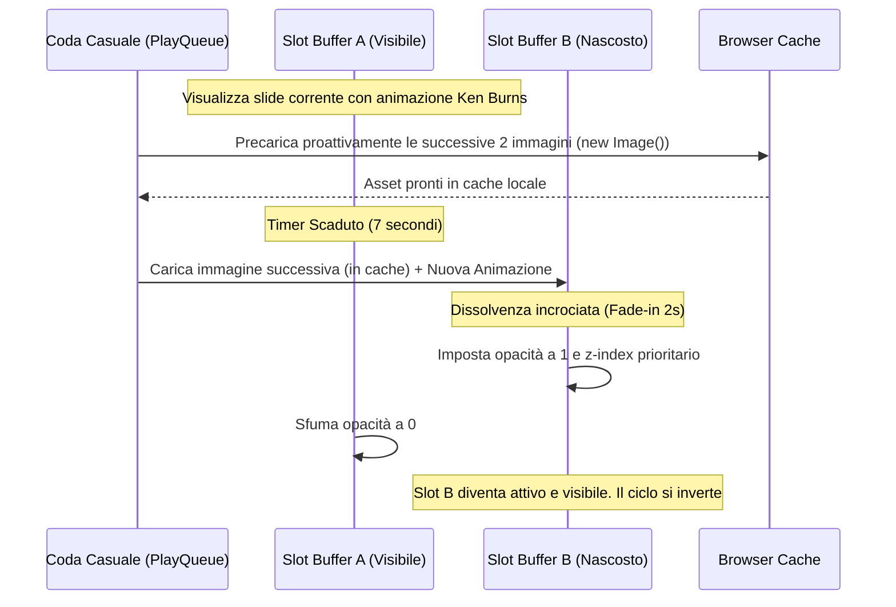

# Modulo Village — Sfondo Immersivo & Ottimizzazione Media

Documentazione tecnica del frontend, del sistema di slideshow con effetti cinematografici e delle tecniche di ottimizzazione delle immagini per il sito principale "Flower Power Village" (Koh Phayam, Thailandia). Questo documento è progettato per fungere da archivio di conoscenza per Gemini Notebook.

---

## 1. Stack Tecnologico

L'esperienza visiva del sito si basa su un'interfaccia fortemente immersiva con transizioni fluide di immagini ad alta definizione, ottimizzate per ridurre i tempi di caricamento e migliorare la fluidità delle animazioni.

*   **Frontend UI & Framework:** React 18.3 + TypeScript 5.5, integrato con Vite 8.x.
*   **Styling & Layout:** Tailwind CSS 3.4 per la reattività del posizionamento e delle query di container.
*   **Ottimizzazione Immagini (Image CDN Proxy):** Proxy open-source `wsrv.nl` per comprimere, convertire in WebP e ridimensionare dinamicamente le immagini ospitate su Supabase Storage.
*   **Media Helper Centralizzato:** [mediaConfig.ts](file:///d:/WEB%20SITE%20Antigravity/flowerpowervillage/src/lib/mediaConfig.ts) per la gestione centralizzata dei preset di risoluzione e qualità delle immagini del sito.
*   **Cinematic Slideshow:** Componente personalizzato [VillageSlideshow.tsx](file:///d:/WEB%20SITE%20Antigravity/flowerpowervillage/src/components/VillageSlideshow.tsx) per la gestione a doppio buffer del carosello di sfondo con effetti di pan e zoom in stile "Ken Burns".
*   **GPU Acceleration:** Proprietà CSS native (`will-change`, `backface-visibility`, `perspective`) per forzare il rendering via hardware e prevenire cali di framerate (FPS drop) durante le animazioni.

---

## 8. Modulo Soggiorno Minimo Dinamico (Gap-Fill) & Calendario Visivo Alloggi

### Architecture & Rules (Puro Gap-Fill Tabula Rasa)
- **Baseline Stagionale Pura (Tabula Rasa su Octorate)**:
  - **1 Nov - 20 Dec**: 2 notti.
  - **21 Dec - 15 Jan (Peak Season)**: 5 notti.
  - **16 Jan - 31 Mar**: 3 notti standard, **2 notti** se `arrivalDate - today <= 30` giorni.
  - **1 Apr - 31 Oct (Low Season)**: 2 notti.
- **Puro Gap-Filling (Ignora Density Pricing)**:
  - Se il buco tra due prenotazioni $G = \text{checkIn}_{\text{next}} - \text{checkOut}_{\text{prev}} < \text{baseline}$: applica `minStay = G` (**🔴 Cerchio Rosso Animato** in Simulazione Dry-Run, **🟢 Cerchio Verde Scuro** in Produzione).
  - Se $G \ge \text{baseline}$: **Non fa nulla** (Mantiene Cerchio Giallo Standard).
- **Controllo Check-out vs Stop Sell**:
  - Nel giorno di checkout (`isCheckoutDay`), se `stopSell === true` (o camera chiusa), la cella DEVE RIMANERE **ROSSA (Stop Sell / Chiuso)**. Se `stopSell === false`, torna **VERDE (Libera)**.
- **Formattazione Nomi Cliente**:
  - Mostra sempre prima il Cognome e poi il Nome (es. `"Sheppard Peter"`).
- **Header Statico Unificato & Menu Navigazione Singola Riga**: Header `Gestione Resort & Booking Engine` e il menu tabs (`PRENOTAZIONI`, `CALENDARIO 30`, `CALENDARIO 365`, `CARATTERISTICHE ALLOGGI`, `PREZZI ALLOGGI`, `ALBERO DERIVATE`, `GESTIONE TARIFFE DERIVATE`, `MESSAGGI CLIENTI`, `OCTORATE PMS`) integrati in un unico contenitore statico in `ResortDashboard.tsx`. Il menu nav adotta un layout a riga singola senza a capo (`flex-nowrap`, zero scrollbar), tipografia massimizzata (`11px` -> `15px font-black`), spaziatura ottimizzata ridotta di 2px (`gap-[2px]` -> `gap-1.5`, `px-1.5` -> `px-2.5`).
  - **Riposizionamento Barra di Ricerca**: La barra di ricerca (`Cerca ospite, email, camera...`) ed il controllo reset prenotazioni nascoste sono stati rimossi dal menu delle tab e posizionati nella riga superiore dell'header, subito dopo il pulsante `Sincronizza`.
  - **Rimozione Tab "IMPORTA SPECIFICHE"**: Rimosso completamente il pulsante ed il relativo pannello dalla plancia di controllo.
  - **Visual Calendar Layout (38px x 33px)**: `ResortVisualCalendar.tsx` adotta una prima colonna alloggi fissa da 130px (`w-[130px] min-w-[130px] max-w-[130px]`), celle giorno con larghezza fissa 38px (`w-[38px] min-w-[38px] max-w-[38px]`), altezza riga 33px (`h-[33px]`), e zoom inline del 90% (`style={{ zoom: 0.9 }}`) per il perfetto adattamento ad una singola schermata.
  - **Cockpit 5 Canali**: Barra inferiore a 5 slot equidistanti (`B`, `A`, `Ab`, `-`, `S`) con la lettera `'S'` che indica lo stato attivo del listino Standard 7d.

---

## 9. Modulo Gestione Tariffe Derivate & Sincronizzazione Live Octorate (Aggiornato)

### Architettura & Mappatura ID Esatti Octorate
- **Gantt Proporzionale (6px/giorno)**: Schede a posizionamento assoluto continuo lungo la timeline Ottobre 2026 - Ottobre 2027.
- **Titoli Schede Personalizzati per Piano**: Ciascun modulo Gantt mostra nel titolo il codice esatto della tariffa corrispondente (`BE`, `7d`, `Main bnb-7d`, `Main bnb-14d`, `AGD AC-7d`, `AGD AC-14d`, `AirBnB`, `AirBnB AC`, `AC7d`, `AC14d`, `AC bnb-7d`, `AC bnb-14d`).
- **Standardizzazione Dicitura STOP SALE**: Corretto il termine in tutta la UI e nello Store (`STOP SALE` al posto di `STOP SELL`).
- **Sezione Albero Tariffe Derivate Intelligente**:
  - Verifica automatica delle tariffe impostate in Stop Sale tutto l'anno dalla Gestione Tariffe Derivate, colorando la scheda del piano in rosso scuro con badge `NON IN USO (STOP SALE)`.
  - Selettore di data dinamico con calendario a tendina dark, pulsante rapido `[ OGGI ]`, e apertura predefinita con rilevamento automatico della data odierna.
- **Larghezza Card Clamped (`min-w-[148px]`)**: Ogni scheda periodo garantisce una larghezza minima di 148px in modo che i selettori di data (`INIZIO` e `FINE`), l'icona del cestino e i controlli Only Check Out siano sempre visibili, selezionabili e perfettamente cliccabili.
- **Cancellazione 1-Click con Trascinamento a Catena**: Possibilità di cancellare qualsiasi periodo con opzione di trascinamento automatico dei periodi successivi per colmare lo spazio.
- **Riconciliazione CTA nel Parser Octorate Grid (`octorate-restrictions-grid.ts`)**: Il backend riconcilia automaticamente le giornate di arrivi chiusi (CTA) immediatamente successive all'apertura, incorporandole come proprietà `onlyCheckoutDays` all'interno della scheda di apertura per garantire perfetta parità 1:1 tra Tabella 1 (Pianificata) e Tabella 2 (Live Octorate) ed eliminare i falsi positivi nel comparatore discrepanze.
- **Uniformazione Grafica Tabella 1 e Tabella 2**: Schede Live renderizzate con identica geometria, palette cromatica nativa per tariffa, posizionamento e saldatura della capsula Only Check-Out gialla/ambra adiacente (`rounded-l-2xl rounded-r-none border-r-0`).
- **Toolbar Superiore Unificata su Singola Riga**:
  - `[ Timeline Pianificata ]` / `[ Timeline Live Octorate ]` (Toggle Viste)
  - `[ SYNC DERIVATE TEST ]` (Verde Smeraldo con protezione anti-click 3s)
  - `[ SYNC DERIVATE PRODUZIONE ]` (Rosso Vivo con modale di sicurezza bloccante)
  - `[ Reset Defaults ]` (Posizionato per ultimo)
- **Barra Intestazione Tabella Gantt**:
  - `[ Evidenzia Discrepanze ]` (Attivazione/disattivazione confronto visivo)
  - `[ Copia da Tabella 2 a Timeline Pianificata ]` (Sincronizzazione Live -> Pianificata con doppia conferma)
- **Mappatura ID Esatti camera Madre Sentinella Jungle Villa (`529773`)**:
  L'endpoint Serverless [`api/resort/octorate-restrictions-grid.ts`](file:///d:/WEB%20SITE%20Antigravity/flowerpowervillage/api/resort/octorate-restrictions-grid.ts) mappa i 12 piani tariffari direttamente sugli ID fisici univoci dei prodotti Octorate:
  - `BE` (Official Booking Engine): **`529784`** (3 periodi reali: Aperto Oct-Nov, Bloccato Dec-Apr, Aperto May)
  - `7d` (Standard 7d): **`529778`**
  - `main_bnb_7d`: **`529788`**
  - `main_bnb_14d`: **`529792`** (3 periodi reali: Bloccato Oct-Dec19, Aperto 75gg Only CO Dec20-Mar31, Bloccato Apr-May)
  - `ac_7d`: **`529780`**
  - `ac_14d`: **`529781`**
  - `ac_bnb_7d`: **`916816`**
  - `ac_bnb_14d`: **`529801`**
  - `agd_ac_7d`: **`921868`**
  - `agd_ac_14d`: **`921869`**
  - `airbnb`: **`529783`**
  - `airbnb_ac`: **`529813`**
- **Auto-Refresh OAuth & Inoltro Serverless**:
  - Rinnovo automatico del token OAuth (`refresh_token`) su risposte Octorate `ApiLoginExpired`.
  - Endpoint fisico dedicato `/api/resort/octorate-restrictions-grid` per aggirare le restrizioni di routing del file system Vercel.

---

## 2. Flussi Logici

Il modulo gestisce la visualizzazione delle immagini di sfondo a schermo intero sia per la landing page split-screen, sia per le sezioni principali del villaggio.

### A. Algoritmo di Ripartizione Casuale (Fisher-Yates Queue)
Per evitare la visualizzazione ripetuta della stessa immagine e garantire un'alternanza dinamica costante:
1.  All'avvio, il componente inizializza una coda casuale di indici degli alloggi usando un algoritmo di rimescolamento di Fisher-Yates (`refillQueue`).
2.  Per prevenire lo sfarfallio o la visualizzazione dello stesso alloggio all'intersezione tra due cicli consecutivi, il primo elemento della nuova coda viene confrontato con l'ultimo visualizzato e scambiato se identico.

### B. Gestione del Doppio Buffer (Buffer Swapping & Preloading)

```mermaid
sequenceDiagram
    participant Coda as Coda Casuale (PlayQueue)
    participant SlotA as Slot Buffer A (Visibile)
    participant SlotB as Slot Buffer B (Nascosto)
    participant Browser as Browser Cache

    Note over SlotA: Visualizza slide corrente con animazione Ken Burns
    Coda->>Browser: Precarica proattivamente le successive 2 immagini (new Image())
    Browser-->>Coda: Asset pronti in cache locale
    Note over SlotA: Timer Scaduto (7 secondi)
    Coda->>SlotB: Carica immagine successiva (in cache) + Nuova Animazione
    Note over SlotB: Dissolvenza incrociata (Fade-in 2s)
    SlotB->>SlotB: Imposta opacità a 1 e z-index prioritario
    SlotA->>SlotA: Sfuma opacità a 0
    Note over SlotB: Slot B diventa attivo e visibile. Il ciclo si inverte
```

---

## 3. Configurazioni Chiave

### Preset delle Immagini (`mediaConfig.ts`)
Il file definisce cinque profili di ottimizzazione per bilanciare qualità visiva e consumo di banda:

```typescript
export const IMAGE_PRESETS = {
  mobile: { width: 800, quality: 80 },       // Griglie/caroselli per smartphone
  desktop: { width: 1400, quality: 80 },     // Slideshow e sfondi standard su desktop
  detail: { width: 1200, quality: 85 },      // Immagini di dettaglio degli alloggi
  thumbnail: { width: 400, quality: 75 },    // Anteprime ed elementi piccoli
  'ken-burns': { width: 2000, quality: 90 }, // Risoluzione 2K per zoom continui fluidi
};
```

### Parametri di Timing e Slide
*   `SLIDE_DURATION`: 7000ms (tempo totale di visualizzazione di ciascuna camera).
*   `FADE_DURATION`: 2000ms (tempo di transizione/dissolvenza incrociata tra i due buffer).
*   `SLIDES`: Array statico contenente il percorso della cartella e dell'immagine originale su Supabase Storage, associando un `origin` specifico (es. `20% 80%` per Jungle Villa Left) per guidare il fuoco visivo durante lo zoom Ken Burns.

---

## 4. Problem Solving & Ottimizzazioni UX

### A. Risoluzione della Sgranatura in Fase di Zoom (Effetto Ken Burns)
*   **Problema:** Gli slideshow animati con trasformazioni `scale` (zoom in/out) tendevano a sgranarsi o a mostrare pixel sfocati sui monitor ad alta risoluzione (Retina o 4K) in quanto l'immagine di partenza veniva caricata a risoluzioni desktop standard.
*   **Soluzione:** Introdotto il preset dedicato `'ken-burns'` in `mediaConfig.ts`. Questo preset richiede al proxy `wsrv.nl` un'immagine con larghezza **2K (2000px)** e qualità al **90%**. In questo modo, l'ingrandimento progressivo fino al 128% mantiene una nitidezza ottimale senza dover caricare il file raw originale (che peserebbe oltre 5MB).

### B. Reset delle Animazioni CSS in React
*   **Problema:** Quando il carosello alternava lo slot attivo ma assegnava lo stesso effetto di movimento keyframe, il browser ottimizzava il rendering evitando di riavviare l'animazione da zero. La slide successiva appariva ferma o scattava a metà corsa.
*   **Soluzione:** È stata introdotta una chiave di stato `animVer` (versione animazione) alternata ciclicamente tra `1` e `2` per ogni buffer. Nel foglio di stile CSS del componente sono state configurate classi duplicate per ogni effetto (es. `.kb-diagonal-up-left-v1` e `.kb-diagonal-up-left-v2`). Questo cambio di classe forza il browser a dereferenziare lo stile precedente e a resettare/far ripartire istantaneamente l'animazione keyframe.

### C. Ottimizzazione delle Prestazioni su Dispositivi Mobili (FPS Drop)
*   **Problema:** Le animazioni di trasformazione continua del layout su grandi sfondi causavano vistosi cali di framerate su smartphone e tablet a causa del continuo ricalcolo della rasterizzazione delle immagini.
*   **Soluzione:** La classe globale `.cinematic-img` è stata ottimizzata forzando la gestione via hardware da parte della GPU. Questo si ottiene applicando le seguenti proprietà CSS:
    *   `will-change: transform` (informa preventivamente la GPU che l'elemento subirà spostamenti).
    *   `backface-visibility: hidden` e `perspective: 1000px` (creano un contesto di rendering 3D, spostando l'elaborazione dal thread principale del browser al processore grafico).

### D. Auto-Scroll Checkout e Allineamento Ambienti Multi-Postazione
* **Problema:** Nel passaggio tra postazioni (Laptop -> Desktop), la mancanza delle variabili `STRIPE_TARGET` nel file `.env.local` provocava il fallimento 500 dell'API `/api/create-checkout-session` con l'errore frontend `Unexpected token 'A', "A server e"... is not valid JSON`. Inoltre, selezionando una camera il form di prenotazione non si posizionava in automatico nella viewport.
* **Soluzione:**
  1. Allineate le credenziali ambiente locali tramite `VAULT-SYNC` (`node scratch/vault-sync.mjs decrypt`), configurando `STRIPE_TARGET=TEST` ed eseguendo il test di verifica [test-credentials-verification.mjs](file:///d:/Antigravity%20-%20Sviluppo%20Website/flower-power-village-bolt/flowerpowervillage/scratch/test-credentials-verification.mjs).
  2. Introdotto in [booking-engine.tsx](file:///d:/Antigravity%20-%20Sviluppo%20Website/flower-power-village-bolt/flowerpowervillage/src/booking/components/booking-engine.tsx) un riferimento `checkoutSectionRef` con `scrollIntoView({ behavior: "smooth", block: "start" })` e classe Tailwind `scroll-mt-6` per posizionare l'utente all'inizio della sezione di completamento dati immediatamente dopo la scelta della camera.

---

## 5. Mappatura Database Octorate (Fonte di Verità Assoluta)

Tutti gli alloggi del resort e i relativi piani tariffari (Booking Engine `BE`, Standard `7d/14d`, `AC`, `bnb`, `Agoda`, `AirBnB`) sono catalogati e mappati nel file di riferimento [.agents/docs_octorate.md](file:///d:/01%20ANTIGRAVITY/flower-power-village-com/flowerpowervillage/.agents/docs_octorate.md).

### Report di Sblocco Permessi Scrittura & Allineamento ID (28/07/2026)
* **Sblocco Permessi Write Access (`READWRITE`)**:
  - Il supporto Octorate ha ufficialmente sbloccato i permessi di scrittura per la struttura `#366879` sul nostro account (`permissions.accommodation = READWRITE`).
  - Verificato con test empirici GET e POST sul server locale: l'endpoint `POST /connect/rest/v1/calendar/bulk` risponde con **HTTP 200 OK** (`{"process": [483635224], "success": true}`). L'errore `403 Caller not in requested role` è ufficialmente risolto.
* **Chiarimento Tassonomia ID (Tariffa Madre vs Product ID)**:
  - L'ID `529773` rappresenta l'ID della **Tariffa Madre di Jungle Villa** (`MOCK_MOTHER_RATE_PLANS`), e non un ID camera generico.
  - È associato direttamente al prodotto del Website Booking Engine **`529784`** (Jungle Villa BE).
* **Esito Verifica Post-Test (Confronto Sincronizzazione)**:
  - Eseguita analisi con lo script [`scratch/check-jungle-villa-minstay.mjs`](file:///d:/01%20ANTIGRAVITY/flower-power-village-com/flowerpowervillage/scratch/check-jungle-villa-minstay.mjs) paginato su 200 prodotti.
  - Risultato per la data odierna (`2026-07-28`): sia la Tariffa Madre (`529773`) sia il prodotto Booking Engine (`529784`) risultano perfettamente allineati con **`minStay: 2 notti`**, prezzo **2290 THB**, disponibilità 1, stopSells `false`.
* **Stato Integrazione & Alternative**:
  - La richiesta di upgrade inviata a `openapi@octorate.com` risulta evasa con successo.
  - Non è più necessario valutare il passaggio o la migrazione verso Beds24 per questo problema di autorizzazione.

---

## 6. Calendario Visivo Resort Admin & Diagnostica API Octorate (REST v1)

### A. Dashboard Amministrativa (`ResortVisualCalendar.tsx`)
* **Architettura Integrata:** Modulo riservato sotto `/admin` con store Zustand locale ([useResortAdminStore.ts](file:///d:/WEB%20SITE%20Antigravity/flowerpowervillage/src/admin/resort/store/useResortAdminStore.ts)) ed helper ([octorateAdmin.ts](file:///d:/WEB%20SITE%20Antigravity/flowerpowervillage/src/admin/resort/lib/octorateAdmin.ts)).
* **Copertura 20/20 Alloggi (Inclusi Fake Bungalow 1 & 2):**
  - Mappatura esaustiva di tutti i 20 alloggi compresi gli ambienti di test Fake Bungalow 1 (`beId: 932244`, Mother `#649669`) e Fake Bungalow 2 (`beId: 932257`, Mother `#921799`).
* **Calcolo Indicatori Derivati (B, A, S):**
  - Normalizzazione blindata degli ID tramite `extractNormalizedId`.
  - Indicatori derivati sovrapposti sulla cella senza alterarne lo sfondo: **B** (Main BnB), **A** (Agoda AC), **S** (Standard 7d con blocco stagionale invernale `2026-12-01` ➔ `2027-04-30`).
* **Sfondo Cella Legato Esclusivamente alla Disponibilità Reale della Madre:**
  - `isMotherClosed` calcolato unicamente sulla presenza di `stopSells: true` o prezzo `≥ 10.000 ฿` sulla Tariffa Madre, escludendo filtri errati su `bookable: false`.
* **Protezione Sovrascrittura Madre (`octorate.ts`):**
  - In `fetchOctorateMonthlyGrid`, rimossa l'ingerenza di `bookable: false` ed implementata la guardia `existing && isPrimaryBEItem(item) && existing.stopSell === false` che impedisce ai listini derivati BE di sovrascrivere lo stato aperto della Tariffa Madre in memoria.
* **Navigazione Rapida Datepicker ("VAI alla Data"):**
  - `handleExecuteDateJump` riposiziona in automatico lo `startIndex` nella modalità a 30 giorni rendendo visibile la colonna target prima di eseguire lo scroll fluido DOM via `colElement.scrollIntoView`.

### B. Diagnostica Capacità API Octorate REST v1
* **Script Diagnostico Isolato:** [`scratch/test-octorate-capabilities.mjs`](file:///d:/WEB%20SITE%20Antigravity/flowerpowervillage/scratch/test-octorate-capabilities.mjs) e [`scratch/ispeziona-dicembre-live.mjs`](file:///d:/WEB%20SITE%20Antigravity/flowerpowervillage/scratch/ispeziona-dicembre-live.mjs) per testare in sicurezza la lettura e le capacità di scrittura del PMS.
* **Risultati Empirici di Scrittura & Lettura:**
  * `GET https://api.octorate.com/connect/rest/v1/calendar/366879`: **`200 OK`** (Lettura griglia del calendario e restrizioni `minStay` perfettamente operative).
  * `GET https://api.octorate.com/connect/rest/v1/api/configuration`: **`200 OK`** (Permessi identificati: `permissions.accommodation = READWRITE`).
  * `POST https://api.octorate.com/connect/rest/v1/calendar/bulk`: **`200 OK`** (**Scrittura Sbloccata & Verificata**! Esito server: `{"process": [...], "success": true}`). Bulk Stop Sell e riaperture stagionali perfettamente operativi su Octorate PMS.
* **Isolamento e Sicurezza:** Nessuna alterazione non autorizzata al Booking Engine del sito pubblico ([src/booking/](file:///d:/WEB%20SITE%20Antigravity/flowerpowervillage/src/booking/)).

---

## 7. Report Allineamento Fuso Orario Thailandia & Fix Calendario Visivo (30/07/2026)

* **Allineamento 1:1 Fuso Orario (`Asia/Bangkok` GMT+7)**:
  - **Causa slittamento 1 giorno indietro**: I timestamp ISO UTC inviati da Octorate (es. `2026-12-31T17:00:00Z`) venivano tagliati a stringa con `.slice(0, 10)`, estraendo `2026-12-31` anziché la data locale thailandese `2027-01-01`.
  - **Soluzione**: Applicato l'helper `toThailandDateStr` sia nel backend (`api/_handlers/octorate.ts`) sia nel frontend (`ResortVisualCalendar.tsx`) per forzare la formattazione `Intl.DateTimeFormat` sul fuso `Asia/Bangkok`. Ora le date di check-in e check-out coincidono al 100% con il PMS Octorate.
* **Fix Matching Room IDs (`getIdsForRoom`)**:
  - Risolto il problema per cui *"jungle villa"* intercettava per errore *"jungle villa right"*, impostando la priorità per corrispondenza esatta delle chiavi.
* **Gestione Artefatto Giorno di Check-out (`isCheckoutDay`)**:
  - Nel giorno di check-out dell'ospite uscente, il blocco di occupazione di Octorate viene trattato come un artefatto: se il resort è aperto ed il prezzo è valido, la cella torna **VERDE (libera)** per il check-in del nuovo ospite.
* **Selettore Data Nativo (Picker Data)**:
  - Aggiunto un menu a tendina/picker data accanto al pulsante `30gg Succ` che permette di saltare istantaneamente a qualsiasi data iniziale desiderata.
* **Personalizzazione Badge Canali OTA**:
  - Canale `BOOKING`: impostato su testo `BOOKING` in colore blu cobalto (`#003580`).
  - Canale `Expedia`: impostato in azzurro cielo (`bg-sky-500`).

---

## 8. Modulo Tariffe Derivate & Albero Canali Octorate 1:1 (30/07/2026)

* **Nuovo Componente Gestione Tariffe Derivate**:
  - Creata la tab dedicated **"🌳 Tariffe Derivate (Albero Octorate)"** ([`src/admin/resort/components/DerivedRatesTreeSection.tsx`](file:///d:/01%20ANTIGRAVITY/flower-power-village-com/flowerpowervillage/src/admin/resort/components/DerivedRatesTreeSection.tsx)).
* **Architettura Grafica a 2 Livelli (Octorate Tree Diagram)**:
  - **Livello 0 (Madre Master)**: Tariffa radice ventilatore base al centro in alto (es. `#529773`, `#293954`).
  - **Livello 1 (Tratto Orizzontale Trasversale)**: Disposizione rigida ed uniforme a 10 colonne: `BE` (WEBSITE) ➔ `7d` (BOOKING, EXPEDIA, AGODA) ➔ `14d` (BOOKING, EXPEDIA, AGODA) ➔ `Main bnb-14d` (BOOKING, EXPEDIA) ➔ `Main bnb-7d` (BOOKING, EXPEDIA) ➔ `AC7d` (BOOKING, EXPEDIA) ➔ `AC14d` (BOOKING, EXPEDIA) ➔ `AGD AC-7d` (AGODA) ➔ `AGD AC-14d` (AGODA) ➔ `AirBnB` (AIRBNB).
  - **Livello 2 (Sub-Derivazioni AC Verticali)**: Sub-nodi che derivano direttamente dai padri di 1° livello con stelo di collegamento: `AirBnB AC` (deriva da `AirBnB` con `+400฿ AMR`), `AC bnb-7d` (deriva da `AC7d` con `+200฿ AMR`), `AC bnb-14d` (deriva da `AC14d` con `+200฿ AMR`).
* **Sincronizzazione Totale 212 Codici Prodotto Octorate**:
  - Allineati al 100% tutti i **212 codici prodotto univoci Octorate** forniti per i 18 alloggi sia nell'Albero sia nella Mappa di Riconoscimento Automatica del Calendario (`ResortVisualCalendar.tsx`).
* **Sequenza Canonica Alloggi**:
  - Tutti i 18 alloggi (Ville, Bungalows, Glamping Tents, Hub Guesthouse Rooms/Lodges) sono disposti nella medesima sequenza del Calendario Visivo e del Sito Web.

---

## 9. Audit Completo Octorate-Supabase & Affinamento Calendario (01/08/2026)

* **Audit & Re-sync ID Prenotazioni (`scratch/audit-all-octorate-bookings.mjs`)**:
  - Implementato uno script di audit avanzato per scansionare tutte le prenotazioni storiche da Octorate e Supabase, risolvendo discrepanze di ID alloggio e normalizzando i nomi.
* **Affinamento Logica MinStay Dinamico (`octorateAdmin.ts`)**:
  - Semplificata la pulizia dei nomi camera in `calculateDynamicMinStay` mantenendo il nome alloggio nativo sanitizzato `(b.accommodation_name || b.accommodation_id || 'unknown').trim()`.
* **Sincronizzazione Webhook & API Route (`api/_handlers/octorate.ts` e `api/_handlers/octorate-webhook.ts`)**:
  - Verificato l'allineamento dei payload ricevuti dai webhook Octorate e ottimizzata la conversione delle date nel fuso orario thailandese `Asia/Bangkok`.

---

## 10. Risoluzione Errore HTTP 404 Supabase `reservations` & Ripristino Fetch Octorate (01/08/2026)

* **Eliminazione Chiamate Errate a Supabase (`reservations`)**:
  - Rimosse tutte le chiamate `supabaseAdmin.from('reservations')` in `api/_handlers/octorate.ts` e `api/_handlers/octorate-webhook.ts`. La tabella `reservations` non esiste nello schema Supabase.
* **Refactoring Serverless Endpoint (`/api/resort/octorate-bookings`)**:
  - L'endpoint backend legge in modo sicuro `access_token` da `octorate_tokens` mediante `SUPABASE_SERVICE_ROLE_KEY`.
  - Interroga direttamente le API REST v1 ufficiali di Octorate (`GET https://api.octorate.com/connect/rest/v1/reservation/366879`) per recuperare tutte le prenotazioni in tempo reale.
* **Verifica Empirica & TypeScript**:
  - Test con `scratch/test-octorate-bookings-endpoint.mjs`: recuperate **23 prenotazioni reali** (Agoda, Booking.com, Airbnb, etc.) con HTTP 200 OK.
  - Verificato con `npx tsc --noEmit` (**0 errori sui tipi**).

---

## 11. Monitor Visivo Live Tariffe Derivate & Sanity Check Prezzi (01/08/2026)

* **Espansione Serverless Endpoint (`/api/resort/octorate-grid`)**:
  - Eliminato il blocco anticipato al superamento dei 36 nodi BE: l'endpoint scarica ed espone in `data` tutti i **240 rate plans live** forniti dal PMS Octorate.
* **Integrazione Store & Feedback Visivo Nodi (`DerivedRatesTreeSection.tsx`)**:
  - Collegato lo store Zustand (`rawOctorateGridItems`) al componente grafico dell'albero.
  - Renderizzato per ciascun nodo (Madre, Livello 1, Livello 2) il prezzo live, il MinStay e lo stato colorato: **Verde Smeraldo** per le tariffe aperte e vendibili, **Rosso Vivo (con icona 🔒 STOP SELL)** per le tariffe in stop-sell o chiuse.
* **Sanity Check Automatico (Discrepanze Prezzi)**:
  - Implementata la verifica automatica delle regole matematiche (`checkPriceSanity`): confronta il prezzo live con quello atteso dal calcolo con il nodo padre (es. `+200฿`, `+400฿`, `-10%`).
  - Se viene rilevata una discrepanza, il nodo mostra un **bordo dorato lampeggiante** ed il badge d'avviso `⚠️ Atteso ฿X`.

## 12. Mappatura Tariffe Derivate Fake Bungalow & Categoria TEST Isolata (01/08/2026)

### ⚠️ REGOLA D'ORO API OCTORATE — Registrata nelle Istruzioni Core
- La direttiva inderogabile **"Scrivere SOLO sulla Tariffa Madre (Livello 0)"** è stata aggiunta in prima posizione assoluta in `.agentinstructions` e `.agents/AGENTS.md`.
- Tutte le chiamate `POST`/`PUT`/`PATCH` per prezzi, `min_stay` o availability **devono colpire esclusivamente l'ID Madre** (es. `649669`, `921799`). È vietato scrivere su derivate Livello 1/2.

### Mappatura Completa ID Tariffe Derivate Fake Bungalow (`octorateAdmin.ts`, `ResortVisualCalendar.tsx`)
- **Fake Bungalow 1** (Madre: `649669`) — 13 derivate mappate: `932243`→`932255`.
- **Fake Bungalow 2** (Madre: `921799`) — 13 derivate mappate: `932256`→`932268`.
- Aggiornati gli array `ids[]` in `ALL_ACCOMMODATIONS_MAP` (`octorateAdmin.ts`) e in `ResortVisualCalendar.tsx`.

### Albero Tariffe Derivate (`DerivedRatesTreeSection.tsx`)
- Aggiunti gli schemi gerarchici completi (Madre → Livello 1 → Livello 2) per **Fake Bungalow 1** e **Fake Bungalow 2** nel `COMPLETE_DERIVATION_SCHEMES`.
- **Categoria `TEST`** aggiunta al union type `AccommodationTreeScheme`: `'Villa' | 'Bungalow' | 'Glamping' | 'Hub Guesthouse' | 'TEST'`.
- I Fake Bungalow sono ora classificati `category: 'TEST'` (non più `'BUNGALOW'`), separandoli visivamente dalle unità di produzione.

### Separazione Visiva & Filtro "Ambiente di Test" (`DerivedRatesTreeSection.tsx`, `ResortVisualCalendar.tsx`)
- **Calendario Visivo**: Aggiunto bottone filtro `🧪 Ambiente di Test (2)` dopo "Hub Guesthouse".
- **Albero Tariffe**: Aggiunto separatore visivo dedicato `🛠️ AMBIENTE DI SIMULAZIONE E TEST (Scollegato dalle OTA)` prima degli alberi dei Fake Bungalow.
- **`accommodations.ts`**: Tipo `RoomType.category` esteso con `'TEST'`; Fake Bungalow 1 e 2 ora classificati `'TEST'`.

### Bug Fix Runtime
- **`ReferenceError: React is not defined`**: Aggiunto `import React` in `DerivedRatesTreeSection.tsx` (necessario per `<React.Fragment key={...}>`).
- **`ReferenceError: AGENCY_DIRECT is not defined`**: Sostituita la costante inesistente `AGENCY_DIRECT` con `AGENCY_WEBSITE` per le tariffe BE dei Fake Bungalow.
- **Simbolo `฿` corrotto (`เธฟ`)**: Riscritto il file con PowerShell UTF-8 corretto dopo corruzione encoding; 139 simboli ripristinati.
- **Blocco codice duplicato**: Rimosso tramite splice PowerShell il doppio blocco Fake Bungalow lasciato da un replace parziale.

---

## 13. Refactoring Calendario Visivo Alloggi, Griglia Continua & Sincronizzazione Anti-Freeze (03/08/2026)

### A. Layout a Griglia Continua (Scorrimento Orizzontale da Oggi al 31 Ottobre Y+1)
- Rimosse le vecchie paginazioni a 30 giorni ("30gg Prec" / "30gg Succ").
- Il calendario genera una matrice continuativa a scorrimento orizzontale nativo (`overflow-x-auto`) che si estende da **Oggi (Asia/Bangkok)** fino al **31 Ottobre dell'anno successivo** (`year + 1`), coprendo l'intera stagione del resort (~450 giorni).

### B. Download Sequenziale Mese per Mese & Cache in Memoria (`useResortAdminStore.ts`)
- **Paginazione API Octorate (`size=20`)**: Octorate limita le query massive restituendo errori `errPageSize`. L'endpoint serverless (`/api/resort/octorate-bookings`) cicla sulle pagine (`size=20`, `page=0, 1, 2...`) aggregando i dati lato Node.js.
- **Download Sequenziale Visivo**: La funzione `downloadSeasonSequential()` scarica le prenotazioni un mese alla volta aggiornando la barra di avanzamento (`0%` → `100%`).
- **Cache in Memoria (Zero Reload al Cambio Tab)**: Al montaggio del componente, se `seasonDownloadStatus === 'completed'` e i dati sono presenti in memoria (`rawOctorateBookings`), il download viene saltato e la griglia viene renderizzata all'istante.
- **Pulsante `Sync Live`**: Consente di forzare la pulizia della cache in memoria e riavviare il download sequenziale della stagione.

### C. DatePicker 100% Passivo (Uncontrolled via `useRef`)
- **Zero React Re-renders**: Rimosse le proprietà `value` e `onChange` legate allo stato React. L'input `<input type="date">` è *uncontrolled* con `ref={dateInputRef}` e `defaultValue={toThailandDateStr(new Date())}`.
- **Apertura su Intero Campo**: L'evento `onClick={(e) => e.currentTarget.showPicker()}` apre la tendina del calendario nativo al click in qualsiasi punto dell'input.
- **Ricerca in 2 Step con Tasto `[🔎 Vai]`**: L mevento click del tasto "Vai" legge il valore direttamente dal DOM (`dateInputRef.current?.value`) ed invoca:
  ```ts
  colElement.scrollIntoView({ behavior: 'smooth', block: 'nearest', inline: 'start' });
  ```
  ancorando la colonna selezionata a sinistra.

### D. Scudo Anti-Lag (`React.memo` per `CalendarCell`)
- Estratta la logica di rendering della singola cella giornaliera nel componente dedicato:
  ```tsx
  const CalendarCell = React.memo(function CalendarCell({ ... }) { ... });
  ```
- Impedisce il ricalcolo delle oltre 9.000 celle durante lo scroll o l'apertura delle modali, mantenendo l'interfaccia a 60fps.

### E. Overlay Bloccante Assoluto & Sincronizzazione Event Loop (Double rAF)
- **Overlay Fullscreen Bloccante**: `fixed inset-0 w-screen h-screen z-50 bg-stone-950/95 pointer-events-auto` copre l me intera viewport e blocca ogni interazione accidentale dell me utente durante il montaggio del DOM.
- **Timing Blindato a 2 Fasi & Event Loop (Doppio rAF)**:
  - Fase 1: Al completamento del download viene attivato l'overlay (`showOverlay = true`, `mountHeavyGrid = false`).
  - Fase 2: Un `setTimeout(500ms)` garantisce al browser il tempo di dipingere il sipario scuro.
  - Fase 3: Scattati i 500ms, si attiva `setMountHeavyGrid(true)` avviando la costruzione del DOM.
  - Fase 4: La disattivazione dell'overlay è sincronizzata con l'Event Loop nativo tramite doppio `requestAnimationFrame`:
    ```ts
    rafId1 = requestAnimationFrame(() => {
      rafId2 = requestAnimationFrame(() => {
        timerId = setTimeout(() => setShowOverlay(false), 300);
      });
    });
    ```
    Se il dispositivo è lento ed impiega diversi secondi per calcolare il layout delle 9.000 celle, `requestAnimationFrame` posticipa l'esecuzione fino al reale completamento del paint, mantenendo l'overlay protettivo per tutto il tempo necessario.

---

## 14. Motore Sconti Last-Minute a Cascata (3 Stadi) & Fix Prezzo Reale (03/08/2026)

### A. Dry-Run Simulation nel Calendario Visivo

- **Fonte Prezzo Corretta**: Il motore Dry-Run legge il prezzo giornaliero reale dalla Tariffa Madre direttamente da `rawOctorateGridItems` (flat array Octorate `{id, name, days:[{date, price}]}`).
- **Logica Match**: Ricerca l'item il cui `id` corrisponde **esattamente** al `motherId`. Fallback a qualsiasi ID dell'alloggio solo se la madre non è nel download.
- **Formula**: `discountedPrice = Math.round(realPrice - (realPrice * discountPct / 100))`.
- **Skip automatico**: Se la data non ha prezzo reale (stop-sell, camera chiusa), la simulazione salta la cella.

### B. Struttura 3 Stadi Sequenziali

| Stadio | Giorni Offset | Durata | Sconto Default | UI |
|---|---|---|---|---|
| Stadio 1: Imminente | 0 – 2 | 3 gg | -10% | 🔴 `bg-red-950/30 border-red-500/40` |
| Stadio 2: Intermedio | 3 – 5 | 3 gg | -5% | 🟠 `bg-orange-950/30 border-orange-500/40` |
| Stadio 3: Esteso | 6 – 9 | 4 gg | -2.5% | 🟡 `bg-yellow-950/30 border-yellow-600/40` |

### C. Modalità Esecuzione (Bivio a 3 Livelli)

```
executionMode:
  'simulation'      → Dry-Run locale, zero API. Anteprima ciano nel Calendario Visivo.
  'test_bungalows'  → Invia SOLO a Fake Bungalow 1 (649669) e 2 (921799).
  'production'      → Invia a TUTTE le Tariffe Madri reali del resort.
```

### D. Feedback Visivo Cella (CalendarCell)

- **Sfondo cella**: rimane `bg-emerald-600` — NON cambia colore.
- **Prezzo**: `text-cyan-300` + `👁️ ฿{scontato} 📉`.
- **Badge**: `bg-cyan-950/90 text-cyan-200 border-cyan-400/80` → `-X% (BE ฿{...})`.
---

## 6. Calendario Visivo Resort Admin & Diagnostica API Octorate (REST v1)

### A. Dashboard Amministrativa (`ResortVisualCalendar.tsx`)
* **Architettura Integrata:** Modulo riservato sotto `/admin` con store Zustand locale ([useResortAdminStore.ts](file:///d:/Antigravity%20-%20Sviluppo%20Website/flower-power-village-bolt/flowerpowervillage/src/admin/resort/store/useResortAdminStore.ts)) ed helper ([octorateAdmin.ts](file:///d:/Antigravity%20-%20Sviluppo%20Website/flower-power-village-bolt/flowerpowervillage/src/admin/resort/lib/octorateAdmin.ts)).
* **Baseline Stagionale Soggiorno Minimo:**
  * Fino al 20 Dicembre: **2 notti**
  * Dal 21 Dicembre al 15 Gennaio (Altissima Stagione): **5 notti**
  * Dal 16 Gennaio in poi: **2 notti**
* **Interfaccia Pulita:** Griglia visiva 18 alloggi con legenda agenzie (Booking.com, Expedia, Agoda, Diretto, Stop Sell) e gestione reattiva locale.

### B. Diagnostica Capacità API Octorate REST v1
* **Script Diagnostico Isolato:** [`scratch/test-octorate-capabilities.mjs`](file:///d:/01%20ANTIGRAVITY/flower-power-village-com/flowerpowervillage/scratch/test-octorate-capabilities.mjs) e [`scratch/test-octorate-write-capability.mjs`](file:///d:/01%20ANTIGRAVITY/flower-power-village-com/flowerpowervillage/scratch/test-octorate-write-capability.mjs) per testare in sicurezza la lettura e le capacità di scrittura del PMS.
* **Risultati Empirici di Scrittura & Lettura:**
  * `GET https://api.octorate.com/connect/rest/v1/calendar/366879`: **`200 OK`** (Lettura griglia del calendario e restrizioni `minStay` perfettamente operative).
  * `GET https://api.octorate.com/connect/rest/v1/api/configuration`: **`200 OK`** (Permessi identificati: `permissions.accommodation = READWRITE`).
  * `POST https://api.octorate.com/connect/rest/v1/calendar/bulk`: **`200 OK`** (**Scrittura Sbloccata & Verificata**! Esito server: `{"process": [483635224], "success": true}`). L'errore `403 Caller not in requested role` è superato.
* **Isolamento e Sicurezza:** Nessuna alterazione non autorizzata al Booking Engine del sito pubblico ([src/booking/](file:///d:/01%20ANTIGRAVITY/flower-power-village-com/flowerpowervillage/src/booking/)).

---

## 7. Report Allineamento Fuso Orario Thailandia & Fix Calendario Visivo (30/07/2026)

* **Allineamento 1:1 Fuso Orario (`Asia/Bangkok` GMT+7)**:
  - **Causa slittamento 1 giorno indietro**: I timestamp ISO UTC inviati da Octorate (es. `2026-12-31T17:00:00Z`) venivano tagliati a stringa con `.slice(0, 10)`, estraendo `2026-12-31` anziché la data locale thailandese `2027-01-01`.
  - **Soluzione**: Applicato l'helper `toThailandDateStr` sia nel backend (`api/_handlers/octorate.ts`) sia nel frontend (`ResortVisualCalendar.tsx`) per forzare la formattazione `Intl.DateTimeFormat` sul fuso `Asia/Bangkok`. Ora le date di check-in e check-out coincidono al 100% con il PMS Octorate.
* **Fix Matching Room IDs (`getIdsForRoom`)**:
  - Risolto il problema per cui *"jungle villa"* intercettava per errore *"jungle villa right"*, impostando la priorità per corrispondenza esatta delle chiavi.
* **Gestione Artefatto Giorno di Check-out (`isCheckoutDay`)**:
  - Nel giorno di check-out dell'ospite uscente, il blocco di occupazione di Octorate viene trattato come un artefatto: se il resort è aperto ed il prezzo è valido, la cella torna **VERDE (libera)** per il check-in del nuovo ospite.
* **Selettore Data Nativo (Picker Data)**:
  - Aggiunto un menu a tendina/picker data accanto al pulsante `30gg Succ` che permette di saltare istantaneamente a qualsiasi data iniziale desiderata.
* **Personalizzazione Badge Canali OTA**:
  - Canale `BOOKING`: impostato su testo `BOOKING` in colore blu cobalto (`#003580`).
  - Canale `Expedia`: impostato in azzurro cielo (`bg-sky-500`).

---

## 8. Modulo Tariffe Derivate & Albero Canali Octorate 1:1 (30/07/2026)

* **Nuovo Componente Gestione Tariffe Derivate**:
  - Creata la tab dedicated **"🌳 Tariffe Derivate (Albero Octorate)"** ([`src/admin/resort/components/DerivedRatesTreeSection.tsx`](file:///d:/01%20ANTIGRAVITY/flower-power-village-com/flowerpowervillage/src/admin/resort/components/DerivedRatesTreeSection.tsx)).
* **Architettura Grafica a 2 Livelli (Octorate Tree Diagram)**:
  - **Livello 0 (Madre Master)**: Tariffa radice ventilatore base al centro in alto (es. `#529773`, `#293954`).
  - **Livello 1 (Tratto Orizzontale Trasversale)**: Disposizione rigida ed uniforme a 10 colonne: `BE` (WEBSITE) ➔ `7d` (BOOKING, EXPEDIA, AGODA) ➔ `14d` (BOOKING, EXPEDIA, AGODA) ➔ `Main bnb-14d` (BOOKING, EXPEDIA) ➔ `Main bnb-7d` (BOOKING, EXPEDIA) ➔ `AC7d` (BOOKING, EXPEDIA) ➔ `AC14d` (BOOKING, EXPEDIA) ➔ `AGD AC-7d` (AGODA) ➔ `AGD AC-14d` (AGODA) ➔ `AirBnB` (AIRBNB).
  - **Livello 2 (Sub-Derivazioni AC Verticali)**: Sub-nodi che derivano direttamente dai padri di 1° livello con stelo di collegamento: `AirBnB AC` (deriva da `AirBnB` con `+400฿ AMR`), `AC bnb-7d` (deriva da `AC7d` con `+200฿ AMR`), `AC bnb-14d` (deriva da `AC14d` con `+200฿ AMR`).
* **Sincronizzazione Totale 212 Codici Prodotto Octorate**:
  - Allineati al 100% tutti i **212 codici prodotto univoci Octorate** forniti per i 18 alloggi sia nell'Albero sia nella Mappa di Riconoscimento Automatica del Calendario (`ResortVisualCalendar.tsx`).
* **Sequenza Canonica Alloggi**:
  - Tutti i 18 alloggi (Ville, Bungalows, Glamping Tents, Hub Guesthouse Rooms/Lodges) sono disposti nella medesima sequenza del Calendario Visivo e del Sito Web.

---

## 9. Audit Completo Octorate-Supabase & Affinamento Calendario (01/08/2026)

* **Audit & Re-sync ID Prenotazioni (`scratch/audit-all-octorate-bookings.mjs`)**:
  - Implementato uno script di audit avanzato per scansionare tutte le prenotazioni storiche da Octorate e Supabase, risolvendo discrepanze di ID alloggio e normalizzando i nomi.
* **Affinamento Logica MinStay Dinamico (`octorateAdmin.ts`)**:
  - Semplificata la pulizia dei nomi camera in `calculateDynamicMinStay` mantenendo il nome alloggio nativo sanitizzato `(b.accommodation_name || b.accommodation_id || 'unknown').trim()`.
* **Sincronizzazione Webhook & API Route (`api/_handlers/octorate.ts` e `api/_handlers/octorate-webhook.ts`)**:
  - Verificato l'allineamento dei payload ricevuti dai webhook Octorate e ottimizzata la conversione delle date nel fuso orario thailandese `Asia/Bangkok`.

---

## 10. Risoluzione Errore HTTP 404 Supabase `reservations` & Ripristino Fetch Octorate (01/08/2026)

* **Eliminazione Chiamate Errate a Supabase (`reservations`)**:
  - Rimosse tutte le chiamate `supabaseAdmin.from('reservations')` in `api/_handlers/octorate.ts` e `api/_handlers/octorate-webhook.ts`. La tabella `reservations` non esiste nello schema Supabase.
* **Refactoring Serverless Endpoint (`/api/resort/octorate-bookings`)**:
  - L'endpoint backend legge in modo sicuro `access_token` da `octorate_tokens` mediante `SUPABASE_SERVICE_ROLE_KEY`.
  - Interroga direttamente le API REST v1 ufficiali di Octorate (`GET https://api.octorate.com/connect/rest/v1/reservation/366879`) per recuperare tutte le prenotazioni in tempo reale.
* **Verifica Empirica & TypeScript**:
  - Test con `scratch/test-octorate-bookings-endpoint.mjs`: recuperate **23 prenotazioni reali** (Agoda, Booking.com, Airbnb, etc.) con HTTP 200 OK.
  - Verificato con `npx tsc --noEmit` (**0 errori sui tipi**).

---

## 11. Monitor Visivo Live Tariffe Derivate & Sanity Check Prezzi (01/08/2026)

* **Espansione Serverless Endpoint (`/api/resort/octorate-grid`)**:
  - Eliminato il blocco anticipato al superamento dei 36 nodi BE: l'endpoint scarica ed espone in `data` tutti i **240 rate plans live** forniti dal PMS Octorate.
* **Integrazione Store & Feedback Visivo Nodi (`DerivedRatesTreeSection.tsx`)**:
  - Collegato lo store Zustand (`rawOctorateGridItems`) al componente grafico dell'albero.
  - Renderizzato per ciascun nodo (Madre, Livello 1, Livello 2) il prezzo live, il MinStay e lo stato colorato: **Verde Smeraldo** per le tariffe aperte e vendibili, **Rosso Vivo (con icona 🔒 STOP SELL)** per le tariffe in stop-sell o chiuse.
* **Sanity Check Automatico (Discrepanze Prezzi)**:
  - Implementata la verifica automatica delle regole matematiche (`checkPriceSanity`): confronta il prezzo live con quello atteso dal calcolo con il nodo padre (es. `+200฿`, `+400฿`, `-10%`).
  - Se viene rilevata una discrepanza, il nodo mostra un **bordo dorato lampeggiante** ed il badge d'avviso `⚠️ Atteso ฿X`.

## 12. Mappatura Tariffe Derivate Fake Bungalow & Categoria TEST Isolata (01/08/2026)

### ⚠️ REGOLA D'ORO API OCTORATE — Registrata nelle Istruzioni Core
- La direttiva inderogabile **"Scrivere SOLO sulla Tariffa Madre (Livello 0)"** è stata aggiunta in prima posizione assoluta in `.agentinstructions` e `.agents/AGENTS.md`.
- Tutte le chiamate `POST`/`PUT`/`PATCH` per prezzi, `min_stay` o availability **devono colpire esclusivamente l'ID Madre** (es. `649669`, `921799`). È vietato scrivere su derivate Livello 1/2.

### Mappatura Completa ID Tariffe Derivate Fake Bungalow (`octorateAdmin.ts`, `ResortVisualCalendar.tsx`)
- **Fake Bungalow 1** (Madre: `649669`) — 13 derivate mappate: `932243`→`932255`.
- **Fake Bungalow 2** (Madre: `921799`) — 13 derivate mappate: `932256`→`932268`.
- Aggiornati gli array `ids[]` in `ALL_ACCOMMODATIONS_MAP` (`octorateAdmin.ts`) e in `ResortVisualCalendar.tsx`.

### Albero Tariffe Derivate (`DerivedRatesTreeSection.tsx`)
- Aggiunti gli schemi gerarchici completi (Madre → Livello 1 → Livello 2) per **Fake Bungalow 1** e **Fake Bungalow 2** nel `COMPLETE_DERIVATION_SCHEMES`.
- **Categoria `TEST`** aggiunta al union type `AccommodationTreeScheme`: `'Villa' | 'Bungalow' | 'Glamping' | 'Hub Guesthouse' | 'TEST'`.
- I Fake Bungalow sono ora classificati `category: 'TEST'` (non più `'BUNGALOW'`), separandoli visivamente dalle unità di produzione.

### Separazione Visiva & Filtro "Ambiente di Test" (`DerivedRatesTreeSection.tsx`, `ResortVisualCalendar.tsx`)
- **Calendario Visivo**: Aggiunto bottone filtro `🧪 Ambiente di Test (2)` dopo "Hub Guesthouse".
- **Albero Tariffe**: Aggiunto separatore visivo dedicato `🛠️ AMBIENTE DI SIMULAZIONE E TEST (Scollegato dalle OTA)` prima degli alberi dei Fake Bungalow.
- **`accommodations.ts`**: Tipo `RoomType.category` esteso con `'TEST'`; Fake Bungalow 1 e 2 ora classificati `'TEST'`.

### Bug Fix Runtime
- **`ReferenceError: React is not defined`**: Aggiunto `import React` in `DerivedRatesTreeSection.tsx` (necessario per `<React.Fragment key={...}>`).
- **`ReferenceError: AGENCY_DIRECT is not defined`**: Sostituita la costante inesistente `AGENCY_DIRECT` con `AGENCY_WEBSITE` per le tariffe BE dei Fake Bungalow.
- **Simbolo `฿` corrotto (`เธฟ`)**: Riscritto il file con PowerShell UTF-8 corretto dopo corruzione encoding; 139 simboli ripristinati.
- **Blocco codice duplicato**: Rimosso tramite splice PowerShell il doppio blocco Fake Bungalow lasciato da un replace parziale.

---

## 13. Refactoring Calendario Visivo Alloggi, Griglia Continua & Sincronizzazione Anti-Freeze (03/08/2026)

### A. Layout a Griglia Continua (Scorrimento Orizzontale da Oggi al 31 Ottobre Y+1)
- Rimosse le vecchie paginazioni a 30 giorni ("30gg Prec" / "30gg Succ").
- Il calendario genera una matrice continuativa a scorrimento orizzontale nativo (`overflow-x-auto`) che si estende da **Oggi (Asia/Bangkok)** fino al **31 Ottobre dell'anno successivo** (`year + 1`), coprendo l'intera stagione del resort (~450 giorni).

### B. Download Sequenziale Mese per Mese & Cache in Memoria (`useResortAdminStore.ts`)
- **Paginazione API Octorate (`size=20`)**: Octorate limita le query massive restituendo errori `errPageSize`. L'endpoint serverless (`/api/resort/octorate-bookings`) cicla sulle pagine (`size=20`, `page=0, 1, 2...`) aggregando i dati lato Node.js.
- **Download Sequenziale Visivo**: La funzione `downloadSeasonSequential()` scarica le prenotazioni un mese alla volta aggiornando la barra di avanzamento (`0%` → `100%`).
- **Cache in Memoria (Zero Reload al Cambio Tab)**: Al montaggio del componente, se `seasonDownloadStatus === 'completed'` e i dati sono presenti in memoria (`rawOctorateBookings`), il download viene saltato e la griglia viene renderizzata all'istante.
- **Pulsante `Sync Live`**: Consente di forzare la pulizia della cache in memoria e riavviare il download sequenziale della stagione.

### C. DatePicker 100% Passivo (Uncontrolled via `useRef`)
- **Zero React Re-renders**: Rimosse le proprietà `value` e `onChange` legate allo stato React. L'input `<input type="date">` è *uncontrolled* con `ref={dateInputRef}` e `defaultValue={toThailandDateStr(new Date())}`.
- **Apertura su Intero Campo**: L'evento `onClick={(e) => e.currentTarget.showPicker()}` apre la tendina del calendario nativo al click in qualsiasi punto dell'input.
- **Ricerca in 2 Step con Tasto `[🔎 Vai]`**: L mevento click del tasto "Vai" legge il valore direttamente dal DOM (`dateInputRef.current?.value`) ed invoca:
  ```ts
  colElement.scrollIntoView({ behavior: 'smooth', block: 'nearest', inline: 'start' });
  ```
  ancorando la colonna selezionata a sinistra.

### D. Scudo Anti-Lag (`React.memo` per `CalendarCell`)
- Estratta la logica di rendering della singola cella giornaliera nel componente dedicato:
  ```tsx
  const CalendarCell = React.memo(function CalendarCell({ ... }) { ... });
  ```
- Impedisce il ricalcolo delle oltre 9.000 celle durante lo scroll o l'apertura delle modali, mantenendo l'interfaccia a 60fps.

### E. Overlay Bloccante Assoluto & Sincronizzazione Event Loop (Double rAF)
- **Overlay Fullscreen Bloccante**: `fixed inset-0 w-screen h-screen z-50 bg-stone-950/95 pointer-events-auto` copre l me intera viewport e blocca ogni interazione accidentale dell me utente durante il montaggio del DOM.
- **Timing Blindato a 2 Fasi & Event Loop (Doppio rAF)**:
  - Fase 1: Al completamento del download viene attivato l'overlay (`showOverlay = true`, `mountHeavyGrid = false`).
  - Fase 2: Un `setTimeout(500ms)` garantisce al browser il tempo di dipingere il sipario scuro.
  - Fase 3: Scattati i 500ms, si attiva `setMountHeavyGrid(true)` avviando la costruzione del DOM.
  - Fase 4: La disattivazione dell'overlay è sincronizzata con l'Event Loop nativo tramite doppio `requestAnimationFrame`:
    ```ts
    rafId1 = requestAnimationFrame(() => {
      rafId2 = requestAnimationFrame(() => {
        timerId = setTimeout(() => setShowOverlay(false), 300);
      });
    });
    ```
    Se il dispositivo è lento ed impiega diversi secondi per calcolare il layout delle 9.000 celle, `requestAnimationFrame` posticipa l'esecuzione fino al reale completamento del paint, mantenendo l'overlay protettivo per tutto il tempo necessario.

---

## 14. Motore Sconti Last-Minute a Cascata (3 Stadi) & Fix Prezzo Reale (03/08/2026)

### A. Dry-Run Simulation nel Calendario Visivo

- **Fonte Prezzo Corretta**: Il motore Dry-Run legge il prezzo giornaliero reale dalla Tariffa Madre direttamente da `rawOctorateGridItems` (flat array Octorate `{id, name, days:[{date, price}]}`).
- **Logica Match**: Ricerca l'item il cui `id` corrisponde **esattamente** al `motherId`. Fallback a qualsiasi ID dell'alloggio solo se la madre non è nel download.
- **Formula**: `discountedPrice = Math.round(realPrice - (realPrice * discountPct / 100))`.
- **Skip automatico**: Se la data non ha prezzo reale (stop-sell, camera chiusa), la simulazione salta la cella.

### B. Struttura 3 Stadi Sequenziali

| Stadio | Giorni Offset | Durata | Sconto Default | UI |
|---|---|---|---|---|
| Stadio 1: Imminente | 0 – 2 | 3 gg | -10% | 🔴 `bg-red-950/30 border-red-500/40` |
| Stadio 2: Intermedio | 3 – 5 | 3 gg | -5% | 🟠 `bg-orange-950/30 border-orange-500/40` |
| Stadio 3: Esteso | 6 – 9 | 4 gg | -2.5% | 🟡 `bg-yellow-950/30 border-yellow-600/40` |

### C. Modalità Esecuzione (Bivio a 3 Livelli)

```
executionMode:
  'simulation'      → Dry-Run locale, zero API. Anteprima ciano nel Calendario Visivo.
  'test_bungalows'  → Invia SOLO a Fake Bungalow 1 (649669) e 2 (921799).
  'production'      → Invia a TUTTE le Tariffe Madri reali del resort.
```

### D. Feedback Visivo Cella (CalendarCell)

- **Sfondo cella**: rimane `bg-emerald-600` — NON cambia colore.
- **Prezzo**: `text-cyan-300` + `👁️ ฿{scontato} 📉`.
- **Badge**: `bg-cyan-950/90 text-cyan-200 border-cyan-400/80` → `-X% (BE ฿{...})`.

### E. Identità Visiva Pannelli Dashboard

| Pannello | Colore |
|---|---|
| ⚡ Sconti a Cascata | `border-amber-500/40` double, `bg-amber-950/20` |
| 📏 Soggiorno Minimo Dinamico | `border-violet-500/40` double, `bg-violet-950/20` |

---

## 15. Modulo Messaggi Clienti, Newsletter & Gestione Unificata Contatti (04/08/2026)

### A. Architettura & Plancia Unificata (`NewsletterCampaignSection.tsx`)
- **Rimozione Doppioni**: Rimosso il vecchio componente duplicato `PhishingAlertSection.tsx` da `ResortDashboard.tsx`. `NewsletterCampaignSection.tsx` è ora l'unica plancia centralizzata per messaggi, newsletter e contatti resort.
- **Isolamento Visivo e DOM**: La tab `📨 Messaggi Clienti` montata in `ResortDashboard.tsx` nasconde rigorosamente tutti i moduli di ottimizzazione (KPI cards, Sconti a Cascata, Min Stay, Albero Tariffe e Calendario).

### B. Scudo "Real-Only" & Filtraggio Prenotazioni Fantasma
- **Verifica Mappatura Camere Fisiche (`isValidPhysicalBooking`)**:
  - Filtra programmaticamente le prenotazioni in ingresso da Octorate/CSV.
  - Scarta immediatamente tutte le prenotazioni virtuali/derivate recanti la sigla `BE` (es. *JV BE*, *Red BE*, *Room 1 BE*) o non appartenenti alle 18 camere fisiche reali in `ALL_ACCOMMODATIONS_MAP`.
  - Solo gli ospiti delle prenotazioni reali presenti nel calendario visivo entrano nella lista contatti.

### C. Formattazione Date Rigida & Compositore "Tabula Rasa"
- **Formattazione `gg/mm/aa` (`formatDateDDMMYY`)**: Tutte le date visualizzate in tabella, nel Modal Popup e nello storico invii adottano tassativamente il formato standard `gg/mm/aa` (es. `10/08/26`).
- **Compositore Tabula Rasa**: Tutti gli stati di input iniziali (`subject`, `message`, `campaignCode`, `senderAccount`) sono impostati a stringhe vuote (`""`) per la massima pulizia.

### D. Stato Invio Dinamico & Gestione Contatti Privi di Recapito
- **Stato Dinamico legato a `campaignCode`**:
  - Se `campaignCode` è vuoto (`""`), la tabella risponde in modalità "vergine": mostra `⚪ Pronto` per tutti i contatti ed azzera a `0` le card statistiche *"Da Avvisare"* e *"Già Avvisati"*.
  - Quando viene digitato un codice campagna, lo stato delle righe si aggiorna dinamicamente (`✅ Inviato` / `✉️ Da Avvisare`) riattivando il tracciamento dei contatori.
- **Gestione Clienti senza Email/Telefono (`hasNoContacts`)**:
  - Se `!email && !phone`, la checkbox di selezione della Playlist viene disabilitata (`disabled={true}`) con stile opaco (`opacity-30 cursor-not-allowed text-stone-600`), impedendo la selezione o l'invio errato.
  - La riga assume una tonalità grigia opaca (`opacity-60 bg-stone-950/40`, testo `text-stone-500`), mentre l'evento `onClick` sul nome dell'ospite rimane attivo con cursore `pointer` per l'apertura del Modal Popup.
  - La logica "Seleziona Tutti" esclude automaticamente i contatti senza email valide.

### E. Gruppo Speciale "TEST / VERIFICA" (Contatti Reali)
- Posizionato in fondo all'elenco delle OTA in un accordion dedicato stilizzato in viola/indaco (`🧪 TEST / VERIFICA`).
- Contiene 4 contatti reali sempre visibili che ignorano i filtri temporali per collaudi rapidi:
  - *Marco 1* (`redflowerpower@gmail.com`)
  - *Marco 2* (`redflowerpower@hotmail.it`)
  - *Simona* (`simona.gnani@gmail.com`)
  - *Kit Suraporn* (`kitsuraporn@gmail.com`)

### F. Modal Popup Dettaglio Prenotazione Intero
- Cliccando sul nome dell'ospite si apre un popup fluttuante a tutto schermo (`fixed inset-0 bg-black/75 backdrop-blur-md`) che espone:
  - 📅 **Periodo & Notti**: Check-in → Check-out in `gg/mm/aa` e conteggio notti.
  - 🛌 **Alloggio & Pax**: Nome alloggio e numero ospiti.
  - 🔌 **Canale**: Badge della sorgente/OTA.
  - 🎫 **Codice**: ID/Codice prenotazione Octorate.
  - 💰 **Finanziario**: Importo Totale THB e Prezzo Netto THB.
  - 🌍 **Nazione**: Paese di provenienza.
  - 📝 **Note dell'Ospite**: Box per richieste speciali.

### G. Storico Invii & Cancellazione Multipla Persistente
- **Espansione Destinatari**: Ogni log di campagna inviato è espandibile per mostrare la griglia completa di Nomi ed Email dei destinatari.
- **Selezione Multipla & Tasto Elimina (`selectedLogIds`)**:
  - Checkbox per singola riga di log e tasto *"Seleziona Tutte"*.
  - Pulsante `🗑️ Elimina Selezionate (N)` per rimuovere le campagne selezionate dallo stato React e da `localStorage` (`fpv_newsletter_logs`, `emailHistory`, `fpv_newsletter_history`).

---

## 9. Dashboard Amministrativa Resort — KPI Unificati, Fisarmoniche OTA & Download Stagionale (V12–V18)

### A. Filtraggio Cancellazioni & Blacklist Manuale (V12)
- **Modulo `bookingFilters.ts`**:
  - `isCancelledBooking(b)`: Intercetta stati `"cancelled"`, `"canceled"`, `"rejected"`, `"annullato"` e prenotazioni OTA a 0 THB.
  - `isTestBookingToHide(b)`: Filtra le prenotazioni virtuali di test (`"Test Only"`, `"API Test"`, `"test_mode"`).
  - `addBookingToBlacklist(bId)` / `clearBlacklistedBookings()`: Gestione persistente del blacklist in `localStorage` (`fpv_blacklisted_booking_ids`).
- **Pulsante Nascondi & Reset**: Ogni riga di prenotazione include il pulsante *Nascondi* (`Trash2`). Nella barra di ricerca appare il tasto *Reset Nascosti (N)* per ripristinare in ogni momento gli elementi esclusi.

### B. Rendiconto Finanziario & Commissioni Canali 3x2 (V14 - V15)
- **Commissioni Ufficiali per Canale**:
  - Booking.com (17.2%), Agoda (18.0%), Expedia (15.0%), Airbnb (15.0%), Website/Sito Web (3.5% gateway fee), Private/Diretto (0.0%).
- **Filtro Temporale Flessibile (Dal / Al)**: Default automatico da *Oggi* a *31 Ottobre del prossimo anno*.
- **Ripartizione Notti Vendute (V15)**: `computeFinancials` calcola le notti per ciascuna prenotazione e genera la griglia 3x2 *Distribuzione Notti Vendute per Canale* coordinata con il rendiconto finanziario (schede bilanciate con `min-h-[360px]`).

### C. Struttura in Fisarmonica (Accordions per Canale) (V16)
- **Fisarmonica a 6 Canali**: Le prenotazioni sono raggruppate per sorgente (**Booking.com**, **Airbnb**, **Agoda**, **Expedia**, **Website**, **Private**).
- **Controlli Rapidi**: Pulsanti *Espandi Tutte le OTA* (`ChevronDown` emerald) e *Comprimi Tutte* (`ChevronUp` ambra) per l'apertura/chiusura istantanea.
- **Stato Iniziale (V17)**: Tutti gli accordion sono chiusi di default all'avvio per la massima pulizia.

### D. Download Sequenziale al Mount & Popup Bloccante (V17)
- **Mount Auto-Fetch**: `downloadSeasonSequential()` viene eseguito al montaggio di `ResortDashboard.tsx`.
- **Modal Popup Bloccante**: Mostra uno spinner animato (`Loader2`), il messaggio di progresso e la percentuale (0-100%) fino al completamento dello scaricamento.
- **Calendari Passivi**: `ResortVisualCalendar.tsx` non esegue più download automatici al mount, rimanendo reattivo e passivo ai dati dello store Zustand.

### E. Stato Compresso Tariffe Derivate (V18)
- In `DerivedRatesTreeSection.tsx`, `expandedRooms` è inizializzato a `{}`. All'accesso, tutti i 18 alloggi e i bungalow di test si presentano completamente compressi di default, con i pulsanti rapidi *Espandi Tutti* e *Comprimi Tutti* coordinati nello stile della dashboard.

### F. Modulo Codici Promozionali & Ticket Sconto V19 / V20 / V26–V30 (06/08/2026)
- **Componente `PromoCodesSection.tsx`**: Integrato in `ResortDashboard.tsx` sotto i 3 moduli sconti storici.
- **Design & Layout**: Tema **Fuchsia / Rose Gold** a doppio bordo. Layout single-line desktop (V20) with tasto 🎲 ticket random interno all'input text, date picker unificato Dal ➔ Al e pulsante `+ AGGIUNGI` (`h-10`).
- **Tracciamento & Link Sconto**: Lista accordion con barra di avanzamento degli utilizzi (`slotsUsed / slotsTotal`), interruttore di stato attivo/disattivo e pulsante per la generazione del link condivisibile (`?promo=CODICE`).
- **Pulsante Refresh Stato Consumo**: Aggiunto il pulsante `🔄 AGGIORNA STATO CONSUMO` accanto al titolo della lista coupon per ri-sincronizzare all'istante l'utilizzo da `localStorage` senza ricaricare la pagina.
- **Esclusività Sconto Coupon (V26–V28)**: Quando un coupon promozionale è attivo (`appliedPromo`), lo sconto automatico di soggiorno (`directDiscountAmount`) viene TASSATIVAMENTE azzerato (`0`). Il coupon si applica in modo esclusivo direttamente sulla Tariffa Madre (`roomCost + extraGuests`), escludendo Colazione ed Aria Condizionata.
- **Guardie di Sicurezza & Fallback (V29–V30)**:
  - Inserito il controllo `hasValidDates = Boolean(checkIn && checkOut && stayDays > 0)` in `RoomGrid.tsx` che bypassa il calcolo dinamico e mostra le tariffe base statiche dell'alloggio quando le date non sono impostate.
  - Protette le funzioni `calculateNights` in `octorate.ts` e `calculateStayDays` con blocchi `try-catch` affinché restituiscano `0` in sicurezza in caso di date non valide, senza crashare.
  - Il cassetto *"Dettaglio Costi"* renderizza una guardia condizionale `{hasValidDates && pricingWithExtras ? (...) : (...)}` con un messaggio di cortesia che invita a selezionare le date quando le date sono assenti.

---

## 10. Unificazione Grafica Caratteristiche & Caching Persistente Octorate (07/08/2026)

### A. Unificazione Stile Caratteristiche Alloggio (Dashboard & Sito Client)
- **Componente Sito `RoomFeaturesGrid.tsx`**:
  - Allineato al 100% allo stile della Dashboard Admin ([`AccommodationFeaturesEditor.tsx`](file:///d:/WEB%20SITE%20Antigravity/flowerpowervillage/src/admin/resort/components/AccommodationFeaturesEditor.tsx)).
  - Card con bordo verde smeraldo `border border-emerald-500/60 ring-1 ring-emerald-500/20 bg-stone-900/90`, contenitori scuri `bg-stone-950/30` con intestazioni numerate in verde smeraldo, badge con spunta verde (`Check` icon) su ogni servizio attivo e layout compatto a 2-3 colonne.
- **Badge Immagini & Rettangoli `RoomGrid.tsx`**:
  - Rettangoli della tipologia alloggio (in alto a sinistra: *VILLE*, *BUNGALOW*, *GLAMPING*, *HUBit@*) e del numero massimo ospiti (in basso a destra: *Fino a 8 ospiti*) aggiornati con lo stesso identico verde smeraldo unificato `bg-emerald-800/95 border border-emerald-650/60 shadow-md backdrop-blur-md` coordinato con la palette del sito.

### B. Caching Persistente & Modale di Scelta all'Avvio (Octorate PMS)
- **Store Zustand ([`useResortAdminStore.ts`](file:///d:/WEB%20SITE%20Antigravity/flowerpowervillage/src/admin/resort/store/useResortAdminStore.ts))**:
  - Stato `cachedImportTime` inizializzato da `localStorage.getItem('fpv_octorate_cache_time')`.
  - Funzione `saveToCache(bookings, grid)`: Salva in modo sicuro in `localStorage` le chiavi `fpv_octorate_cache_bookings`, `fpv_octorate_cache_grid` e `fpv_octorate_cache_time` (timestamp ISO).
  - Funzione `loadFromCache()`: Legge ed esegue il parsing dei dati salvati, popola `rawOctorateBookings` e `rawOctorateGridItems` ed imposta `seasonDownloadStatus` su `'completed'` (100%).
  - Auto-salvataggio: `downloadSeasonSequential()` invoca automaticamente `saveToCache` al raggiungimento del 100% del download.
- **Finestra Modale Elegante di Scelta ([`ResortDashboard.tsx`](file:///d:/WEB%20SITE%20Antigravity/flowerpowervillage/src/admin/resort/components/ResortDashboard.tsx))**:
  - Al mount, se viene rilevato `cachedImportTime`, il download automatico viene bloccato e viene mostrata la modale: *«Rilevato salvataggio locale del: [Data e Ora]»*.
### C. Sistema di Verifica Empirica Scrivibilità (Writability Sync Live API) & Stop Sell Diretto (09/08/2026)
- **Regola d'Oro Octorate**:
  1. *Prezzi*: Le variazioni di prezzo colpiscono sempre e solo l'ID della Tariffa Madre (Livello 0).
  2. *Restrizioni (Stop Sell, MinStay, CA, CD)*: La scrittura diretta sulle tariffe derivate è consentita esclusivamente sui nodi con ereditarietà scollegata su Octorate (`R1 7d` / `Standard 7d`).
- **Endpoint Serverless `api/_handlers/verify-writability.ts`**:
  - Riceve `rateId`, ottiene il token OAuth Octorate da Supabase (`octorate_tokens`) ed esegue un test temporaneo di scrittura (`closeToArrival`) su una data futura +45 giorni.
  - Se Octorate risponde con successo (`isWritable = true`), ripristina immediatamente il valore originale e restituisce l'esito JSON.
- **Endpoint Serverless `api/_handlers/update-restriction.ts`**:
  - Invia richieste `POST /calendar/bulk` ad Octorate per modificare direttamente la restrizione `stopSells` per i nodi derivati sbloccati.
- **Store Zustand ([`useResortAdminStore.ts`](file:///d:/WEB%20SITE%20Antigravity/flowerpowervillage/src/admin/resort/store/useResortAdminStore.ts))**:
  - Tracciamento `verifiedWritability`, `testingSlugs`, `accommodationTestingProgress` persistito in `localStorage` (`fpv_verified_writability`).
  - Azioni `verifyAllRatesWritability`, `verifyAccommodationWritability` e `toggleRateStopSell`.
- **Interfaccia Utente ([`DerivedRatesTreeSection.tsx`](file:///d:/WEB%20SITE%20Antigravity/flowerpowervillage/src/admin/resort/components/DerivedRatesTreeSection.tsx))**:
  - Pannello di controllo **Tropical Glassmorphism** per la verifica empirica globale e pulsante compatto `🧪 Test Live API` su ogni singola scheda alloggio con barra di progresso ciano/smeraldo.
  - Interruttore di azione rapida per lo **Stop Sell** sui nodi abilitati (`isWritable === true`), che permette di invertire la restrizione live (da 🔒 `STOP` a 🔓 `OK`) direttamente dalle schede dell'albero grafico.

---

## 11. Architettura Staging a 2 Fasi & Sincronizzazione Atomica Restrizioni Octorate (17/08/2026)

### A. Pattern Staging & Commit a 2 Fasi (Timeline Gantt Restrizioni)
- **Componente Principale ([`GestioneRestrizioniCanali.tsx`](file:///d:/WEB%20SITE%20Antigravity/flowerpowervillage/src/admin/resort/components/GestioneRestrizioniCanali.tsx))**:
  ```tsx
  const CalendarCell = React.memo(function CalendarCell({ ... }) { ... });
  ```
- Impedisce il ricalcolo delle oltre 9.000 celle durante lo scroll o l'apertura delle modali, mantenendo l'interfaccia a 60fps.

### E. Overlay Bloccante Assoluto & Sincronizzazione Event Loop (Double rAF)
- **Overlay Fullscreen Bloccante**: `fixed inset-0 w-screen h-screen z-50 bg-stone-950/95 pointer-events-auto` copre l me intera viewport e blocca ogni interazione accidentale dell me utente durante il montaggio del DOM.
- **Timing Blindato a 2 Fasi & Event Loop (Doppio rAF)**:
  - Fase 1: Al completamento del download viene attivato l'overlay (`showOverlay = true`, `mountHeavyGrid = false`).
  - Fase 2: Un `setTimeout(500ms)` garantisce al browser il tempo di dipingere il sipario scuro.
  - Fase 3: Scattati i 500ms, si attiva `setMountHeavyGrid(true)` avviando la costruzione del DOM.
  - Fase 4: La disattivazione dell'overlay è sincronizzata con l'Event Loop nativo tramite doppio `requestAnimationFrame`:
    ```ts
    rafId1 = requestAnimationFrame(() => {
      rafId2 = requestAnimationFrame(() => {
        timerId = setTimeout(() => setShowOverlay(false), 300);
      });
    });
    ```
    Se il dispositivo è lento ed impiega diversi secondi per calcolare il layout delle 9.000 celle, `requestAnimationFrame` posticipa l'esecuzione fino al reale completamento del paint, mantenendo l'overlay protettivo per tutto il tempo necessario.

---

## 14. Motore Sconti Last-Minute a Cascata (3 Stadi) & Fix Prezzo Reale (03/08/2026)

### A. Dry-Run Simulation nel Calendario Visivo

- **Fonte Prezzo Corretta**: Il motore Dry-Run legge il prezzo giornaliero reale dalla Tariffa Madre direttamente da `rawOctorateGridItems` (flat array Octorate `{id, name, days:[{date, price}]}`).
- **Logica Match**: Ricerca l'item il cui `id` corrisponde **esattamente** al `motherId`. Fallback a qualsiasi ID dell'alloggio solo se la madre non è nel download.
- **Formula**: `discountedPrice = Math.round(realPrice - (realPrice * discountPct / 100))`.
- **Skip automatico**: Se la data non ha prezzo reale (stop-sell, camera chiusa), la simulazione salta la cella.

### B. Struttura 3 Stadi Sequenziali

| Stadio | Giorni Offset | Durata | Sconto Default | UI |
|---|---|---|---|---|
| Stadio 1: Imminente | 0 – 2 | 3 gg | -10% | 🔴 `bg-red-950/30 border-red-500/40` |
| Stadio 2: Intermedio | 3 – 5 | 3 gg | -5% | 🟠 `bg-orange-950/30 border-orange-500/40` |
| Stadio 3: Esteso | 6 – 9 | 4 gg | -2.5% | 🟡 `bg-yellow-950/30 border-yellow-600/40` |

### C. Modalità Esecuzione (Bivio a 3 Livelli)

```
executionMode:
  'simulation'      → Dry-Run locale, zero API. Anteprima ciano nel Calendario Visivo.
  'test_bungalows'  → Invia SOLO a Fake Bungalow 1 (649669) e 2 (921799).
  'production'      → Invia a TUTTE le Tariffe Madri reali del resort.
```

### D. Feedback Visivo Cella (CalendarCell)

- **Sfondo cella**: rimane `bg-emerald-600` — NON cambia colore.
- **Prezzo**: `text-cyan-300` + `👁️ ฿{scontato} 📉`.
- **Badge**: `bg-cyan-950/90 text-cyan-200 border-cyan-400/80` → `-X% (BE ฿{...})`.

### E. Identità Visiva Pannelli Dashboard

| Pannello | Colore |
|---|---|
| ⚡ Sconti a Cascata | `border-amber-500/40` double, `bg-amber-950/20` |
| 📏 Soggiorno Minimo Dinamico | `border-violet-500/40` double, `bg-violet-950/20` |

---

## 15. Modulo Messaggi Clienti, Newsletter & Gestione Unificata Contatti (04/08/2026)

### A. Architettura & Plancia Unificata (`NewsletterCampaignSection.tsx`)
- **Rimozione Doppioni**: Rimosso il vecchio componente duplicato `PhishingAlertSection.tsx` da `ResortDashboard.tsx`. `NewsletterCampaignSection.tsx` è ora l'unica plancia centralizzata per messaggi, newsletter e contatti resort.
- **Isolamento Visivo e DOM**: La tab `📨 Messaggi Clienti` montata in `ResortDashboard.tsx` nasconde rigorosamente tutti i moduli di ottimizzazione (KPI cards, Sconti a Cascata, Min Stay, Albero Tariffe e Calendario).

### B. Scudo "Real-Only" & Filtraggio Prenotazioni Fantasma
- **Verifica Mappatura Camere Fisiche (`isValidPhysicalBooking`)**:
  - Filtra programmaticamente le prenotazioni in ingresso da Octorate/CSV.
  - Scarta immediatamente tutte le prenotazioni virtuali/derivate recanti la sigla `BE` (es. *JV BE*, *Red BE*, *Room 1 BE*) o non appartenenti alle 18 camere fisiche reali in `ALL_ACCOMMODATIONS_MAP`.
  - Solo gli ospiti delle prenotazioni reali presenti nel calendario visivo entrano nella lista contatti.

### C. Formattazione Date Rigida & Compositore "Tabula Rasa"
- **Formattazione `gg/mm/aa` (`formatDateDDMMYY`)**: Tutte le date visualizzate in tabella, nel Modal Popup e nello storico invii adottano tassativamente il formato standard `gg/mm/aa` (es. `10/08/26`).
- **Compositore Tabula Rasa**: Tutti gli stati di input iniziali (`subject`, `message`, `campaignCode`, `senderAccount`) sono impostati a stringhe vuote (`""`) per la massima pulizia.

### D. Stato Invio Dinamico & Gestione Contatti Privi di Recapito
- **Stato Dinamico legato a `campaignCode`**:
  - Se `campaignCode` è vuoto (`""`), la tabella risponde in modalità "vergine": mostra `⚪ Pronto` per tutti i contatti ed azzera a `0` le card statistiche *"Da Avvisare"* e *"Già Avvisati"`.
  - Quando viene digitato un codice campagna, lo stato delle righe si aggiorna dinamicamente (`✅ Inviato` / `✉️ Da Avvisare`) riattivando il tracciamento dei contatori.
- **Gestione Clienti senza Email/Telefono (`hasNoContacts`)**:
  - Se `!email && !phone`, la checkbox di selezione della Playlist viene disabilitata (`disabled={true}`) con stile opaco (`opacity-30 cursor-not-allowed text-stone-600`), impedendo la selezione o l'invio errato.
  - La riga assume una tonalità grigia opaca (`opacity-60 bg-stone-950/40`, testo `text-stone-500`), mentre l'evento `onClick` sul nome dell'ospite rimane attivo con cursore `pointer` per l'apertura del Modal Popup.
  - La logica "Seleziona Tutti" esclude automaticamente i contatti senza email valide.

### E. Gruppo Speciale "TEST / VERIFICA" (Contatti Reali)
- Posizionato in fondo all'elenco delle OTA in un accordion dedicato stilizzato in viola/indaco (`🧪 TEST / VERIFICA`).
- Contiene 4 contatti reali sempre visibili che ignorano i filtri temporali per collaudi rapidi:
  - *Marco 1* (`redflowerpower@gmail.com`)
  - *Marco 2* (`redflowerpower@hotmail.it`)
  - *Simona* (`simona.gnani@gmail.com`)
  - *Kit Suraporn* (`kitsuraporn@gmail.com`)

### F. Modal Popup Dettaglio Prenotazione Intero
- Cliccando sul nome dell'ospite si apre un popup fluttuante a tutto schermo (`fixed inset-0 bg-black/75 backdrop-blur-md`) che espone:
  - 📅 **Periodo & Notti**: Check-in → Check-out in `gg/mm/aa` e conteggio notti.
  - 🛌 **Alloggio & Pax**: Nome alloggio e numero ospiti.
  - 🔌 **Canale**: Badge della sorgente/OTA.
  - 🎫 **Codice**: ID/Codice prenotazione Octorate.
  - 💰 **Finanziario**: Importo Totale THB e Prezzo Netto THB.
  - 🌍 **Nazione**: Paese di provenienza.
  - 📝 **Note dell'Ospite**: Box per richieste speciali.

### G. Storico Invii & Cancellazione Multipla Persistente
- **Espansione Destinatari**: Ogni log di campagna inviato è espandibile per mostrare la griglia completa di Nomi ed Email dei destinatari.
- **Selezione Multipla & Tasto Elimina (`selectedLogIds`)**:
  - Checkbox per singola riga di log e tasto *"Seleziona Tutte"*.
  - Pulsante `🗑️ Elimina Selezionate (N)` per rimuovere le campagne selezionate dallo stato React e da `localStorage` (`fpv_newsletter_logs`, `emailHistory`, `fpv_newsletter_history`).

---

## 9. Dashboard Amministrativa Resort — KPI Unificati, Fisarmoniche OTA & Download Stagionale (V12–V18)

### A. Filtraggio Cancellazioni & Blacklist Manuale (V12)
- **Modulo `bookingFilters.ts`**:
  - `isCancelledBooking(b)`: Intercetta stati `"cancelled"`, `"canceled"`, `"rejected"`, `"annullato"` e prenotazioni OTA a 0 THB.
  - `isTestBookingToHide(b)`: Filtra le prenotazioni virtuali di test (`"Test Only"`, `"API Test"`, `"test_mode"`).
  - `addBookingToBlacklist(bId)` / `clearBlacklistedBookings()`: Gestione persistente del blacklist in `localStorage` (`fpv_blacklisted_booking_ids`).
- **Pulsante Nascondi & Reset**: Ogni riga di prenotazione include il pulsante *Nascondi* (`Trash2`). Nella barra di ricerca appare il tasto *Reset Nascosti (N)* per ripristinare in ogni momento gli elementi esclusi.

### B. Rendiconto Finanziario & Commissioni Canali 3x2 (V14 - V15)
- **Commissioni Ufficiali per Canale**:
  - Booking.com (17.2%), Agoda (18.0%), Expedia (15.0%), Airbnb (15.0%), Website/Sito Web (3.5% gateway fee), Private/Diretto (0.0%).
- **Filtro Temporale Flessibile (Dal / Al)**: Default automatico da *Oggi* a *31 Ottobre del prossimo anno*.
- **Ripartizione Notti Vendute (V15)**: `computeFinancials` calcola le notti per ciascuna prenotazione e genera la griglia 3x2 *Distribuzione Notti Vendute per Canale* coordinata con il rendiconto finanziario (schede bilanciate con `min-h-[360px]`).

### C. Struttura in Fisarmonica (Accordions per Canale) (V16)
- **Fisarmonica a 6 Canali**: Le prenotazioni sono raggruppate per sorgente (**Booking.com**, **Airbnb**, **Agoda**, **Expedia**, **Website**, **Private**).
- **Controlli Rapidi**: Pulsanti *Espandi Tutte le OTA* (`ChevronDown` emerald) e *Comprimi Tutte* (`ChevronUp` ambra) per l'apertura/chiusura istantanea.
- **Stato Iniziale (V17)**: Tutti gli accordion sono chiusi di default all'avvio per la massima pulizia.

### D. Download Sequenziale al Mount & Popup Bloccante (V17)
- **Mount Auto-Fetch**: `downloadSeasonSequential()` viene eseguito al montaggio di `ResortDashboard.tsx`.
- **Modal Popup Bloccante**: Mostra uno spinner animato (`Loader2`), il messaggio di progresso e la percentuale (0-100%) fino al completamento dello scaricamento.
- **Calendari Passivi**: `ResortVisualCalendar.tsx` non esegue più download automatici al mount, rimanendo reattivo e passivo ai dati dello store Zustand.

### E. Stato Compresso Tariffe Derivate (V18)
- In `DerivedRatesTreeSection.tsx`, `expandedRooms` è inizializzato a `{}`. All'accesso, tutti i 18 alloggi e i bungalow di test si presentano completamente compressi di default, con i pulsanti rapidi *Espandi Tutti* e *Comprimi Tutti* coordinati nello stile della dashboard.

### F. Modulo Codici Promozionali & Ticket Sconto V19 / V20 / V26–V30 (06/08/2026)
- **Componente `PromoCodesSection.tsx`**: Integrato in `ResortDashboard.tsx` sotto i 3 moduli sconti storici.
- **Design & Layout**: Tema **Fuchsia / Rose Gold** a doppio bordo. Layout single-line desktop (V20) with tasto 🎲 ticket random interno all'input text, date picker unificato Dal ➔ Al e pulsante `+ AGGIUNGI` (`h-10`).
- **Tracciamento & Link Sconto**: Lista accordion con barra di avanzamento degli utilizzi (`slotsUsed / slotsTotal`), interruttore di stato attivo/disattivo e pulsante per la generazione del link condivisibile (`?promo=CODICE`).
- **Pulsante Refresh Stato Consumo**: Aggiunto il pulsante `🔄 AGGIORNA STATO CONSUMO` accanto al titolo della lista coupon per ri-sincronizzare all'istante l'utilizzo da `localStorage` senza ricaricare la pagina.
- **Esclusività Sconto Coupon (V26–V28)**: Quando un coupon promozionale è attivo (`appliedPromo`), lo sconto automatico di soggiorno (`directDiscountAmount`) viene TASSATIVAMENTE azzerato (`0`). Il coupon si applica in modo esclusivo direttamente sulla Tariffa Madre (`roomCost + extraGuests`), escludendo Colazione ed Aria Condizionata.
- **Guardie di Sicurezza & Fallback (V29–V30)**:
  - Inserito il controllo `hasValidDates = Boolean(checkIn && checkOut && stayDays > 0)` in `RoomGrid.tsx` che bypassa il calcolo dinamico e mostra le tariffe base statiche dell'alloggio quando le date non sono impostate.
  - Protette le funzioni `calculateNights` in `octorate.ts` e `calculateStayDays` con blocchi `try-catch` affinché restituiscano `0` in sicurezza in caso di date non valide, senza crashare.
  - Il cassetto *"Dettaglio Costi"* renderizza una guardia condizionale `{hasValidDates && pricingWithExtras ? (...) : (...)}` con un messaggio di cortesia che invita a selezionare le date quando le date sono assenti.

---

## 10. Unificazione Grafica Caratteristiche & Caching Persistente Octorate (07/08/2026)

### A. Unificazione Stile Caratteristiche Alloggio (Dashboard & Sito Client)
- **Componente Sito `RoomFeaturesGrid.tsx`**:
  - Allineato al 100% allo stile della Dashboard Admin ([`AccommodationFeaturesEditor.tsx`](file:///d:/WEB%20SITE%20Antigravity/flowerpowervillage/src/admin/resort/components/AccommodationFeaturesEditor.tsx)).
  - Card con bordo verde smeraldo `border border-emerald-500/60 ring-1 ring-emerald-500/20 bg-stone-900/90`, contenitori scuri `bg-stone-950/30` con intestazioni numerate in verde smeraldo, badge con spunta verde (`Check` icon) su ogni servizio attivo e layout compatto a 2-3 colonne.
- **Badge Immagini & Rettangoli `RoomGrid.tsx`**:
  - Rettangoli della tipologia alloggio (in alto a sinistra: *VILLE*, *BUNGALOW*, *GLAMPING*, *HUBit@*) e del numero massimo ospiti (in basso a destra: *Fino a 8 ospiti*) aggiornati con lo stesso identico verde smeraldo unificato `bg-emerald-800/95 border border-emerald-650/60 shadow-md backdrop-blur-md` coordinato con la palette del sito.

### B. Caching Persistente & Modale di Scelta all'Avvio (Octorate PMS)
- **Store Zustand ([`useResortAdminStore.ts`](file:///d:/WEB%20SITE%20Antigravity/flowerpowervillage/src/admin/resort/store/useResortAdminStore.ts))**:
  - Stato `cachedImportTime` inizializzato da `localStorage.getItem('fpv_octorate_cache_time')`.
  - Funzione `saveToCache(bookings, grid)`: Salva in modo sicuro in `localStorage` le chiavi `fpv_octorate_cache_bookings`, `fpv_octorate_cache_grid` e `fpv_octorate_cache_time` (timestamp ISO).
  - Funzione `loadFromCache()`: Legge ed esegue il parsing dei dati salvati, popola `rawOctorateBookings` e `rawOctorateGridItems` ed imposta `seasonDownloadStatus` su `'completed'` (100%).
  - Auto-salvataggio: `downloadSeasonSequential()` invoca automaticamente `saveToCache` al raggiungimento del 100% del download.
- **Finestra Modale Elegante di Scelta ([`ResortDashboard.tsx`](file:///d:/WEB%20SITE%20Antigravity/flowerpowervillage/src/admin/resort/components/ResortDashboard.tsx))**:
  - Al mount, se viene rilevato `cachedImportTime`, il download automatico viene bloccato e viene mostrata la modale: *«Rilevato salvataggio locale del: [Data e Ora]»*.
### C. Sistema di Verifica Empirica Scrivibilità (Writability Sync Live API) & Stop Sell Diretto (09/08/2026)
- **Regola d'Oro Octorate**:
  1. *Prezzi*: Le variazioni di prezzo colpiscono sempre e solo l'ID della Tariffa Madre (Livello 0).
  2. *Restrizioni (Stop Sell, MinStay, CA, CD)*: La scrittura diretta sulle tariffe derivate è consentita esclusivamente sui nodi con ereditarietà scollegata su Octorate (`R1 7d` / `Standard 7d`).
- **Endpoint Serverless `api/_handlers/verify-writability.ts`**:
  - Riceve `rateId`, ottiene il token OAuth Octorate da Supabase (`octorate_tokens`) ed esegue un test temporaneo di scrittura (`closeToArrival`) su una data futura +45 giorni.
  - Se Octorate risponde con successo (`isWritable = true`), ripristina immediatamente il valore originale e restituisce l'esito JSON.
- **Endpoint Serverless `api/_handlers/update-restriction.ts`**:
  - Invia richieste `POST /calendar/bulk` ad Octorate per modificare direttamente la restrizione `stopSells` per i nodi derivati sbloccati.
- **Store Zustand ([`useResortAdminStore.ts`](file:///d:/WEB%20SITE%20Antigravity/flowerpowervillage/src/admin/resort/store/useResortAdminStore.ts))**:
  - Tracciamento `verifiedWritability`, `testingSlugs`, `accommodationTestingProgress` persistito in `localStorage` (`fpv_verified_writability`).
  - Azioni `verifyAllRatesWritability`, `verifyAccommodationWritability` e `toggleRateStopSell`.
- **Interfaccia Utente ([`DerivedRatesTreeSection.tsx`](file:///d:/WEB%20SITE%20Antigravity/flowerpowervillage/src/admin/resort/components/DerivedRatesTreeSection.tsx))**:
  - Pannello di controllo **Tropical Glassmorphism** per la verifica empirica globale e pulsante compatto `🧪 Test Live API` su ogni singola scheda alloggio con barra di progresso ciano/smeraldo.
  - Interruttore di azione rapida per lo **Stop Sell** sui nodi abilitati (`isWritable === true`), che permette di invertire la restrizione live (da 🔒 `STOP` a 🔓 `OK`) direttamente dalle schede dell'albero grafico.

---

## 11. Architettura Staging a 2 Fasi & Sincronizzazione Atomica Restrizioni Octorate (17/08/2026)

### A. Pattern Staging & Commit a 2 Fasi (Timeline Gantt Restrizioni)
- **Componente Principale ([`GestioneRestrizioniCanali.tsx`](file:///d:/WEB%20SITE%20Antigravity/flowerpowervillage/src/admin/resort/components/GestioneRestrizioniCanali.tsx))**:
  - **Fase 1 (Anteprima Staging)**: I pulsanti `ANTEPRIMA SYNC TEST` e `ANTEPRIMA SYNC PRODUZIONE` clonano localmente i periodi pianificati in `stagedRestrictions`, attivano lo stato `syncStage = 'staged_preview'` e commutano la visualizzazione su Tabella 2 senza inviare alcuna chiamata API ad Octorate.
  - **Tabella 2 in Staging**: Mostra l'intestazione con badge evidente `🟡 TABELLA 2: ANTEPRIMA STAGING [TEST / PRODUZIONE]` e badge `PREVIEW` su ogni card, visualizzando aperture, fasce Only Check-out (10gg/14gg) e blocchi Stop Sell prima dell'invio.
  - **Fase 2 (Commit su Octorate)**: Il pulsante dedicato `🚀 CONFERMA & SINCRONIZZA SU OCTORATE (TEST/PROD)` esegue la sincronizzazione effettiva via API Octorate. Il pulsante `✕ Annulla Anteprima` ripristina la visualizzazione dati live.

### B. Risoluzione Targeting ID e Spostamento Fake Bungalow 2
- **Backend ([`update-restriction.ts`](file:///d:/WEB%20SITE%20Antigravity/flowerpowervillage/api/_handlers/update-restriction.ts) & [`update-rateplan-restrictions-bulk.ts`](file:///d:/WEB%20SITE%20Antigravity/flowerpowervillage/api/_handlers/update-rateplan-restrictions-bulk.ts))**:
  - Rimosso l'hardcoding su `motherBeIdFB1` per tutte le tariffe. Ciascun piano tariffario punta al proprio ID specifico:
    - *Fake Bungalow 1 (FB1)*: `TEST_PRODUCT_IDS[planKey]` (es. AirBnB = `932252`, 7d = `932244`, BE = `932243`).
    - *Fake Bungalow 2 (FB2)*: `TEST_PRODUCT_IDS[planKey] + 13` (es. AirBnB = `932265`).
    - *Bungalow Reali (Produzione)*: `REAL_PRODUCT_IDS[planKey]`.

### C. Esecuzione Atomica Tabula Rasa & Isolamento Periodi
- **Fix Sovrascrittura a Catena**:
  - Il reset preventivo annuale (`2026-10-01` → `2027-10-31`) viene eseguito **esclusivamente quando richiesto esplicitamente** tramite il flag `isTabulaRasa: true` all'avvio della sincronizzazione del piano.
  - Le chiamate dei singoli periodi (`isTabulaRasa: false`) scrivono **esclusivamente le date specifiche (`dateFrom` → `dateTo`)** e l'eventuale cuscinetto CTA, senza azzerare o riaprire i periodi precedenti dello stesso piano.
  - I piani disattivati ricevono direttamente lo Stop Sell sull'intero arco temporale senza alcun azzeramento preliminare a `stopSells: false`.

---

## 12. Gestione Modulare Min Stay (Soggiorno Minimo a Corsia Indipendente)

### A. Regola Madre di Livello 0 per il Min Stay
* **Architettura a Cascata di Octorate**:
  * Il soggiorno minimo (`minstay`) è una restrizione fisica legata alla **Camera/Alloggio di Livello 0** (es. `Fake Bungalow 1` ID `649669`, `Fake Bungalow 2` ID `921799`, `Jungle Villa` ID `529773`).
  * Tutte le tariffe sottostanti (inclusa la tariffa madre `BE`, `7d`, `14d`, `AirBnB`, ecc.) sono derivate ed ereditano automaticamente il soggiorno minimo a cascata.
  * La scrittura di `minstay` DEVE colpire **esclusivamente gli ID Alloggio di Livello 0** e non le tariffe figlie.

### B. Payload API Octorate (`POST /calendar/bulk`)
* **Vincolo Naming Rigoroso**:
  * L'endpoint di Octorate `POST /calendar/bulk` richiede **tassativamente la chiave in tutto minuscolo `"minstay"`** all'interno dell'oggetto `values`:
    ```json
    {
      "room": 649669,
      "dateFrom": "2026-10-01",
      "dateTo": "2026-12-15",
      "values": { "minstay": 4 }
    }
    ```
  * L'uso di `minStay` (camelCase) genera l'errore `{"error": "Missing values at index 0!", "success": false}`.

### C. Interfaccia Utente & Timeline Gantt ([`GestioneRestrizioniCanali.tsx`](file:///d:/WEB%20SITE%20Antigravity/flowerpowervillage/src/admin/resort/components/GestioneRestrizioniCanali.tsx))
* **Corsia Dedicata Min Stay**:
  * Card speculari a quelle dei piani tariffari con date picker interattivo (`DD/MM/YYYY`), stepper numerico rapido `[-]` / `[ + ]`, popover di inserimento relativo (Prima ◀ / Dopo ▶) e cancellazione con opzione di scivolamento automatico (Trascina 🧲 / Solo questo modulo ❌).
  * Esclusione del `minStay` dalla procedura di Tabula Rasa sia manuale che automatica per garantire la persistenza continua della configurazione delle notti minime.
  * Riconciliazione in tempo reale dei blocchi `minStayPeriods` in Tabella 2 Live tramite `groupDailyMinStay` in [`octorate-restrictions-grid.ts`](file:///d:/WEB%20SITE%20Antigravity/flowerpowervillage/api/_handlers/octorate-restrictions-grid.ts).

---

## 13. Sincronizzazione Globale Multi-Alloggio Produzione & UI Badges (17/08/2026)

### A. Mappatura Multi-Alloggio 194 Prodotti Reali ([`update-restriction.ts`](file:///d:/WEB%20SITE%20Antigravity/flowerpowervillage/api/_handlers/update-restriction.ts) & [`update-rateplan-restrictions-bulk.ts`](file:///d:/WEB%20SITE%20Antigravity/flowerpowervillage/api/_handlers/update-rateplan-restrictions-bulk.ts))
* **Risoluzione Hardcoding Sentinel Room**:
  * Sostituito il singolo ID di Jungle Villa con la matrice completa `REAL_PRODUCTS_BY_PLAN` che raggruppa tutti i 194 ID prodotto di Octorate per ciascun canale:
    * `Standard 7d`: **18 alloggi** (`916110`, `495976`, `872182`, `529778`, `422300`, `422296`, `422293`, `422422`, `422445`, `495803`, `422325`, `495549`, `422213`, `422351`, `422131`, `422265`, `422402`, `422149`).
    * `Main bnb-7d` / `Main bnb-14d`: **18 alloggi** ciascuno.
    * `Airbnb Standard`: **18 alloggi**.
    * `AC 7d` / `AC 14d` / `AC bnb-7d` / `AC bnb-14d` / `Airbnb AC`: **16 alloggi con AC** ciascuno.
    * `Agoda AC-7d` / `Agoda AC-14d`: **4 alloggi** dedicati.
    * `Booking Engine (BE)`: **17 alloggi**.
* **Sincronizzazione Atomica**: Premendo `CONFERMA & SINCRONIZZA SU OCTORATE (PROD)`, i comandi di apertura/Stop Sell vengono inviati all'unisono a tutti i 18 alloggi del resort.

### B. Targeting Soggiorno Minimo sulle 18 Camere Madri di Livello 0
* `MOTHER_ACCOMMODATION_IDS.real` contiene tutti i 18 ID fisici di Livello 0: `[883795, 529773, 495796, 495795, 494840, 421511, 293965, 293945, 293948, 293942, 293943, 293954, 293955, 293951, 293962, 293963, 293957, 293959]`.
* Il comando `strategy: 'minstay'` scrive le notti minime esclusivamente a livello padre, propagandosi automaticamente a cascata su tutte le tariffe del PMS.

### C. Estensione Temporale Download Griglia Octorate ([`octorate-restrictions-grid.ts`](file:///d:/WEB%20SITE%20Antigravity/flowerpowervillage/api/_handlers/octorate-restrictions-grid.ts))
* Esteso `dateTo` da `2027-05-31` a `2027-10-31` (fine Ottobre 2027), consentendo alla Tabella 2 Live di scaricare e visualizzare l'intera stagione senza tagli anticipati a Maggio.

### D. Badge Canali Grafici & Accessori ([`GestioneRestrizioniCanali.tsx`](file:///d:/WEB%20SITE%20Antigravity/flowerpowervillage/src/admin/resort/components/GestioneRestrizioniCanali.tsx))
* `AC`: Badge ciano compatto con icona vento `<Wind />` (sostituito `AC Only`).
* `Breakfast`: Badge ambra con icona colazione `<Coffee />` per `Main bnb-7d`, `Main bnb-14d`, `AC bnb-7d` e `AC bnb-14d`.

---

## 14. Motore Soggiorno Minimo Dinamico 24/7 & Confini Temporali Octorate (18/08/2026)

### A. Risoluzione Confine Temporale `dateTo` Inclusivo nelle API Octorate
* **Problema Risolto**: Nelle chiamate `POST /connect/rest/v1/calendar/bulk`, l'estremo `dateTo` è inclusivo per Octorate. Inviare `dateTo: nextIn` causava la sovrascrittura del soggiorno minimo anche sul giorno del check-in dell'ospite successivo.
* **Correzione Applicata**: In [`octorateAdmin.ts`](file:///d:/WEB%20SITE%20Antigravity/flowerpowervillage/src/admin/resort/lib/octorateAdmin.ts) e [`octorate-webhook.ts`](file:///d:/WEB%20SITE%20Antigravity/flowerpowervillage/api/_handlers/octorate-webhook.ts), `dateTo` è stato normalizzato a `nextIn - 1 giorno` (`toThailandDateStr(new Date(nextInTime - 86400000))`), garantendo che vengano scritte solo ed esclusivamente le notti libere effettive del buco.

### B. Inclusione del Gap Iniziale (da Oggi alla Prima Prenotazione)
* In [`octorateAdmin.ts`](file:///d:/WEB%20SITE%20Antigravity/flowerpowervillage/src/admin/resort/lib/octorateAdmin.ts), l'algoritmo di gap-fill è stato esteso per includere il segmento temporale che va da **Oggi (`rangeStartStr`)** al check-in della prima prenotazione futura (`sorted[0].in`), assicurando la corretta sincronizzazione anche del giorno corrente.

### C. Webhook Serverless 24/7 Bidirezionale ([`octorate-webhook.ts`](file:///d:/WEB%20SITE%20Antigravity/flowerpowervillage/api/_handlers/octorate-webhook.ts))
* **Gap-Fill Automatico ($Gap < Baseline$)**: Se una prenotazione riduce lo spazio disponibile sotto il minimo di stagione (es. 1 notte ad Agosto o 3 notti a Natale), il webhook invia a Octorate il valore ridotto a $Gap$ notti.
* **Ripristino Baseline Dinamico ($Gap \ge Baseline$)**: Se una prenotazione viene cancellata o spostata e la finestra si riapre a una durata pari o superiore al valore standard, il webhook invia automaticamente a Octorate il ripristino al **valore di base del periodo stagionale** (es. $2\text{ notti}$ ad Agosto, $5\text{ notti}$ a Natale/Capodanno).
* **Targeting Staging**: Scrittura reale live abilitata per *Fake Bungalow 1* (`#649669`) e *Fake Bungalow 2* (`#921799`) con payload array nativo.

### D. Pulizia Visuale Calendario ([`ResortVisualCalendar.tsx`](file:///d:/WEB%20SITE%20Antigravity/flowerpowervillage/src/admin/resort/components/ResortVisualCalendar.tsx))
* Aggiunta la guardia `!matchingBooking` su `isSimulatedBadge` e `isSynchronizedBadge`: i giorni occupati da prenotazioni mantengono il loro stato pulito standard e non mostrano mai cerchietti verdi o rossi di gap-fill.
* Ricarica automatica live della griglia (`loadLiveGrid()`) al termine della sincronizzazione o del ripristino per riflettere all'istante lo stato PMS a video.

---

## 15. Sblocco Produzione Reale Soggiorno Minimo & Risoluzione Paginazione Webhook (20/08/2026)

### A. Sblocco Produzione Reale su Tutte le 18 Tariffe Madri Fisiche
* **Modulo Backend (`api/_handlers/octorate.ts`)**: Lo Staging Lock (che limitava le scritture solo ai Fake Bungalow `#649669` e `#921799`) è stato circoscritto alla sola modalità `test_bungalows`. In modalità `production`, la scrittura del Soggiorno Minimo Dinamico è sbloccata su tutte le 18 Tariffe Madri reali del resort (`529773`, `495795`, `495796`, `494840`, `421511`, `293957`, `293954`, `293962`, `293965`, `293955`, `293963`, `293959`, `293948`, `293945`, `293943`, `293951`, `883795`, `293942`).
* **Batching Parallelo da 250 Elementi**: I payload per `POST /connect/rest/v1/calendar/bulk` vengono automaticamente suddivisi in blocchi da 250 elementi ed inviati in parallelo tramite `Promise.all` per evitare timeout ed eccedenza dei limiti di payload API.

### B. Risoluzione Paginazione API Octorate nel Webhook 24/7 (`api/_handlers/octorate-webhook.ts`)
* **Problema Risolto**: L'endpoint Octorate `/reservation/` limita a 100 le prenotazioni per pagina. Un vecchio controllo `pageData.length < 200` interrompeva prematuramente il download alla sola prima pagina (prime 100 prenotazioni fino a inizio dicembre), escludendo dal calcolo tutte le prenotazioni di alta stagione (Natale/Gennaio).
* **Correzione Applicata**: La paginazione itera ora correttamente fino a 25 pagine con `size=100` verificando `page + 1 >= totalPages`, garantendo l'inclusione di tutte le oltre 200 prenotazioni stagionali nel calcolo gap-fill.

### C. Layering e Centratura Modali di Conferma (`ResortDashboard.tsx` & `StandardRatesProtectionSection.tsx`)
* I modali di conferma modalità produzione (`showCascadeProdModal`, `showMinStayProdModal`, `showProdModal`) sono stati spostati al livello root del componente con `fixed inset-0 z-[9999] bg-black/85 backdrop-blur-md flex items-center justify-center p-4`, garantendo perfetta centratura a schermo intero e priorità di rendering assoluta sopra tutti gli elementi grafici.

### D. Mappatura Unità Collegate Master / Sub-Units (`linkedKeys`)
* **Problema Risolto**: Quando una sotto-unità (es. *Jungle Villa Left* `#495795` o *Right* `#495796`) riceve una prenotazione, Octorate blocca automaticamente l'intera villa Master (*Jungle Villa* `#529773`), ma la prenotazione nel database Octorate appartiene unicamente alla sotto-unità. Senza collegamento, la Master non riconosceva le occupazioni delle sotto-unità e viceversa.
* **Correzione Applicata**: In [`octorateAdmin.ts`](file:///d:/WEB%20SITE%20Antigravity/flowerpowervillage/src/admin/resort/lib/octorateAdmin.ts) e [`octorate-webhook.ts`](file:///d:/WEB%20SITE%20Antigravity/flowerpowervillage/api/_handlers/octorate-webhook.ts), `ALL_ACCOMMODATIONS_MAP` integra la proprietà `linkedKeys`. Prima del calcolo degli intervalli e dei gap, le prenotazioni dell'alloggio vengono unite a quelle delle unità collegate, garantendo che i buchi (es. 13-16 Gennaio su Jungle Villa Master) vengano calcolati con precisione millimetrica su disponibilità reali.

### E. Master Switch Soggiorno Minimo Dinamico con Segnalazione Verde Lampeggiante & Protezione a Doppio Click
* **Banner di Stato Reattivo**:
  * **Stato Attivo (`🟢 FUNZIONALITÀ ATTIVA`)**: Banner in evidenza con cerchio verde smeraldo animato a impulsi (`animate-ping` + `animate-pulse`), badge `LIVE PMS` e pallino verde lampeggiante visibile anche sulla linguetta `📏 SOGGIORNO MINIMO`.
  * **Disattivazione di Sicurezza a Doppio Click**:
    * 1° Click: Il pulsante si arma in rosso vivo lampeggiante (`⚠️ CONFERMI DISATTIVAZIONE? CLICCA DI NUOVO`) con auto-disarmo automatico dopo 4 secondi.
    * 2° Click: Disattiva la funzionalità e invia automaticamente a Octorate il ripristino delle baseline stagionali standard (2, 5 e 3 notti), tornando alla normale gestione manuale del calendario.
  * **Riattivazione Rapida**: Pulsante `[ ⚡ ATTIVA SOGGIORNO MINIMO DINAMICO ]` che riaccende il calcolo e la sincronizzazione 24/7 con un singolo click.

### F. Persistenza di Stato Locale (`localStorage`) con Default Attivo in Produzione
* In [`useResortAdminStore.ts`](file:///d:/WEB%20SITE%20Antigravity/flowerpowervillage/src/admin/resort/store/useResortAdminStore.ts), `isDynamicCalculationEnabled` e `dynamicMinStayExecutionMode` sono persistiti in `localStorage` (`fp_dynamic_min_stay_enabled` e `fp_dynamic_min_stay_mode`) con default `true` / `production`, evitando che il ricaricamento del browser (`F5`) azzeri lo stato a spento.


