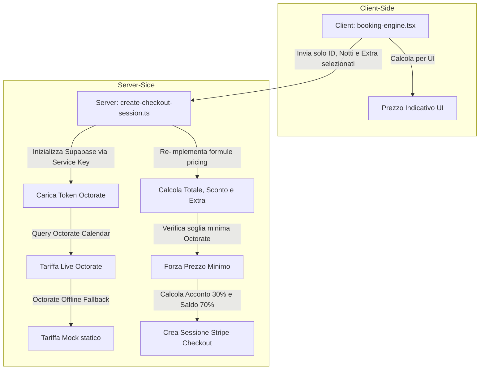

# Motore Prezzi, Sconti & Sottoscritture — Booking Resort

Documentazione tecnica della logica di business che regola il calcolo dei prezzi, le regole di stagionalità, l'applicazione degli sconti e i supplementi per le prenotazioni del resort Flower Power Village. Questo documento è progettato per fungere da archivio di conoscenza per Gemini Notebook.

---

## 1. Regole di Stagionalità

Il resort distingue tra due principali stagioni tariffarie per regolare i prezzi base delle sistemazioni in assenza di tariffe dinamiche inserite manualmente su Octorate.

*   **Bassa Stagione (Low Season):** Definita dal periodo che va **da Maggio a Ottobre** (compresi). 
    *   *Logica di implementazione:* La stagionalità viene verificata controllando se il mese di check-in o il mese di check-out appartengono all'array dei mesi di bassa stagione `[4, 5, 6, 7, 8, 9]` (rappresentazione a base 0 dei mesi da maggio a ottobre in JavaScript).
*   **Alta Stagione (High Season):** Tutti i mesi al di fuori del periodo di bassa stagione (da Novembre ad Aprile).
*   **Implicazioni sui prezzi:**
    *   Se viene selezionato un soggiorno a lungo termine (Long-stay ≥ 30 notti) durante la **Bassa Stagione**, il sistema applica la tariffa base minima scontata dell'alloggio (`base_price_low`).
    *   Negli altri casi, si applica la tariffa base standard dell'alloggio (`base_price_high`).

---

## 2. Algoritmo degli Sconti per Soggiorno

Il sistema incentiva i soggiorni di media e lunga durata applicando sconti percentuali progressivi in base al numero di notti prenotate (`stayDays` o `nights`). 

La logica di ripartizione degli sconti è gestita dalla funzione `getDiscountInfo` ed è così strutturata:

1.  **Sconto Diretto (Direct Booking Price): 10% di sconto (`0.10`)**
    *   Applicato a tutte le prenotazioni inferiori alle 15 notti effettuate direttamente sul sito ufficiale.
2.  **Sconto Media Permanenza (Medium-Stay): 15% di sconto (`0.15`)**
    *   Applicato per prenotazioni **da 15 a 29 notti** (compresi).
3.  **Sconto Lungo Termine (Long-Term Coliving): 20% di sconto (`0.20`)**
    *   Applicato per soggiorni pari o superiori a **30 notti**.

> [!IMPORTANT]
> **Gerarchia di applicazione dello sconto:**
> Lo sconto percentuale si applica **esclusivamente** sul costo della camera e sulla quota dell'ospite aggiuntivo extra. I supplementi di colazione e aria condizionata vengono calcolati a parte e sommati al netto, senza subire alcuno sconto.

---

## 3. Supplementi ed Extra

I costi accessori e le variazioni di configurazione degli ospiti vengono inseriti nel computo finale seguendo formule specifiche:

### A. Ospiti Aggiuntivi Extra (Soggetto a sconto)
Ogni camera ha una capienza base (`baseGuests`) e una capienza massima. Se il numero di ospiti inserito supera la capienza base, viene applicato un supplemento di **200 THB a notte** per ogni ospite extra.
*   *Formula:* `extraGuests = Math.min(maxExtraGuests, Math.max(0, guests - baseGuests))`
*   *Costo Totale:* `extraGuests * 200 THB * notti` (sommato al costo camera prima di applicare lo sconto).

### B. Aria Condizionata (Non soggetto a sconto)
Se selezionata, l'aria condizionata viene conteggiata come un supplemento fisso una tantum (flat) per soggiorno, indipendentemente dalla durata.
*   *Costo Totale:* **500 THB flat** per soggiorno.

### C. Servizio Colazione (Non soggetto a sconto)
Se selezionata, la colazione viene applicata a tutti gli ospiti per l'intera durata del soggiorno.
*   *Formula:* **200 THB** a persona al giorno.
*   *Costo Totale:* `200 THB * ospiti * notti`.

---

## 4. Coerenza e Allineamento Client-Server

Per evitare vulnerabilità di sicurezza (quali manomissioni dei prezzi dal pannello ispeziona elemento del browser) e discrepanze di arrotondamento, la logica di pricing è replicata e verificata rigorosamente su due livelli.

### Protocollo di Allineamento
1.  **Inoltro dei dati:** Il client **non invia mai il prezzo calcolato** al server. Invia solo le variabili di input: `accommodationId`, `checkIn`, `checkOut`, `guests`, `extraBreakfast` e `extraAC`.
2.  **Ricalcolo lato Server:** La rotta `/api/create-checkout-session` esegue nuovamente l'intera logica di calcolo dei giorni di permanenza, del controllo di bassa stagione e dell'estrazione dello sconto applicabile (10%, 15% o 20%).
3.  **Sorgente dei prezzi:**
    *   Il server recupera in tempo reale i prezzi dal calendario di Octorate per le date indicate.
    *   Se Octorate is online, verifica che la tariffa non scenda sotto la soglia di sicurezza (`minimumSellingPrice` configurato in Octorate per la camera). Se scende, forza la soglia di sicurezza.
    *   Se Octorate è offline, utilizza i prezzi mock statici memorizzati in `MOCK_ACCOMMODATIONS` determinando il prezzo base a seconda che sia attiva la bassa stagione o meno.
4.  **Generazione della sessione Stripe:** Calcolato il totale netto finale, il server definisce:
    *   **Acconto (30%):** Addebitato istantaneamente via Stripe Checkout: `depositPaid = Math.round(finalTotal * 0.3)`.
    *   **Saldo (70%):** Pagato in loco al check-in: `balanceDue = finalTotal - depositPaid`.
5.  **Passaggio nei Metadati:** Tutti i valori intermedi del calcolo (notti, ospiti, sconti, acconto, saldo) vengono inseriti nei metadati della sessione Stripe. In questo modo, l'handler di convalida finale `/api/verify-checkout-session` estrae i dettagli certificati direttamente da Stripe per sincronizzarli su Octorate e includerli nel PDF/email, escludendo ogni possibilità di alterazione dei dati da parte del client.
