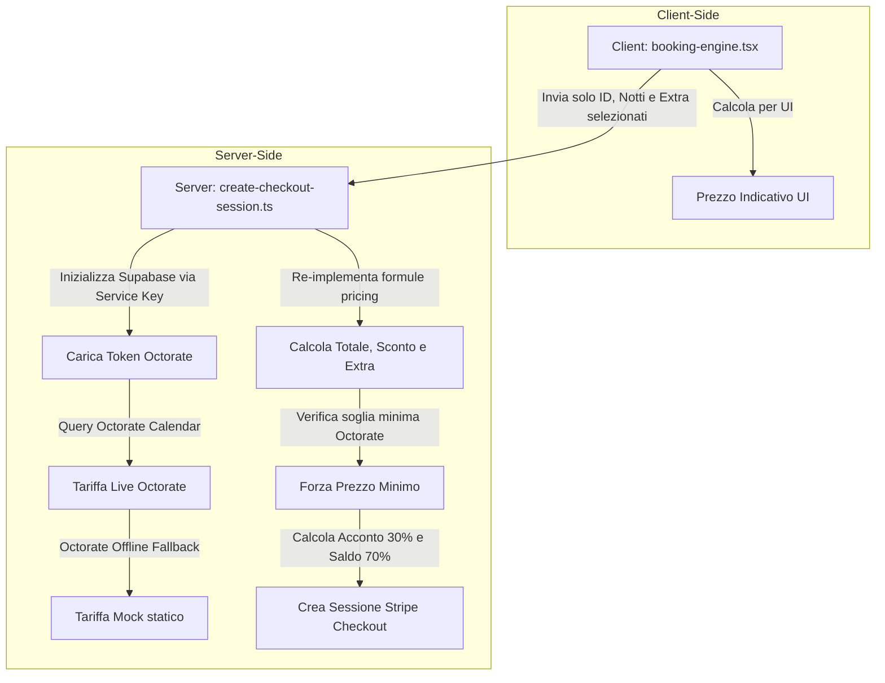

# Motore Prezzi, Sconti & Sottoscritture — Booking Resort

Documentazione tecnica della logica di business che regola il calcolo dei prezzi, le regole di stagionalità, l'applicazione degli sconti e i supplementi per le prenotazioni del resort Flower Power Village. Questo documento è progettato per fungere da archivio di conoscenza per Gemini Notebook.

---

## 1. Regole di Stagionalità

Il resort distingue tra due principali stagioni tariffarie per regolare i prezzi base delle sistemazioni in assenza di tariffe dinamiche inserite manualmente su Octorate.

*   **Bassa Stagione (Low Season):** Definita dal periodo che va **da Maggio a Ottobre** (compresi). 
    *   *Logica di implementazione:* La stagionalità viene verificata controllando se il mese di check-in o il mese di check-out appartengono all'array dei mesi di bassa stagione `[4, 5, 6, 7, 8, 9]` (rappresentazione a base 0 dei mesi da maggio a ottobre in JavaScript).
*   **Alta Stagione (High Season):** Tutti i mesi al di fuori del periodo di bassa stagione (da Novembre ad Aprile).
*   **Implicazioni sui prezzi:**
    *   Se viene selezionato un soggiorno a lungo termine (Long-stay ≥ 30 notti) durante la **Bassa Stagione**, il sistema applica la tariffa base minima scontata dell'alloggio (`base_price_low`).
    *   Negli altri casi, si applica la tariffa base standard dell'alloggio (`base_price_high`).

---

## 2. Algoritmo degli Sconti per Soggiorno

Il sistema incentiva i soggiorni di media e lunga durata applicando sconti percentuali progressivi in base al numero di notti prenotate (`stayDays` o `nights`). 

La logica di ripartizione degli sconti è gestita dalla funzione `getDiscountInfo` ed è così strutturata:

1.  **Sconto Diretto (Direct Booking Price): 10% di sconto (`0.10`)**
    *   Applicato a tutte le prenotazioni inferiori alle 15 notti effettuate direttamente sul sito ufficiale.
2.  **Sconto Media Permanenza (Medium-Stay): 15% di sconto (`0.15`)**
    *   Applicato per prenotazioni **da 15 a 29 notti** (compresi).
3.  **Sconto Lungo Termine (Long-Term Coliving): 20% di sconto (`0.20`)**
    *   Applicato per soggiorni pari o superiori a **30 notti**.

> [!IMPORTANT]
> **Gerarchia di applicazione dello sconto:**
> Lo sconto percentuale si applica **esclusivamente** sul costo della camera e sulla quota dell'ospite aggiuntivo extra. I supplementi di colazione e aria condizionata vengono calcolati a parte e sommati al netto, senza subire alcuno sconto.

---

## 3. Supplementi ed Extra

I costi accessori e le variazioni di configurazione degli ospiti vengono inseriti nel computo finale seguendo formule specifiche:

### A. Ospiti Aggiuntivi Extra (Soggetto a sconto)
Ogni camera ha una capienza base (`baseGuests`) e una capienza massima. Se il numero di ospiti inserito supera la capienza base, viene applicato un supplemento di **200 THB a notte** per ogni ospite extra.
*   *Formula:* `extraGuests = Math.min(maxExtraGuests, Math.max(0, guests - baseGuests))`
*   *Costo Totale:* `extraGuests * 200 THB * notti` (sommato al costo camera prima di applicare lo sconto).

### B. Aria Condizionata (Non soggetto a sconto)
Se selezionata, l'aria condizionata viene conteggiata come un supplemento fisso una tantum (flat) per soggiorno, indipendentemente dalla durata.
*   *Costo Totale:* **500 THB flat** per soggiorno.

### C. Servizio Colazione (Non soggetto a sconto)
Se selezionata, la colazione viene applicata a tutti gli ospiti per l'intera durata del soggiorno.
*   *Formula:* **200 THB** a persona al giorno.
*   *Costo Totale:* `200 THB * ospiti * notti`.

---

## 4. Coerenza e Allineamento Client-Server

Per evitare vulnerabilità di sicurezza (quali manomissioni dei prezzi dal pannello ispeziona elemento del browser) e discrepanze di arrotondamento, la logica di pricing è replicata e verificata rigorosamente su due livelli.


```mermaid
graph TD
    Client[Client: booking-engine.tsx] -->|Invia solo ID, Notti e Extra selezionati| Server[Server: create-checkout-session.ts]
    
    subgraph Client-Side
        Client -->|Calcola per UI| PriceUI[Prezzo Indicativo UI]
    end
    
    subgraph Server-Side
        Server -->|Inizializza Supabase via Service Key| FetchKeys[Carica Token Octorate]
        FetchKeys -->|Query Octorate Calendar| LiveRate[Tariffa Live Octorate]
        LiveRate -->|Octorate Offline Fallback| MockRate[Tariffa Mock statico]
        
        Server -->|Re-implementa formule pricing| Calculate[Calcola Totale, Sconto e Extra]
        Calculate -->|Verifica soglia minima Octorate| SafetyFloor[Forza Prezzo Minimo]
        SafetyFloor -->|Calcola Acconto 30% e Saldo 70%| Stripe[Crea Sessione Stripe Checkout]
    end
```

### Protocollo di Allineamento
1.  **Inoltro dei dati:** Il client **non invia mai il prezzo calcolato** al server. Invia solo le variabili di input: `accommodationId`, `checkIn`, `checkOut`, `guests`, `extraBreakfast` e `extraAC`.
2.  **Ricalcolo lato Server:** La rotta `/api/create-checkout-session` esegue nuovamente l'intera logica di calcolo dei giorni di permanenza, del controllo di bassa stagione e dell'estrazione dello sconto applicabile (10%, 15% o 20%).
3.  **Sorgente dei prezzi:**
    *   Il server recupera in tempo reale i prezzi dal calendario di Octorate per le date indicate.
    *   Se Octorate is online, verifica che la tariffa non scenda sotto la soglia di sicurezza (`minimumSellingPrice` configurato in Octorate per la camera). Se scende, forza la soglia di sicurezza.
    *   Se Octorate è offline, utilizza i prezzi mock statici memorizzati in `MOCK_ACCOMMODATIONS` determinando il prezzo base a seconda che sia attiva la bassa stagione o meno.
4.  **Generazione della sessione Stripe:** Calcolato il totale netto finale, il server definisce:
    *   **Acconto (30%):** Addebitato istantaneamente via Stripe Checkout: `depositPaid = Math.round(finalTotal * 0.3)`.
    *   **Saldo (70%):** Pagato in loco al check-in: `balanceDue = finalTotal - depositPaid`.
5.  **Passaggio nei Metadati:** Tutti i valori intermedi del calcolo (notti, ospiti, sconti, acconto, saldo) vengono inseriti nei metadati della sessione Stripe. In questo modo, l'handler di convalida finale `/api/verify-checkout-session` estrae i dettagli certificati direttamente da Stripe per sincronizzarli su Octorate e includerli nel PDF/email, escludendo ogni possibilità di alterazione dei dati da parte del client.

---

## 5. Algoritmo Gap-Fill e Uniformità sui Confini Stagionali

### Regola del `maxBaselineInGap`
Quando un "buco" di $G$ notti tra due prenotazioni consecutive attraversa un confine stagionale:
- **Soluzione (`calculateDynamicMinStay` & `computeGapFillMinStays`)**: Si calcola `maxBaselineInGap` (il minStay più alto nel buco); se $G < \text{maxBaselineInGap}$, viene impostato `minStay = G` per tutti i giorni del buco.

---

## 6. Automazione Sconti a Cascata Last-Minute (3 Stadi Sequenziali) — 03/08/2026

### ⚠️ REGOLA D'ORO OCTORATE (INDEROGABILE)
Tutte le scritture API (`POST`/`PUT`) per modificare prezzi o disponibilità su Octorate **DEVONO SEMPRE** colpire l'**ID Tariffa Madre (Livello 0)**. È vietato scrivere su tariffe derivate (Livello 1 o 2).

### Struttura a 3 Stadi Sequenziali

| Stadio | Giorni Offset | Durata | Sconto | Colore UI |
|--------|---------------|--------|--------|-----------|
| Stadio 1: Imminente | 0 – 2 | 3 gg | **-10%** | 🔴 Rosso |
| Stadio 2: Intermedio | 3 – 4 | 2 gg | **-5%** | 🟠 Arancio |
| Stadio 3: Esteso | 5 – 6 | 2 gg | **-2.5%** | 🟡 Giallo |

### File Coinvolti
- `src/admin/resort/lib/octorateAdmin.ts` → `calculateCascadeDiscountUpdates()`, `getTargetAccommodationsForMode()`
- `src/admin/resort/store/useResortAdminStore.ts` → `executeLastMinuteStrategy()` (logica Dry-Run)
- `src/admin/resort/components/ResortDashboard.tsx` → UI Pannello Cascata (3 sezioni colorate)
- `src/admin/resort/components/ResortVisualCalendar.tsx` → `CalendarCell` (rendering prezzo ciano)

### Modalità di Esecuzione (Bivio a 3 Livelli)

```
executionMode:
  ├── 'simulation'      → Calcolo Dry-Run locale senza API. Anteprima in ciano nel Calendario Visivo.
  ├── 'test_bungalows'  → Invia SOLO a Fake Bungalow 1 (ID 649669) e Fake Bungalow 2 (ID 921799).
  └── 'production'      → Invia a TUTTE le Tariffe Madri reali del resort.
```

### Algoritmo di Calcolo del Prezzo Reale (Fix 03/08/2026)

**Problema risolto**: il vecchio algoritmo usava `room.basePrice` hardcoded (1500฿ o prezzi da config statica). Il prezzo di partenza sbagliato generava sconti su basi errate.

**Soluzione attuale (Dry-Run nello Store)**:
1. Accede direttamente a `rawOctorateGridItems` (flat array dal PMS).
2. Per ogni alloggio, cerca il rate plan con ID uguale alla **Tariffa Madre** (`motherId`) — priorità all'ID esatto.
3. Dal `item.days[]`, estrae il prezzo per la **data specifica** (`day.date === dateStr`).
4. Formula: `discountedPrice = Math.round(realPrice - (realPrice * discountPct / 100))`.
5. Lo skip avviene se la data non ha un prezzo reale (stop-sell, camera chiusa, ecc.).

### Mappa Mother Rate IDs (Priorità per Dry-Run)

| Alloggio | Mother Rate ID |
|---|---|
| Jungle Villa | 529773 |
| Jungle Villa Left | 495795 |
| Jungle Villa Right | 495796 |
| Peace & Love Villa | 494840 |
| Villa Penthouse | 421511 |
| Yellow Bungalow | 293957 |
| Red Bungalow | 293954 |
| Green Bungalow | 293962 |
| Camel Tent Bungalow | 293965 |
| Lagoon Tent Bungalow | 293955 |
| Internal Room | 293942 |
| Room 1–5 | 293963/293959/293948/293945/293943 |
| Lodge 1–2 | 293951/883795 |
| Fake Bungalow 1–2 | 649669/921799 |

### Rendering Visivo nel Calendario (CalendarCell)
- **Sfondo cella**: rimane verde smeraldo (`bg-emerald-600`) — NON cambia colore.
- **Prezzo scontato**: testo ciano brillante `text-cyan-300` con icona `👁️ ฿{prezzoScontato} 📉`.
- **Badge sconto**: `bg-cyan-950/90 text-cyan-200 border-cyan-400/80` → `-X% (BE ฿{prezzoScontato})`.
- **`hasDiscount`**: attivato da `simulatedMatch.isSimulatedDiscount === true`.

---

## 7. Identità Visiva Pannelli Dashboard (03/08/2026)

| Pannello | Colore Bordo | Sfondo |
|---|---|---|
| ⚡ Sconti a Cascata | `border-amber-500/40` (doppio) | `bg-amber-950/20` |
| ↳ Stadio 1 | `border-red-500/40` | `bg-red-950/30` |
| ↳ Stadio 2 | `border-orange-500/40` | `bg-orange-950/30` |
| ↳ Stadio 3 | `border-yellow-600/40` | `bg-yellow-950/30` |
| 📏 Soggiorno Minimo Dinamico | `border-violet-500/40` (doppio) | `bg-violet-950/20` |

---

## 8. Motore Codici Promozionali & Ticket Sconto V19/V20 (06/08/2026)

### Architettura & Persistenza
- **Zustand Store (`useResortAdminStore.ts`)**: Stato `promoCodes: PromoCode[]` integrato e sincronizzato automaticamente con `localStorage` sotto la chiave `'fpv_promo_codes'`.
- **Formato Dati (`PromoCode`)**:
  - `id`: identificativo univoco generato temporalmente.
  - `code`: stringa univoca in maiuscolo (es. `WELCOME2026` o `TICKET-8X92`).
  - `discountType`: `'percentage'` (% sconto) oppure `'fixed'` (importo fisso in THB `฿`).
  - `discountValue`: valore numerico dello sconto.
  - `slotsTotal` & `slotsUsed`: conteggio utilizzi totali e correnti.
  - `isSingleUse`: flag boolean per ticket monouso (se `true`, `slotsTotal = 1`).
  - `validFrom` & `validTo`: intervallo di validità temporale (formato `YYYY-MM-DD`).
  - `active`: interruttore on/off per attivare/disattivare il codice.

### Interfaccia Utente (`PromoCodesSection.tsx`) & Design V20
- **Identità Visiva**: Tema **Fuchsia / Rose Gold** a doppio bordo (`bg-fuchsia-950/20 border-2 border-fuchsia-500/40 shadow-xl shadow-fuchsia-950/30 ring-1 ring-fuchsia-500/10`) speculare ai 3 moduli sconti storici.
- **Layout Single-Line V20 (Desktop)**: Form di creazione su riga unica orizzontale (`flex-col lg:flex-row`):
  1. Input Codice / Ticket con tasto **🎲 Ticket Random** posizionato assolutamente all'interno dell'input.
  2. Selettore tipo sconto (% / ฿) e valore.
  3. Contatore utilizzi massimi e checkbox monouso.
  4. Date picker unificato **Dal ➔ Al**.
  5. Pulsante `+ AGGIUNGI` ad altezza coordinata `h-10`.
- **Interattività & Pulsante Refresh**:
  - Tasto **`🔄 AGGIORNA STATO CONSUMO`** per ricaricare istantaneamente il consumo dei coupon da `localStorage`.

---

## 9. Regola di Esclusività del Coupon & Metadati Certificati Stripe V26–V30 (06/08/2026)

### Direttiva Inderogabile di Esclusività Coupon (V26–V28)
- **Zero Sconti Sovrapposti**: Quando un coupon promozionale (`appliedPromo` o `promoCode`) è applicato alla prenotazione, lo sconto automatico di soggiorno per durata (`directDiscountAmount`) viene **TASSATIVAMENTE FORZATO A 0**.
- **Base di Calcolo (Tariffa Madre)**: Lo sconto del coupon viene calcolato esclusivamente sulla Tariffa Madre dell'alloggio più eventuali ospiti extra (`roomCost + extraGuests`), **escludendo rigorosamente** i supplementi di Colazione (+1.000 THB) ed Aria Condizionata (+500 THB).
- **Integrazione Frontend (`booking-engine.tsx`, `RoomGrid.tsx`)**:
  - Nel carrello e nella scheda dell'alloggio, quando il coupon è attivo la riga dello sconto diretto (-10%) viene completamente nascosta.
  - Viene mostrata solo la riga `🎟️ Coupon (CODICE): -฿XXX`.

### Certificazione dei Metadati Finanziari Stripe (V27)
- **Archiviazione nei Metadati Stripe (`checkout.ts`)**:
  I valori finanziari finali sono scritti e certificati direttamente nei metadati della sessione di pagamento Stripe Checkout:
  - `grandTotal`, `depositAmount`, `balanceDue`, `promoCode`, `discountAmount`, `promoDiscountAmount`, `directDiscountAmount`.
- **Verifica Serverless (`verify.ts`)**:
  La funzione di verifica legge ed estrae questi importi certificati dai metadati Stripe per popolare il JSON di risposta, la ricevuta PDF (`booking-confirmation.ts`) e la mail di conferma, garantendo perfetta corrispondenza tra quanto pagato dal cliente e quanto registrato nei log Octorate.
  3. Input Slots utilizzabili.
  4. Checkbox Monouso 🎟️.
  5. Date picker unificato Dal ➔ Al in un'unica pillola visiva.
  6. Pulsante fisso `+ AGGIUNGI` con altezza `h-10`.
- **Tracciamento & Link Condivisibile**: Lista accordion con barra di progresso dell'utilizzo (`slotsUsed / slotsTotal`), interruttore ON/OFF e tasto per copiare il link condivisibile (`?promo=CODICE`).

### Incremento Automatizzato a Prenotazione Avvenuta
- Nel motore di prenotazione (`booking-engine.tsx`), il parametro `?promo=CODICE` viene letto all'avvio. Alla conferma ed alla verifica del pagamento in `verifyAndConfirmBooking`, il sistema invoca `useResortAdminStore.getState().incrementPromoCodeUsage(code)` incrementando `slotsUsed` e disattivando automaticamente i ticket monouso esauriti.

---

## 10. Pannello Unificazione Prezzi Base Aria Condizionata & Colazione nelle Tariffe Derivate (07/08/2026)

### A. Pannello di Controllo Unificazione in Dashboard Admin ([`DerivedRatesTreeSection.tsx`](file:///d:/WEB%20SITE%20Antigravity/flowerpowervillage/src/admin/resort/components/DerivedRatesTreeSection.tsx))
- **Interfaccia a 2 Caselle di Input**:
  1. **Aria Condizionata (AC)**: Input numerico per impostare il prezzo unico base per l'Aria Condizionata (es. `400 THB` / notte). Mostra l'importo attualmente attivo.
  2. **1 Colazione (Breakfast)**: Input numerico per impostare il prezzo unico base per 1 colazione (es. `150 THB` / persona / notte). Mostra l'importo attualmente attivo.

### A. Definizione Immutabile delle Sigle `7d` e `14d`
Le sigle `7d` e `14d` presenti nelle tariffe derivate Octorate indicano **esclusivamente i giorni del termine di cancellazione gratuita** (Cancellation Policy / Lead Time) e **non** sconti per la durata del soggiorno:
- **`7d`**: Cancellazione gratuita con rimborso del 100% fino a 7 giorni prima del check-in. Negli ultimi 7 giorni prima del check-in, la cancellazione comporta la trattenuta del 100% dell'importo (penale totale).
- **`14d`**: Cancellazione gratuita con rimborso del 100% fino a 14 giorni prima del check-in. Negli ultimi 14 giorni prima del check-in, la cancellazione comporta la trattenuta del 100% dell'importo (penale totale).

### B. Elenco dei 12 Piani Tariffari Reali Mappati
1. **`BE`**: Official Booking Engine (Tariffa Madre Sito Web)
2. **`7d`**: Standard 7d (Canc. gratuita 7gg per Booking, Expedia, Agoda & Sito)
3. **`Main bnb-7d`**: Booking.com & Expedia Standard (Canc. gratuita 7gg)
4. **`Main bnb-14d`**: Booking.com & Expedia Standard (Canc. gratuita 14gg)
5. **`AC7d`**: Master AC (Canc. gratuita 7gg alloggi AC)
6. **`AC14d`**: Master AC (Canc. gratuita 14gg alloggi AC)
7. **`AC bnb-7d`**: Booking.com & Expedia AC (Canc. gratuita 7gg alloggi AC)
8. **`AC bnb-14d`**: Booking.com & Expedia AC (Canc. gratuita 14gg alloggi AC)
9. **`AGD AC-7d`**: Agoda AC 7d (Canc. gratuita 7gg alloggi AC su Agoda)
10. **`AGD AC-14d`**: Agoda AC 14d (Canc. gratuita 14gg alloggi AC su Agoda)
11. **`AirBnB`**: Airbnb Standard (Canc. termini Airbnb alloggi Standard)
12. **`AirBnB AC`**: Airbnb AC (Canc. termini Airbnb alloggi AC)

---

## 11. Motore Sconti a Cascata Last Minute (3 Stadi Sequenziali) — Aggiornamento 22/08/2026

### A. Regola d'Oro Octorate & Ancoraggio Immutabile Prezzi Base (Livello 0)
- **Isolamento Livello 0**: L'algoritmo di Sconto a Cascata Last Minute agisce **esclusivamente sugli ID delle Tariffe Madri** (Livello 0) dei 18 alloggi e dei 2 Fake Bungalow di test.
- **Ancoraggio Immutabile al 100% (Zero Sconti Ricorsivi)**: Il calcolo percentuale dello sconto per qualsiasi giorno è rigidamente ancorato al prezzo base standard iniziale dell'alloggio (`FALLBACK_BASELINE_PRICES` / `room.basePrice`, es. Jungle Villa 2.290฿, Yellow 990฿), ignorando completamente eventuali prezzi temporanei già scontati presenti sulle celle live di Octorate. Questo impedisce qualsiasi accumulo di sconti su sconti nel tempo.
- **Cascata Automatica**: Octorate PMS propaga automaticamente la tariffa madre scontata a tutte le 212 tariffe derivate (OTA, Booking Engine, BNB, Agoda, ecc.).

### B. Finestra Mobile a Dimensione Dinamica (Rolling Window)
L'orizzonte mobile totale è calcolato dinamicamente sommando i giorni configurati per i 3 stadi:
$$\text{Finestra Totale} = \text{Stadio 1 (gg)} + \text{Stadio 2 (gg)} + \text{Stadio 3 (gg)}$$
1. **Stadio 1 (Lead Time gg 0 → Stadio 1)**: Sconto **-10.0%** sul prezzo base originale.
2. **Stadio 2 (Lead Time gg Stadio 1 → Stadio 1+2)**: Sconto **-5.0%** sul prezzo base originale.
3. **Stadio 3 (Lead Time gg Stadio 1+2 → Totale)**: Sconto **-2.5%** sul prezzo base originale.

### C. Meccanismo di Avanzamento Automatico Giornaliero (`Daily Auto-Roll`)
- **Persistenza Stato & Parametri**: Lo stato del servizio (`isLastMinuteActive`), la data di sync (`fp_last_minute_sync_date`) e i parametri dei 3 stadi sono memorizzati in `localStorage`.
- **Auto-Hydration all'Avvio & Cambio Scheda**:
  - Al montaggio della Dashboard, al ritorno del focus sulla finestra (`window.focus` / `visibilitychange`) o tramite polling ogni 5 minuti, viene eseguito `autoAdvanceDailyLastMinute()`.
  - Se la data odierna è cambiata rispetto all'ultimo invio (`todayStr !== lastSyncDate`) ed il servizio è in Produzione, il sistema calcola la nuova finestra traslata, aggiorna istantaneamente il Calendario visivo e sincronizza Octorate PMS in background senza richiedere click manuali.

---

## 12. Motore Tariffe Standard OTA - High Season (Apertura 7d OTA) — 22/08/2026

### A. Obiettivo & Isolamento Piano Tariffario
- **Target Esclusivo**: Gestisce l'apertura e la chiusura della **sola Tariffa Standard `7d`** (senza A/C, senza colazione) collegata alle agenzie online esterne (**Booking.com, Expedia, Agoda**).
- **Mappatura Rigorosa**: Colpisce esclusivamente i 18 Rate Plan ID della tariffa `7d` (`STANDARD_7D_RATE_IDS` / `REAL_PRODUCTS_BY_PLAN['7d']`) e i 2 ID dei Fake Bungalow di test (`TEST_PRODUCTS_BY_PLAN['7d']` = `[932244, 932257]`).
- **Snellimento Totale**: Rimossa ogni gestione superflua del Close-to-Arrival (CTA) per una sincronizzazione rapida, pulita e affidabile.

### B. Parametri Modificabili
1. **Inizio Stagione (`standardSeasonStartDate`)**: Data di partenza della High Season (default: `15-12-2026`).
2. **Fine Stagione (`standardSeasonEndDate`)**: Data di chiusura della High Season (default: `31-03-2027`).
3. **Trigger Apertura (`standardDaysTriggerLimit`)**: Giorni di anticipo rispetto al check-in per sbloccare la tariffa (default: `15 gg`).
4. **Durata Apertura (`standardDaysOpenDuration`)**: Numero di giorni consecutivi di apertura della finestra rolling (default: `10 gg`).

### C. Avanzamento Giornaliero Automatico (`autoAdvanceDailyStandardProtection`)
- **Fuso Orario**: Calcolato rigidamente sul fuso orario di Koh Phayam / Bangkok (`Asia/Bangkok`, UTC+7) tramite `toThailandDateStr()`.
- **Sincronizzazione Senza Intervento Umano**: Agganciato ad avvio dashboard, eventi di visibilità/focus finestra e polling background ogni 5 minuti.
- **Marker di Allineamento**: Salva `fp_standard_protection_sync_date` per garantire 1 sola sincronizzazione API al giorno a data cambiata.

### D. Snapshot Periodo Standard & Rollback Rapido (`Salva Default / Rollback Default`)
- **Tasto `SALVA DEFAULT`**: Salva una fotocopia persistente (`localStorage: fp_saved_standard_config`) della configurazione attualmente presente nei 4 campi.
- **Tasto `ROLLBACK DEFAULT`**: Ripristina istantaneamente nei campi i parametri salvati (oppure il default reale `15-12-2026 ➔ 31-03-2027, Trigger: 15gg, Durata: 10gg`), consentendo di alternare con 1 click tra periodi di test immediati e il periodo di default di produzione.

