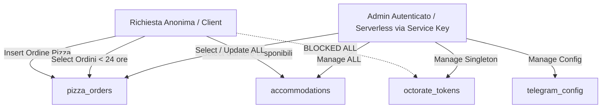

# Schema Database & Sicurezza RLS — Supabase

Questo documento descrive dettagliatamente la struttura del database relazionale, la configurazione degli storage bucket e le regole di sicurezza (RLS) implementate su Supabase per il progetto Flower Power. Questo documento è progettato per fungere da archivio di conoscenza per Gemini Notebook.

---

## 1. Schema delle Tabelle

Il database PostgreSQL è composto da quattro tabelle principali e una tabella di sentinel.

### A. Tabella `pizza_orders` (Gestione Ordini Delivery)
Memorizza gli ordini del modulo di online delivery per la pizzeria.

| Campo | Tipo PostgreSQL | Vincoli / Valore di Default | Descrizione |
|---|---|---|---|
| `id` | `uuid` | `PRIMARY KEY` • `gen_random_uuid()` | Identificativo univoco dell'ordine. |
| `created_at` | `timestamptz` | `now()` | Data e ora di inoltro dell'ordine. |
| `customer_name`| `text` | `NOT NULL` • `''` | Nome del cliente. |
| `phone` | `text` | `NOT NULL` • `''` | Numero di telefono tailandese. |
| `address` | `text` | `NOT NULL` • `''` | Indirizzo di consegna (include coordinate `[COORD: lat,lng]`). |
| `items` | `jsonb` | `NOT NULL` • `'[]'::jsonb` | Elenco articoli carrello (tipo `CartItemSaved[]`). |
| `total` | `numeric(10,2)`| `NOT NULL` • `0` | Importo totale dell'ordine in THB. |
| `status` | `text` | `CHECK (status IN ('new', 'preparing', 'delivering', 'completed', 'rejected'))` • `'new'` | Stato dell'ordine per la cucina e il tracking. |
| `payment_method`| `text` | `CHECK (payment_method IN ('promptpay', 'cash'))` • `'promptpay'` | Metodo di pagamento. |
| `receipt_url` | `text` | `NULL` | URL dello screenshot di pagamento (se PromptPay). |
| `telegram_notified`| `boolean`| `NOT NULL` • `false` | Flag per impedire notifiche Telegram duplicate. |
| `latitude` | `numeric(10,8)`| `NULL` | Coordinata latitudine della consegna. |
| `longitude` | `numeric(11,8)`| `NULL` | Coordinata longitudine della consegna. |
| `has_whatsapp` | `boolean` | `NOT NULL` • `false` | Indica se il cliente ha WhatsApp attivo sul numero. |
| `has_line` | `boolean` | `NOT NULL` • `false` | Indica se il cliente ha LINE attivo sul numero. |
| `driver_latitude`| `numeric(10,8)`| `NULL` | Latitudine in tempo reale del fattorino (Sentinel: `-99`). |
| `driver_longitude`| `numeric(11,8)`| `NULL` | Longitudine in tempo reale del fattorino (Sentinel: `-99`). |
| `tracking_active`| `boolean` | `NOT NULL` • `false` | Stato di attivazione del tracking live GPS per il client. |
| `telegram_message_id`| `bigint`| `NULL` | ID del messaggio Telegram inviato (per modifiche inline). |

### B. Tabella `accommodations` (Catalogo Alloggi Resort)
Contiene l'elenco delle camere, bungalow e ville del villaggio.

| Campo | Tipo PostgreSQL | Vincoli / Valore di Default | Descrizione |
|---|---|---|---|
| `id` | `uuid` | `PRIMARY KEY` • `gen_random_uuid()` | ID alloggio. |
| `created_at` | `timestamptz` | `now()` | Data creazione. |
| `updated_at` | `timestamptz` | `now()` (Aggiornato via Trigger) | Data ultima modifica. |
| `slug` | `text` | `UNIQUE` • `NOT NULL` | Identificativo URL unico (es. `jungle-villa`). |
| `name` | `text` | `NOT NULL` • `''` | Nome dell'alloggio. |
| `type` | `text` | `CHECK (type IN ('villa', 'bungalow', 'room', 'lodge', 'tent'))` • `'room'` | Categoria tipologia alloggio. |
| `description` | `text` | `NOT NULL` • `''` | Descrizione testuale estesa. |
| `capacity` | `integer` | `NOT NULL` • `2` | Capienza massima ospiti. |
| `rooms` | `integer` | `NOT NULL` • `1` | Numero di stanze interne. |
| `bathrooms` | `integer` | `NOT NULL` • `1` | Numero di bagni interni. |
| `beds` | `text` | `NOT NULL` • `''` | Descrizione testuale configurazione letti. |
| `features` | `jsonb` | `NOT NULL` • `'[]'::jsonb` | Array di dotazioni (WiFi, AC, Cucina, ecc.). |
| `price_per_night`| `numeric(10,2)`| `NOT NULL` • `0` | Tariffa base per notte (THB). |
| `images` | `jsonb` | `NOT NULL` • `'[]'::jsonb` | Array di URL delle foto. |
| `is_available` | `boolean` | `NOT NULL` • `true` | Visibilità pubblica nel motore di prenotazione. |

### C. Tabella `telegram_config` (Credenziali Webhook Bot)
Gestisce i dati di configurazione per il bot di notifica.

| Campo | Tipo PostgreSQL | Vincoli / Valore di Default | Descrizione |
|---|---|---|---|
| `id` | `text` | `PRIMARY KEY` • `'default'` | Identificativo univoco del record. |
| `bot_token` | `text` | `NOT NULL` | Token del bot Telegram generato da BotFather. |
| `chat_id` | `text` | `NOT NULL` | ID numerico del gruppo o canale dello staff. |
| `updated_at` | `timestamptz` | `now()` | Data di aggiornamento della configurazione. |

### D. Tabella `octorate_tokens` (Credenziali OAuth singleton)
Gestisce i token d'accesso OAuth di Octorate.

| Campo | Tipo PostgreSQL | Vincoli / Valore di Default | Descrizione |
|---|---|---|---|
| `id` | `text` | `PRIMARY KEY` • `'singleton'` • `CHECK (id = 'singleton')` | Record unico per evitare righe duplicate. |
| `access_token` | `text` | `NOT NULL` | Bearer Token di Octorate attivo. |
| `refresh_token`| `text` | `NOT NULL` | Token di ricarica per superare la scadenza. |
| `expires_in` | `integer` | `NOT NULL` | Durata di validità in secondi. |
| `updated_at` | `timestamptz` | `now()` | Timestamp dell'ultimo aggiornamento/refresh. |

---

## 2. Storage Buckets

Il sistema implementa quattro bucket pubblici di Supabase Storage per ospitare file statici e dinamici:

1.  **`receipts` (Pubblico):** Ospita gli screenshot delle ricevute PromptPay caricati dai clienti durante il checkout.
    *   *Dimensione massima:* 5MB.
    *   *Mime Types ammessi:* `image/jpeg`, `image/png`, `image/webp`.
2.  **`accommodation-images` (Pubblico):** Contiene le foto degli alloggi del resort gestite dall'amministratore.
    *   *Dimensione massima:* 10MB.
    *   *Mime Types ammessi:* `image/jpeg`, `image/png`, `image/webp`, `image/avif`.
3.  **`delivery_food` (Pubblico):** Immagini dei piatti e delle pizze del menu di consegna a domicilio.
    *   *Dimensione massima:* 10MB.
    *   *Mime Types ammessi:* `image/jpeg`, `image/png`, `image/webp`, `image/avif`.
4.  **`site-images` (Pubblico):** Risorse grafiche generali utilizzate per il layout e i loghi del sito.

### Automazione Cache-Control (Bucket `delivery_food`)
Per minimizzare l'utilizzo di banda e ottimizzare i tempi di caricamento del menu, è stato configurato un trigger PostgreSQL (`set_delivery_food_cache_control_trigger`) che intercetta i file inseriti nel bucket `delivery_food` e forza l'intestazione cache di immutabilità nei metadati dell'oggetto:

```sql
CREATE OR REPLACE FUNCTION public.set_delivery_food_cache_control()
RETURNS TRIGGER AS $$
BEGIN
  IF NEW.bucket_id = 'delivery_food' THEN
    NEW.metadata := jsonb_set(COALESCE(NEW.metadata, '{}'::jsonb), '{cacheControl}', '"public, max-age=31536000, immutable"');
  END IF;
  RETURN NEW;
END;
$$ LANGUAGE plpgsql SET search_path = public, pg_temp;
```

---

## 3. Row Level Security (RLS) Hardening

Per proteggere l'integrità del database da letture di massa o tentativi di hacking, è attiva una politica rigorosa di isolamento tramite Row Level Security.

### Politiche di Sicurezza delle Tabelle



#### A. Tabella `pizza_orders`
*   **Inserimento:** Consentito a chiunque (ruolo `public` o utenti anonimi) per permettere ai clienti del sito di inviare ordini.
*   **Lettura (Select):**
    *   Gli utenti anonimi (`anon`) possono selezionare solo gli ordini creati nelle ultime 24 ore:
        `USING (created_at > now() - interval '24 hours')`. Questo previene lo scraping dello storico e protegge la privacy dei clienti.
    *   Gli amministratori autenticati (`authenticated`) possono selezionare e leggere l'intero storico degli ordini.
*   **Aggiornamento (Update):** Consentito solo agli utenti autenticati (`authenticated`) per consentire allo staff di cambiare lo stato dell'ordine e attivare il tracking GPS.

#### B. Tabella `accommodations`
*   **Lettura (Select):** Gli utenti anonimi (`anon`) possono visualizzare solo gli alloggi esplicitamente contrassegnati come disponibili (`is_available = true`). Gli utenti autenticati (`authenticated`) possono vedere tutti gli alloggi.
*   **Scrittura (Insert/Update):** Riservata esclusivamente ad amministratori autenticati (`authenticated`).

#### C. Tabella `telegram_config`
*   **Accesso:** Bloccato a utenti anonimi. Solo utenti autenticati (`authenticated`) possono leggere, inserire o aggiornare la configurazione del bot.

#### D. Tabelle `octorate_tokens` e `keep_alive`
*   **Accesso:** Completamente bloccato sia in lettura che in scrittura a chiunque sia connesso come `public` o `anon` (`USING (false)`).
*   *Nota di implementazione:* Le API Serverless di Vercel interrogano e aggiornano queste tabelle bypassando l'RLS tramite l'uso della chiave privata `SUPABASE_SERVICE_ROLE_KEY`, garantendo che i token di Octorate non vengano mai esposti al browser.

### Politiche di Sicurezza degli Storage Bucket
*   **`receipts`:** Chiunque (anonimo) può scaricare/leggere le ricevute tramite link diretto, e chiunque può caricare immagini (per permettere l'invio della ricevuta PromptPay). L'eliminazione e la visualizzazione ad elenco del bucket sono vietate agli utenti anonimi.
*   **`accommodation-images` / `delivery_food`:** Lettura pubblica degli asset per il rendering del sito. Inserimento, modifica ed eliminazione sono riservati esclusivamente agli amministratori autenticati (`authenticated`). Il listing pubblico del bucket `delivery_food` è bloccato per prevenire scansioni di massa.
